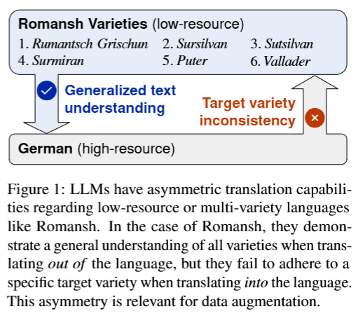
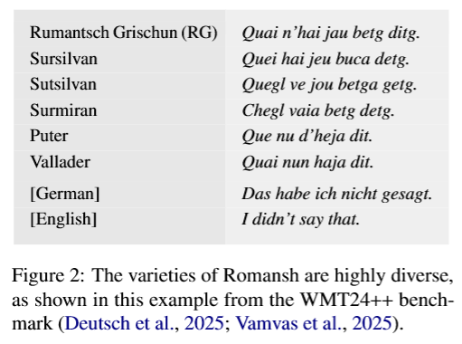
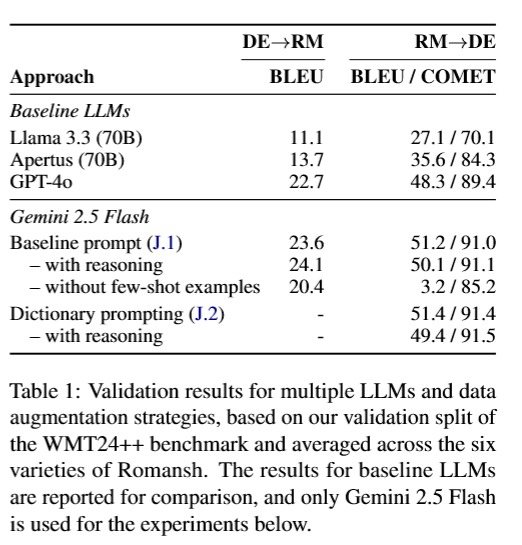
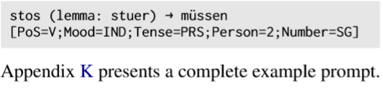
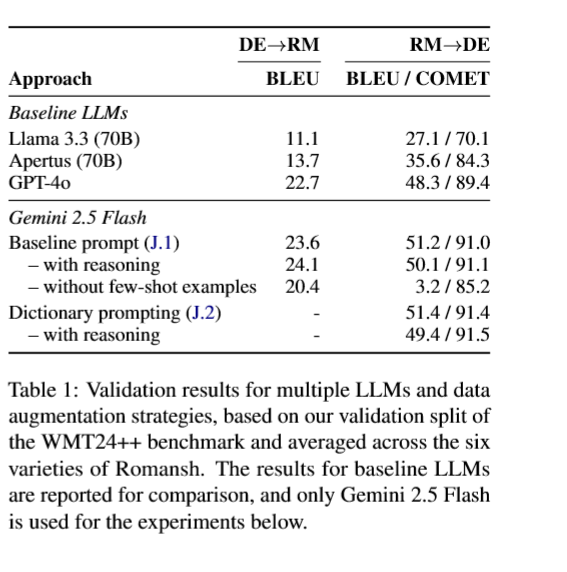
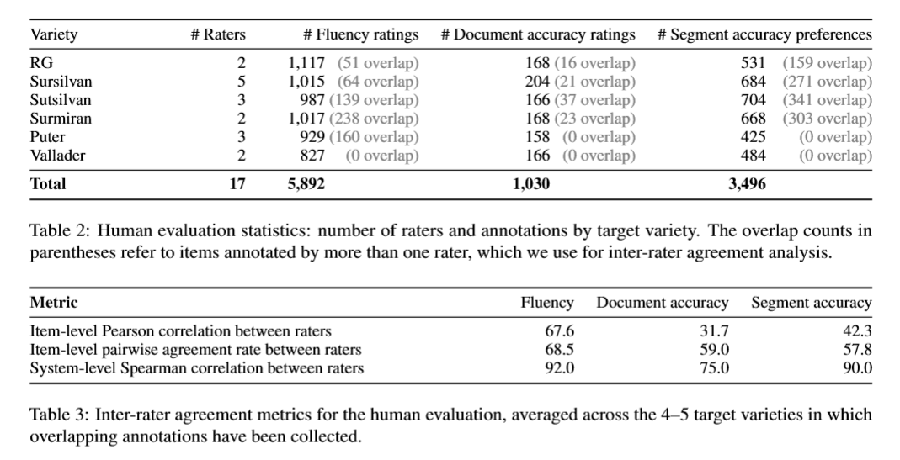
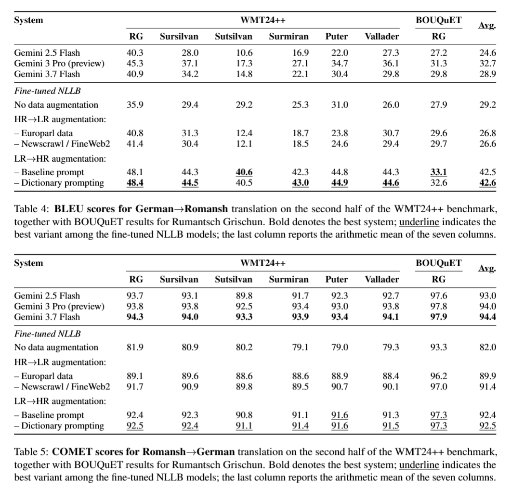
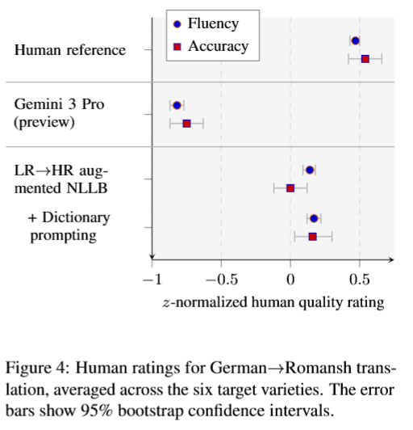
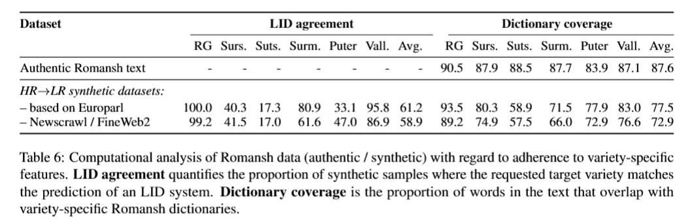
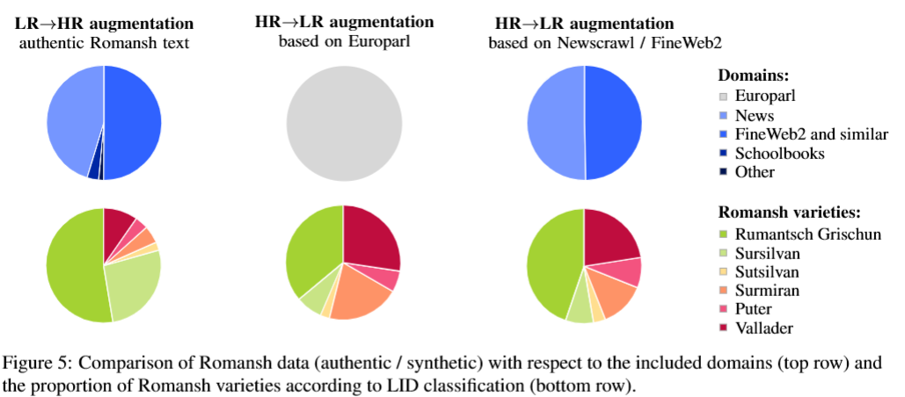

# 大语言模型中的翻译不对称性作为数据增强因素：以 6 种罗曼什语变体为案例研究

2026-arxiv

1 苏黎世大学
2 利亚・罗曼什组织（Lia Rumantscha，瑞士罗曼什语官方机构，负责保护、推广罗曼什语言文化）

# Abstract

现有低资源机器翻译策略，大多依靠大语言模型，基于高资源语言文本来生成合成数据。我们针对拥有 6 种不同变体的罗曼什语，重新审视该思路。大模型在向罗曼什语做翻译时，常常混淆各个语言变体；但将罗曼什语译为德语这类高资源语言时，翻译效果却相当出色。受这种翻译不对称性影响，数据增强的方向成为关键抉择。我们发现，与当下主流策略相反，生成译为高资源语言的合成译文是更优方案。只有采用该方案，我们的模型才能在德语→罗曼什语翻译任务上超越 Gemini 3 Pro 基线模型（在资源最少的语言变体上，BLEU 值相比 Gemini 提升 23 点）。人工评估证实：本实验得到了首个能够流畅产出各罗曼什语变体译文的模型。

# 1 Introduction

传统研究表明，前向翻译与回译都是神经机器翻译有效的数据增强策略（参见 Burlot 和 Yvon，2018），具体选用哪种策略取决于可获取的单语数据。近期有研究利用大模型，以英语为源开展大规模前向翻译，为低资源机器翻译构建合成训练数据（de Gibert 等人，2025）。尽管该方法对部分语言对效果不错，但本文着重指出：面对低资源语言或多变体语言时，大模型能力存在固有的不对称性（见图 1）。

本文研究罗曼什语，这是瑞士的一门少数民族语言，分布于多个阿尔卑斯山谷，使用人口为 4‑6 万人。罗曼什语包含 6 种差异显著的变体，各变体之间通常无法互通，因此，研发能够区分不同变体的机器翻译系统是该社群的迫切需求。罗曼什语也是翻译不对称现象的典型案例：已有研究表明，<u>大模型在做罗曼什语译出任务时，能够很好地理解任意变体的罗曼什语文本</u>；但在向罗曼什语译入时，却难以生成目标指定变体的文本（Vamvas 等人，2025；Apertus 项目团队等人，2026）。因此，利用大模型生成罗曼什语合成文本，或许并不是数据增强的最优方案。

本文开展了一组受控的德语⇔罗曼什语案例研究，从实验层面对比两种数据增强方向：一种是以高资源语言文本为起点，生成低资源语言的合成译文（高资源→低资源增强，HR→LR）；另一种是投入成本收集低资源语言的人工真实语料，再生成高资源语言的合成译文（低资源→高资源增强，LR→HR）。

为对比这两种数据增强方案，我们基于增强后的数据集对 NLLB 模型（Costa‑jussà 等人，2024）开展微调，并在全部 6 种语言变体上对德语⇔罗曼什语翻译任务进行评测。令人意外的是，实验发现<u>低资源→高资源（LR→HR）数据增强对两个下游翻译方向（德语→罗曼什语、罗曼什语→德语）均为更优方案</u>。因此，针对德语→罗曼什语机器翻译任务，对低资源文本做回译的效果优于对高资源文本做前向翻译。<u>而对于罗曼什语→德语机器翻译任务，基于低资源文本的前向翻译同样要优于对高资源文本做回译。</u>

我们的案例研究表明：<u>低资源语言的真实原生数据对于基于大语言模型的数据增强仍然具备极高价值</u>，因此，搜集单语文本依旧是低资源机器翻译领域重要的基础环节。总而言之，本文的主要贡献如下：

- 本文在包含 6 种不同目标变体的低资源场景下，对基于大语言模型的数据增强开展了受控对比实验。
- 本文验证了少样本提示、词典提示等可用于数据增强的提示策略。
- 我们开源发布了经过微调的机器翻译模型、用于低资源→高资源（LR→HR）增强的合成回译数据、一万条以上人工质量标注数据，以及评测代码。

# 2 研究背景：罗曼什语的语言变体

罗曼什语是瑞士四种官方语言之一，属于少数语言，仅在瑞士格劳宾登州通行，被认定为濒危语言。有观点认为，将罗曼什语视作单一语言并不准确（Caviezel，1993）；它更像是一个方言连续体，不存在一个统摄全部变体的通用标准语（Liver，2010；Grünert，2024）。在格劳宾登州境内，罗曼什语使用区域可划分为五个片区，每个片区都拥有自身书面传统，被称为idiom（地域标准变体）。
因此，idiom 是罗曼什语各地方口语变体经过规范化之后的书面形式，拥有独立的正字法（见图 2）与文学传统。这种分散式标准化始于 16 世纪，源于宗教与文学出版物；而由于缺少统一集中的共同文化圈层，进一步加剧了各变体之间的分化（Grünert，2024）。

使用人口规模最大的变体为苏西尔万语（Sursilvan，约占罗曼什语使用者的 50%）与瓦拉德尔语（Vallader，20%），而苏茨尔万语（Sutsilvan）使用者数量极少，仅占 3%。另外两种变体分别为苏米尔兰语（Surmiran，10%）与普特语（Puter，12%）（Furer，2005）。现有可用数据大致也体现出这样的人口分布特征（参见附录 F 与附录 H）。

与其余五种变体不同，格劳宾登罗曼什语（Rumantsch Grischun，RG）并非基于口语规范化形成的地域标准变体，而是一门人工构建语言，主要以苏西尔万、苏米尔兰、瓦拉德尔三种变体为基础创制而成（Liver，2010）。它被设计用于政府与公共机构的沟通场景，定位是作为现有地域变体的补充，而非取而代之（Coray，2008）。州政府与联邦政府使用 RG 来发布官方文件与对外通告。公开易得的网络语料大多为 RG 变体，正因如此，以往针对罗曼什语的机器翻译研究几乎只聚焦 RG 这一种变体（例如 Müller 等人，2020；Kudugunta 等人，2023，以及 Supertext 的商用翻译系统）。但罗曼什语使用者在校园与工作场景中实际使用的是各自本土的地域变体；大多数使用者最多只是能够看懂 RG，并不熟练使用。变体感知型机器翻译，能够帮助罗曼什语使用者更好地获取其他语言，或是其他罗曼什变体产出的内容。

# 3 大语言模型翻译不对称现象

众所周知，大语言模型将低资源语言作为源语言时的表现，要优于将其作为目标语言时的表现（例如 Bawden 和 Yvon，2023；Zhu 等人，2024；全语种机器翻译团队等人，2026）。近期评测在罗曼什语上也观测到同样的不对称现象（Vamvas 等人，2025；Apertus 项目团队等人，2026），本文表 1 使用四款大模型复现了该结论。

对于这种不对称现象，存在若干种潜在解释。第一种解释为迁移不对称：从亲缘关系更近的高资源语言实现知识迁移，在理解任务上能够更有效地弥补低资源语言训练样本不足的问题，但在生成任务上效果较差。另一种解释是标准化不对称：部分低资源语言的变体多样性高于高资源语言（相对于其在训练数据中的占比），这会使得通用大模型在向这类语言做译入生成时，任务歧义性大幅提升。最后，分词差异也可能是原因：生成低资源语言文本需要模型做出更多解码决策，自回归架构本身存在的错误与偏见（Lesci 等人，2025）也更容易发生累积放大。

虽然这些推测性解释究竟在多大程度上适用于德语‑罗曼什语这一语言对，目前尚无定论，但本文认为标准化不对称起到尤为关键的作用。图 3a 的混淆矩阵直观展示了大模型难以按要求输出指定罗曼什变体的现象：当把德语文本翻译为苏茨尔万（Sutsilvan）、苏米尔兰（Surmiran）或普特（Puter）这类变体时，Gemini 2.5 Flash 以目标变体作为参考译文计算得到的 BLEU 分数，反而低于使用其他资源更丰富变体作为参考译文的分数。部分更新版本的 Gemini 变体混淆问题有所缓解，但模型依然明显偏向资源更充足的变体，尤其是 RG 人工标准变体（详见附录 L）。

本文表明，大语言模型的翻译不对称现象对数据增强有着直接启示意义。

# 4 Data Augmentation Methods

## 4.1 前向翻译与回译

前向翻译利用单语源语文本生成合成目标译文，而回译则利用单语目标语文本生成合成源语文本。对比研究表明，两种方法对神经机器翻译均具备效果（Burlot 和 Yvon，2018；Bogoychev 和 Sennrich，2020），二者至今仍被广泛使用（Kocmi 等人，2025）。近期，de Gibert 等人（2025）发现，基于 GPT‑4o 的大规模前向翻译能够改善巴斯克语、格鲁吉亚语等 7 种低资源语言的神经机器翻译效果。Frontull 和 Moser（2024）针对意大利语⇔拉迪恩语任务，将前向翻译与回译结合为迭代流程，并以 GPT‑3.5 生成的回译数据作为初始种子数据。不过，目前尚缺少针对基于大模型的前向翻译与回译的系统性对比研究。

本文在受控实验条件下对德语⇋罗曼什语机器翻译开展对比，固定大模型（Gemini 2.5 Flash）、提示词以及下游神经机器翻译模型（NLLB）。我们对各版本模型做双向联合训练，覆盖全部语言变体，每一条样本都双向复用。这种多语言设置与传统双语回译方案（Sennrich 等人，2016）有所不同，但更贴合实际落地使用需求。

因此，全部合成译文既可以视作前向翻译，也可以视作回译，具体取决于下游模型实际的使用方向。而尚存的研究问题在于：这些合成数据究竟应当生成低资源语言（高资源→低资源增强，参考 de Gibert 等人，2025），还是应当基于低资源语言文本生成高资源语言译文（低资源→高资源增强）。为避免歧义，后续章节我们将沿用这两个术语。

## 4.2 词典提示（Dictionary Prompting）

我们实验了一种基于大模型的数据增强变体方案，该方案将双语词典词条追加至提示词当中（Ghazvininejad 等人，2023；Court and Elsner，2024）。受该提示方式较高的开销所限，我们仅在**低资源→高资源（LR→HR）**增强方向上开展测试。

词典信息包含输入文本中每个单词对应的罗曼什语词元，同时附带可用的德语单词级译文以及单词的形态分析信息。例如，向大模型解释苏西尔万变体（Sursilvan）单词 **stos** 的示例如下：

# 5 Experimental Setup

## 5.1 Evaluation Data 评测数据

评测主要采用 WMT24++ 基准集中的罗曼什语版本（Vamvas 等人，2025），并搭配 Deutsch 等人（2025）提供的德语版本。该基准数据集包含来自 4 个领域的 998 个文本片段，分别为文学、新闻、社交以及口语领域。我们将该基准数据集进行划分：每个领域前 50% 文档作为验证集，剩余 50% 作为测试集，以便基于验证集开展超参调优与提示词工程。最终实验结果均基于测试集得到。

我们还在较新的 BOUQuET 基准数据集上开展评测（Andrews 等人，2025），该数据集包含 854 对德语‑罗曼什语句对，覆盖 8 个领域以及 12 种语言语体的组合。该基准数据集仅提供格劳宾登罗曼什通用变体（RG）的数据。

## 5.2 LLM-based Data Augmentation

为构建合成训练数据，我们向大模型输入提示指令：**“将下面文本翻译为 {language}”**，单次请求最多翻译 500 token 长度的文本片段。完整提示词参见附录 J。数据增强阶段采用贪心解码，基于采样的数据增强方案（Edunov 等人，2018）留作后续研究。

此外，基于 WMT24++ 验证集划分得到的实验结果（表 1），我们做出如下实验选择：

- 与另外三款开销相近的大模型相比，Gemini 2.5 Flash（Comanici 等人，2025）在两个翻译方向上均取得最优分数，印证了 Vamvas 等人（2025）的前期结论。因此，本文后续实验均采用该模型。
- 关闭推理能力能够降低大规模数据增强实验的开销。开启推理能力（设置 2048 token 的推理预算）仅能在验证集上带来小幅提升：德语→罗曼什语 BLEU 提升 0.5；罗曼什语→德语 COMET 提升 0.1。
- 少样本示例对指令遵循至关重要（德语→罗曼什语 BLEU 提升 3.2；罗曼什语→德语 COMET 提升 5.8）。不使用任何示例的零样本提示会出现输出英文而非德语的问题，导致 BLEU 仅有 3.2 的极低分数。
- 词典提示展现出正向效果（COMET 提升 0.4）。尽管该方法在 COMET 指标上的提升幅度相对有限，但我们仍将其作为一种变体纳入大规模数据增强实验与人工评估，原因在于该技术可能对长尾现象产生影响，而这类长尾现象很难通过自动指标加以量化。

本文一共基于 Gemini 2.5 Flash 开展四组大规模数据增强实验（采用不同的数据组合，区分是否启用词典提示），总开销约为 2400 美元（详见附录 G）。

## 5.3 Training Data

作为实验的前置条件，我们整理构建了罗曼什语各变体的单语数据与平行语料（详见附录 F）。

对于低资源→高资源（LR→HR）数据增强，我们使用 1.4 亿 token 的罗曼什语真实单语数据，数据主要来源于网络语料库、新闻以及教材（表 10）。总共整合了 12 处不同来源的数据，其中大部分已经公开可用，还有一部分随本文一并开源，便于后续研究复现实验。

针对由德语出发的高资源→低资源（HR→LR）数据增强，我们整理构建了两套规模相当的数据集：

- 欧洲议会语料：该实验设置参照 de Gibert 等人（2025）的做法，从德语欧洲议会语料库中采样（Koehn，2005）。该方案可以直接与前人工作做对比，但所用文本的领域与用于 LR→HR 增强的罗曼什原生真实数据不同，这一点可能会对对比结果造成干扰。
- 新闻爬虫 / FineWeb2：该版本采用一套与罗曼什原生真实数据相匹配的德语混合数据集：50% 来自 Newscrawl 2023 的新闻文本（Kocmi 等人，2025），另外 50% 来自 FineWeb2 的网页文本（Penedo 等人，2025）。图 5 表明，该混合数据集能够高度近似 LR→HR 增强所使用数据的领域分布。

所有实验组均加入 2300 万 token 的真实平行数据，其中包含约 300 万来自罗曼什‑德语双语词典的词形。大模型以文档粒度生成合成译文，之后我们将文档切分为较短片段，用于神经机器翻译模型微调。我们借助罗曼什子变体语言识别分类器（Model 等人，2026），对全部罗曼什语文本片段（包含合成文本）重新标注所属语言变体。更多预处理细节以及最终训练数据统计信息详见附录 C 与附录 H，附录结果表明，所有实验方案均使用规模相当的训练数据。

## 5.4 NMT Fine-tuning

我们对 NLLB‑200‑Distilled 1.3B 模型进行微调（Costa‑jussà 等人，2024），这是一款基于 Transformer 编码器‑解码器架构的多语言神经机器翻译模型。由于 NLLB 预训练语言集合中并未包含罗曼什语，我们为模型词表扩充 6 个新语言标记，分别对应罗曼什语的各个子变体。采用温度采样（温度系数T=1.5）对样本占比不足的翻译方向做上采样。其余超参数详见附录 A。

## **5.5 自动评测**

**针对德语→罗曼什语方向，由于缺少面向该目标语言训练的专用评估指标，我们采用 SacreBLEU（Post，2018）计算 BLEU 分数（Papineni 等人，2002），同时辅以人工评估（见下文 5.6 节）。对于罗曼什语→德语方向，主要报告 xCOMET 指标（Guerreiro 等人，2024），复现 Vamvas 等人（2025）的实验设置。使用 XCOMET‑XL2 模型，并采用仅参考模式：仅输入德语译文与德语参考译文，不输入罗曼什语源文本；原因是罗曼什语并未纳入 xCOMET 的训练数据。参照 Kocmi 等人（2024）的做法，xCOMET 分数在各个领域上做宏平均，以消除不同文本片段粒度差异带来的影响。**

## 5.6 人工评测

我们招募了能够掌握全部六种罗曼什语变体的 18 名母语者，对德语→罗曼什语方向表现最优的三套系统译文以及人工参考译文开展盲评对比。流畅度在文本片段粒度进行打分，准确度则在文档粒度打分；两项维度均采用 7 分制评分。

对于大部分语言变体，一部分评测条目由多名标注者共同打分（表 2），据此我们可以计算标注者间一致性指标。（表 3 给出各目标变体上的平均结果，附录 N.2 提供分变体的详细分析）。系统层面的斯皮尔曼相关系数，流畅度与准确度两项指标大多处于 0.80‑1.00 区间；而样本层面皮尔逊相关系数处于中等水平：流畅度为 0.52‑0.82，准确度仅 0.17‑0.50。

为从人工打分结果计算系统得分，我们对每位标注者的分数做 Z‑score 标准化，再跨文本片段取均值。采用自助重采样（bootstrap resampling，Koehn，2004）计算 95% 置信区间。

# 6 Results

表 4 与表 5 给出了两个翻译方向上的自动评测结果。图 4 可视化展示了三套最优系统的人工评估结果；各子变体的详细实验结果见附录 M。

高资源到低资源（HR→LR）数据增强无法为资源最少的语言变体带来增益。将仅使用原生平行语料训练的模型（“无数据增强”）与同时使用原生平行语料和合成伪平行语料训练的模型进行对比，即可衡量 HR→LR 数据增强的收益。尽管经过 HR→LR 增强的模型训练所用数据量扩大至原来的 14 倍（附录 H），但该模型并未稳定优于基线模型。在德语→罗曼什语方向（表 4）中，该模型在资源相对充足的变体（格里斯洪罗曼什语、苏西尔万方言、瓦拉德尔方言）上性能有所提升，但在资源匮乏变体（苏齐尔万方言、苏米尔兰方言、普特方言）上性能反而下降，其中苏齐尔万方言 BLEU 分数下降高达‑17。这表明，HR→LR 增强生成的合成文本，对在这些低资源变体上微调机器翻译模型没有帮助。第 7 节对合成文本的分析将进一步证实该推断。

高资源端数据多样性对高资源→低资源（HR→LR）增强没有帮助。不出所料，HR→LR 数据增强在罗曼什语→德语方向能够带来增益（表 5），相比无增强基线模型，COMET 平均提升 7.9‑9.4。对比两套源数据集（欧洲议会语料、新闻爬虫 / FineWeb2）的效果，我们发现后者在罗曼什语→德语方向能够带来稳定提升（COMET 平均 + 1.5），但在德语→罗曼什语方向没有稳定效果（BLEU‑0.2）。因此，源文本的领域多样性对于 HR→LR 数据增强而言属于次要影响因素。

LR→HR 数据增强在两个下游翻译方向上均表现更优。基于 LR→HR 合成伪数据微调得到的机器翻译模型，性能优于 HR→LR 合成数据训练的模型以及不做任何数据增强的基线模型。该结论在两个测试翻译方向、罗曼什全部子变体上均成立；德语→罗曼什方向 BLEU 平均提升 15.8，罗曼什→德语方向 COMET 平均提升 1.1。

附录 I 中对罗曼什语→德语方向 COMET 分数与 BLEU 分数的对比表明，双向性能提升现象可以由平行语料语义准确度的提升来解释：平均来看，经过 HR→LR 增强的模型与 LR→HR 增强模型的德语 BLEU 分数相近，但前者在 COMET 指标上明显更差。==相较于 BLEU，COMET 更易于捕捉长尾语义错误，该现象可以解释两项指标之间的结果不一致问题。==

总体而言，上述实验结果表明：<u>基于大模型的数据增强，理想情况下应当采用低资源→高资源（LR→HR）方向，依托低资源语言的原生单语数据开展</u>；同时，持续搜集这类原生单语数据，将持续对机器翻译质量提升起到促进作用。

基于大模型的数据增强，可以实现具备子变体区分能力的罗曼什语机器翻译。我们微调后的 NLLB 模型，在德语→罗曼什语翻译方向上，平均 BLEU 分数相比 Gemini 3 Pro 高出 9.9；其中资源最少的苏齐尔万变体上，BLEU 提升最高可达 23.2（表 4）。人工评估结果（图 4）显示，母语者对本系统译文流畅度的打分显著高于 Gemini。在系统整体层面上，标注者同样更认可本系统的准确度；但单条样本层面准确度的标注一致性仅为中等水平（表 3）。而在罗曼什语→德语方向上，我们模型的 COMET 得分仍然低于 Gemini，这体现出 Gemini 模型能力存在方向不对称性。

在数据增强的提示词中融入词典信息，在自动评测（平均 + 0.1 BLEU / +0.1 COMET）与人工评测上均能给下游模型带来微弱提升；但该提升不具备统计显著性，并且在各个语言变体上效果并不稳定。未来研究可以跳出提示词的用法，对已有的词典信息做更多利用，例如用于拒绝微调（rejection fine‑tuning）。

德语→罗曼什语方向上 HR→LR 数据增强性能不佳，由此引出如下问题：LLM 生成的罗曼什合成文本具体存在哪些缺陷，以及该合成文本与 LR→HR 增强所使用的原生真实文本相比有何差异。我们借助语言识别分类系统（Model 等人，2026）以及词典检索工具开展计算分析；该词典工具可将罗曼什语文本中的词形与各子变体专属词典进行匹配（Fischer 等人，2026）。

# 7 Analysis of Augmented Data

大模型很难生成能够被正确识别的低资源子变体文本。表 6 左侧结果显示，在苏齐尔万（Sutsilvan）合成样本中，仅有 17% 能够被语言识别分类器判定为苏齐尔万变体；普特（Puter）合成样本被正确识别为本变体的比例不足 50%。该现象与图 3 中 Gemini 2.5 Flash 的混淆矩阵结果相互印证：当模型生成苏齐尔万、普特译文时，译文与格里斯洪统一变体（RG）、瓦拉德尔（Vallader）参考译文的匹配度，反而高于和自身真实目标变体参考译文的匹配度。

然而，基于语言识别（LID）开展这类分析存在一个潜在混淆因素：部分子变体本身对 LID 模型而言识别难度更低。举例来说，合成苏米尔兰（Surmiran）文本的 LID 一致性相对较高（61.6%‑80.9%），这有可能源于该 LID 分类器对苏米尔兰变体具备特别高的召回率（Model 等人，2026）。

训练机器翻译系统时，我们使用语言识别（LID）分类器对样本重新标注，覆盖大模型生成的原始语种标记。由此带来的结果是，HR→LR 增强数据集在子变体维度上出现数据不均衡（图 5），不过不均衡程度弱于现有的罗曼什原生真实语料。

训练机器翻译系统时，我们采用语言识别（LID）系统对样本重新标注，覆盖大模型输出的语言标记。因此，经过高资源→低资源（HR→LR）增强得到的数据集在各子变体上存在数据不均衡问题（图 5），不过其不均衡程度要弱于现有的罗曼什原生真实语料。

大模型难以生成符合特定子变体规范的词形。表 6 右侧结果表明，罗曼什合成文本中，能够匹配变体词典的词汇占比低于原生真实罗曼什文本。举例：苏齐尔万（Sutsilvan）合成文本仅有 57.5%‑58.9% 的词汇可以在苏齐尔万词典中查到；而苏齐尔万原生真实文本中可匹配词典的词汇占比可达 88.5%。

综合以上分析可知，HR→LR 增强得到的数据对机器翻译微调效用有限；究其原因，这类数据反映出大模型偏向资源更充足变体的固有偏差，同时大模型对低资源变体的学习接触十分有限。

# 8 Conclusion

针对六种罗曼什语变体的案例研究表明：使用大模型开展数据增强时，翻译方向至关重要。由低资源语言出发的回译，相比从高资源语言出发的正向翻译，能够产出质量更优的训练信号。这说明，在同类低资源语言场景下，==搜集原生单语数据仍然具备不可替代的重要性。==