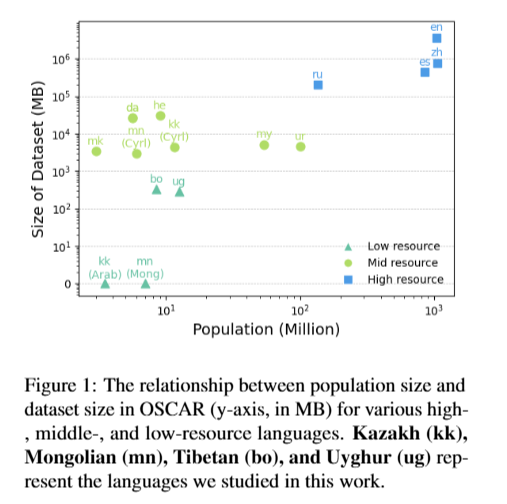
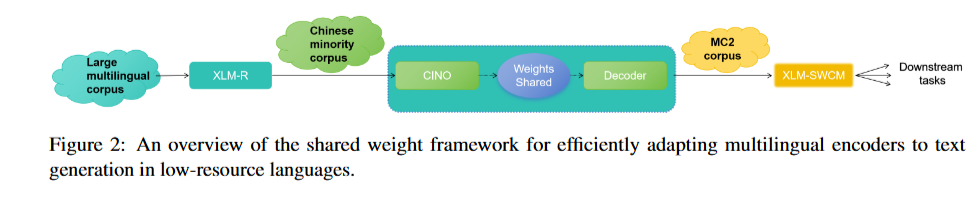
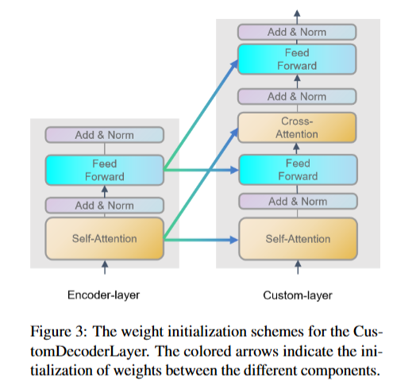
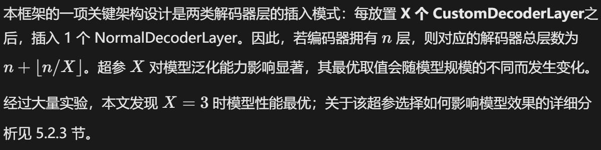
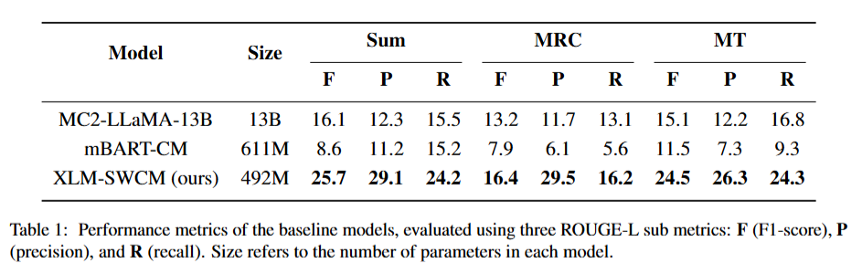
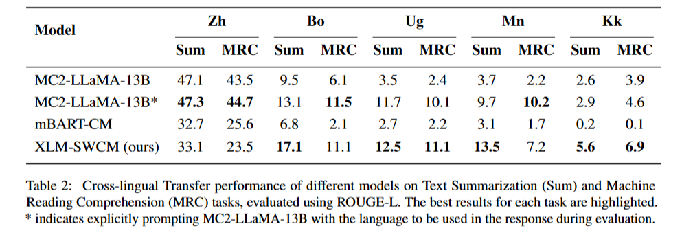
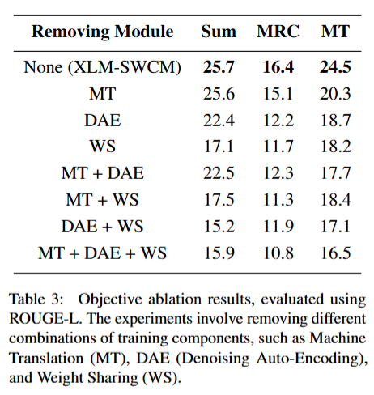
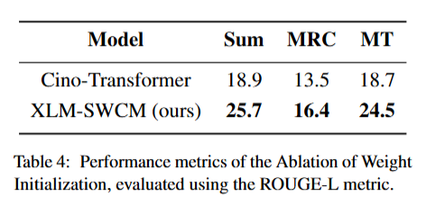
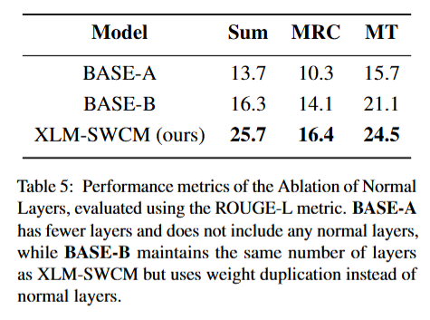
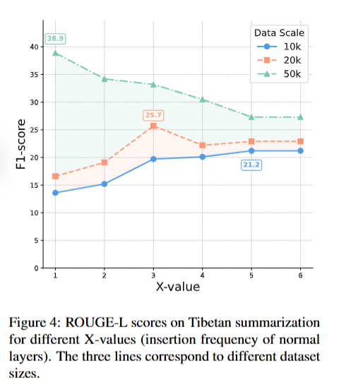

# 多语言编码器的潜在能力远超你的认知：面向极低资源语言的权重共享预训练

2025-ACL

中央民族大学、上海交通大学

# Abstract

尽管 XLM‑R 等多语言语言模型推动了自然语言处理领域多语言技术的发展，但这类模型在极低资源语言上的表现依旧很差。雪上加霜的是，LLaMA、通义千问（Qwen）等现代大语言模型支持的语种数量远少于 XLM‑R，这导致世界上许多语言都没有可用的文本生成模型。为解决这一难题，本文提出一种全新框架，将多语言编码器适配于极低资源语言的文本生成任务。该框架复用编码器与解码器之间的权重，使模型能够利用编码器已经学习到的语义空间，在低资源语言场景下实现高效学习与良好泛化。我们将该框架应用于四种中国少数民族语言，构建了 XLM‑SWCM 模型；实验表明，即便对比规模大得多的模型，该模型在各类下游任务上依旧具备更优异的性能。

# 1 Introduction

近年来，随着 XLM‑R（Conneau 等人，2020）、mBART（Liu 等人，2020）、mT5（Xue 等人，2021）等多语言预训练模型不断发展，语言模型在多语言任务上取得了显著进展，在高资源语言上效果尤为突出。然而，藏语、维吾尔语、哈萨克语、蒙古语这类在中国拥有数百万使用者的低资源语言，模型支持情况依旧十分糟糕。这几种语言中，藏语使用者超 1000 万，维吾尔语超 1100 万，哈萨克语约 300 万，蒙古语约 700 万，但现有多语言语料库中，它们的数据占比严重不足。如图 1 所示，在 OSCAR（Jansen 等人，2022）这类主流多语言语料库中，这些语言的使用人口规模和可用数据量之间存在巨大差距。哈萨克语与蒙古语的处境尤为严峻，几乎没有可用数据，导致主流多语言模型很难纳入这两种语言。

尽管 mBART、mT5 等模型宣称能够支持数百种语言，但这些模型并未使用中国少数民族语言数据进行训练。相比之下，LLaMA（Touvron 等人，2023）、通义千问 Qwen（Yang 等人，2024）这类更先进的多语言大语言模型，所支持的语种数量甚至更少。 

这一技术缺口凸显出，我们需要针对性方案来解决极低资源语言下的文本生成难题。为应对该挑战，<u>本文提出一种全新框架，可以将多语言编码器高效拓展为编码器‑解码器架构</u>。==针对低资源语言训练数据稀缺的问题，我们在编码器和解码器之间引入权重共享机制：将从编码器迁移过来的权重与随机初始化的权重交错排布，使模型能够在低资源条件下高效适配文本生成任务==。

针对上述四种中国少数民族语言开展的大量实验证明，本文所提方法具备显著优势：模型收敛速度更快、泛化效果更佳，同时拥有强大的跨语言迁移能力。本文提出的模型 XLM‑SWCM（面向中国少数民族的 XLM 权重共享模型），在文本摘要任务上相比基线模型 mBART 最高提升 199%，在阅读理解任务上最高提升 108%；并且在跨语言迁移实验条件下，性能优于参数量大得多的 MC2‑LLaMA 13B 模型（Zhang 等人，2024b）。

总而言之，本文的主要贡献如下：

- 1）提出一种权重共享框架，能够将多语言编码器高效适配至低资源语言的文本生成任务；
- 2）基于该方法训练得到面向多种中国少数民族语言的 XLM‑SWCM 模型；
- 3）开展大量实验，验证 XLM‑SWCM 相较于同等规模基线模型以及规模大得多的大语言模型具备更优性能，证明了本文框架的可行性。

我们的代码与模型将在论文发表后开源公布。

# 2 Related Works

## 2.1 Multilingual Corpus

CC100、mC4、OSCAR、CulturaX、Madlad‑400 等大规模多语言语料库的发布，推动了多语言大语言模型（LLM）的发展（Wenzek 等人，2020；Raffel 等人，2019；Jansen 等人，2022；Nguyen 等人，2024；Kudugunta 等人，2023）。尽管这些资源在一定程度上覆盖了部分低资源语言，但中国少数民族语言的数据覆盖依旧存在公认的短板，该问题主要源于各语言书写系统之间的巨大差异。

中国少数民族语言所使用的书写系统，往往与世界其他地区同语系变体的书写系统存在差异。以维吾尔语为例：我国境内的维吾尔语主要采用阿拉伯字母书写（UEY—— 维吾尔阿拉伯文），拉丁字母（ULY—— 维吾尔拉丁文）仅作为补充书写形式。与之相对，俄罗斯及中亚地区使用的维吾尔语则采用西里尔字母书写（USY—— 维吾尔西里尔文）。在采集少数民族语言数据时，上述多语言语料库要么无法区分这些不同书写体系，要么仅收录其中某一种书写体系的数据，如图 1 所示。

近期发布的**中国少数民族多语言语料库 MC2**（Zhang 等人，2024b）填补了中国少数民族语言预训练语料的空白，该语料库覆盖四种数据匮乏的语言：藏语、维吾尔语、哈萨克语与蒙古语。本研究将该数据集作为主要预训练语料。

## 2.2 多语言语言模型的发展

过去数年间，自然语言处理领域涌现出多款预训练语言模型的多语言变体，例如 mBART（Liu 等人，2020）与 mT5（Xue 等人，2021）。这类模型最多可支持 100 种语言，并展现出强大的跨语言迁移能力。近年来，大语言模型（LLM）的出现彻底变革了多语言自然语言处理技术。PaLM（Chowdhery 等人，2023）、BLOOM（Scao 等人，2022）等模型在多语言能力上取得重大进展；而 LLaMA 系列（Touvron 等人，2023）及其多语言变体，降低了多语言大模型的使用门槛。以 XGLM、NLLB（Lin 等人，2022；Costa‑jussà 等人，2022）为代表的专用模型，则致力于拓展语言覆盖范围，提升数百种低资源语言上的跨语言迁移性能。==但上述模型中，几乎没有能够支持中国少数民族语言的==。

## 2.3 中国少数民族语言的自然语言处理

为提升中国少数民族语言的可研究可用性，现有前期研究主要致力于构建面向各类 NLP 任务的标注数据集。相关工作主要围绕三大任务类型展开：文本分类（Qun 等人，2017；Shi 等人，2023）、问答任务（Sun 等人，2021）以及机器翻译（Zhang 等人，2024a）。针对少数民族语言专门训练的代表性模型包括 CINO（Yang 等人，2022）、MiLMo（Deng 等人，2023）以及 TiBert（Liu 等人，2022）。尽管已经取得上述进展，但这些模型均未公开其预训练语料；同时，能够完成少数民族语言文本生成的模型仍然存在明显缺口。

# 3 Method

## 3.1 将编码器适配于文本生成任务

### 3.1.1 Framework Overview

本节将介绍权重共享框架。该框架利用编码器与解码器之间的权重共享机制，高效地将多语言编码器适配到低资源语言的文本生成任务。

完整流程如图 2 所示。本工作以 CINO（Yang 等人，2022）为起点，CINO 是基于 XLM‑R 针对中国少数民族语言做持续预训练得到的模型。我们复制 CINO 的权重来初始化解码器层以实现知识迁移，并将编码器与解码器的部分权重进行绑定，实现高效训练。我们将该模型命名为 XLM‑SWCM，在 MC2 语料库上完成预训练后，将其应用于下游任务，涵盖单语言微调与跨语言迁移两类场景。

### 3.1.2 Model Architecture

与原始 Transformer 类似，本文所提出的模型包含两个主要组件：

编码器：采用预训练的仅编码器模型，具体为 CINO—— 这是针对中国少数民族语言增强优化后的 XLM‑R 变体。

解码器：带有专用权重迁移机制的 Transformer 解码器堆叠层。为平衡编码器大规模预训练阶段习得的知识与下游生成任务所需的新知识，本文设计两类解码器层：`NormalDecoderLayer`与`CustomDecoderLayer`。二者与编码器保持完全一致的隐藏维度、中间层维度以及注意力头数量。

**NormalDecoderLayer（普通解码器层）**：权重随机初始化的标准 Transformer 解码器层。采用传统架构，依次执行自注意力、交叉注意力与前馈网络计算。该类层使模型能够从零开始学习生成任务专属特征，对从编码器迁移过来的知识形成补充。

**CustomDecoderLayer（自定义解码器层）**：经过修改的 Transformer 解码器层，继承来自编码器的预训练权重。该层采用增强型结构，设置<u>两个位置经过特殊设计的前馈网络</u>：FFN1 置于自注意力与交叉注意力之间，FFN2 放置在交叉注意力之后；两个前馈网络各自配备独立的层归一化与残差连接，如图 3 所示。CustomDecoderLayer 的全部权重均继承自预训练编码器，以此复用编码器已经学习到的表征。

### 3.1.3 权重共享机制

在本文框架中，预训练编码器仅包含自注意力模块与前馈网络模块；而解码器层若要实现有效生成，则需要同时具备自注意力与交叉注意力机制。因此，本文设计了特殊方案用于权重的初始化与复用，如图 3 所示。

对于`CustomDecoderLayer`的权重初始化，解码器的自注意力与交叉注意力权重均由编码器的自注意力模块初始化。与之类似，解码器层中的两个前馈网络（FFN）模块的权重，均由对应编码器层的前馈网络模块初始化。该机制减少了需要学习的有效参数量，加速模型收敛，在保证模型稳定性的同时，实现预训练编码器语言知识的高效迁移。

## 3.2 Pretraining

### 3.2.1 Pretraining Tasks

本文采用多任务训练方式开展预训练。主任务为基于 mBART 降噪自编码（DAE）策略的自监督学习。该策略利用解码器预测输入序列中被掩码的部分，帮助模型从编码器的词级完形填空任务平滑过渡到序列生成任务。

此外，本文将机器翻译作为辅助训练目标，重点关注汉语与中国各少数民族语言之间的翻译任务。具体而言，训练数据包含汉语与少数民族语言的双向翻译平行语料。该辅助目标能够提升模型的跨语言迁移能力，进而改善模型在各类低资源语言处理任务上的效果。

### 3.2.2 Training Data

**THUCNews**（清华大学自然语言处理组，2016）是中文新闻数据集，来源于 2005‑2011 年间新浪新闻 RSS 订阅源的历史数据，包含约 74 万篇新闻文本。本文从该数据集中抽取了一部分简体中文新闻文本子集。

**MC2**（Zhang 等人，2024b）提供面向中国多种少数民族语言的多语言数据，包含藏语、维吾尔语、哈萨克语以及蒙古语。具体的数据规模详见附录 A。该单语数据集与 THUCNews 共同作为 DAE 降噪自编码任务的训练数据。

机器翻译数据集利用谷歌翻译构建，生成汉语与四种少数民族语言（藏语、维吾尔语、哈萨克语、蒙古语）之间的双向翻译句对。由于这些低资源语言的平行语料资源匮乏，本文采用了不同的数据构建策略：针对维吾尔语、哈萨克语以及蒙古语，人工整合零散数据集，并借助可靠的英‑汉翻译系统，将已有的英语‑少数民族语言句对转换为汉语‑少数民族语言句对。对于藏语，则从数据相对丰富的 TibetanSFT 语料库中进行采样 ¹。全部翻译结果均经过母语者核验以保障质量；每种语言选取 2000 条句对，为四种少数民族语言构建均衡的辅助训练数据。

将这三类语料库进行合并后，整合得到的数据集能够让模型同时高效处理高资源语言与低资源语言，提升模型的跨语言迁移能力以及多语言处理能力。

# 4 Experiments

## 4.1 Pretraining

**训练配置** 模型共训练 8 个轮次，峰值学习率设置为 \(1\mathrm{e}{-4}\)，使用 AdamW 优化器（Loshchilov 和 Hutter，2019），全局批次大小为 600，采用预热占比为 0.1 的线性学习率调度器。最大序列长度设置为 256 token，开启混合精度训练以优化内存占用与训练效率。为保证训练稳定性，将梯度范数裁剪至 1.0。模型在两块 NVIDIA A800（80GB 显存）GPU 上完成训练，整体训练耗时 92 小时。

**模型适配** 本文扩展了模型词表，新增专用语言标记符（`<bo>`、`<kk>`、`<mn>`、`<ug>`、`<zh>`），用于处理目标语言（藏语、哈萨克语、蒙古语、维吾尔语与汉语）。这些语言标识直接加在模型输入的句首起始标记`<s>`（bos token）之后。该修改能够保证模型在预训练以及下游任务微调阶段，均可有效处理并区分不同语言。后续全部实验均统一采用该处理方式。

基于上述配置，本文以 **CINO‑base‑v2** 作为编码器，训练得到全新的序列到序列模型 XLM‑SWCM，参数量为 4.57 亿。详细架构配置参见附录 B。

## 4.2 下游任务

### 4.2.1 Experiment Setting

为评估 XLM‑SWCM 的模型能力，我们在低资源与高资源语言上开展三项下游任务的微调实验：文本摘要、机器阅读理解（MRC）以及机器翻译。选取这几项任务，旨在覆盖自然语言处理中多样化的文本生成场景。

**单语言微调** 由于低资源语种带标注数据稀缺，单语言微调实验主要以藏语为对象，藏语拥有若干公开数据集：

- 文本摘要：该任务使用 Ti‑Sum 数据集（Xiaodong，2022），包含 2 万组标题‑文章句对。
- 机器阅读理解（MRC）：本任务主要使用 TibetanQA 数据集（Sun 等人，2022），该数据集标称包含 2 万条样本，但公开可获取的仅有 2000 条。因此本文通过融合来自 TibetanSFT 语料库的 5000 条样本，以及借助谷歌翻译从中文机器阅读理解数据集（Cui 等人，2019）翻译得到的 3000 条样本对其进行扩充。通过该方式构建出总计 1 万条样本的完整数据集。
- 机器翻译：机器翻译任务同样使用 TibetanSFT 语料库，经过清洗处理后得到 5 万条汉藏双向平行句对。

**跨语言迁移** 除单语言微调之外，本文还开展跨语言迁移实验，用来测试 XLM‑SWCM 在多种低资源语言上的泛化能力。该实验旨在评估：模型在高资源语言（简体中文）上完成微调，再搭配极少量目标语种样本之后，在藏语、维吾尔语、蒙古语以及哈萨克语上的效果。

- 文本摘要：汉语部分使用公开数据集 LCSTS（Hu 等人，2015），该数据集包含从各类中文门户网站抓取的 10 万条样本。对于四种少数民族语言，每种语言从对应语种新闻门户网站抓取约 3000 条经过清洗的样本，使用新闻标题作为摘要。
- 机器阅读理解（MRC）：中文采用 CMRC 2018 数据集（Cui 等人，2019），共包含 1 万条样本。藏语使用从公开的 TibetanQA 数据集中抽取的 500 条样本。其余三种少数民族语言（维吾尔语、蒙古语、哈萨克语），借助机器翻译工具对 MRC 数据进行翻译与清洗，最终每种语言各筛选 500 条样本。

本文选用两组基线模型，保证在处理中国少数民族语言时具备较全面的覆盖能力与可靠的性能。两个模型均在 MC2 数据集上开展继续预训练。第一个基线模型为 MC2‑LLaMA‑13B，该模型基于前人工作中的 LLaMA2‑Chinese 构建（Zhang 等人，2024b）。第二个基线模型 mBART‑CM，由 mBART‑cc25 改造而来，对词表进行扩充，加入各少数民族语言专属词元。

**训练设置**  XLM‑SWCM 与 mBART‑CM 均为序列到序列模型，采用标准训练配置完成微调。这两个模型训练轮次设置为 50 轮，批次大小为 200 条样本，以保证充分学习并取得最优效果。MC2‑LLaMA‑13B 模型采用 LoRA 微调（Hu 等人，2022），秩设置为 8，训练 3 个轮次。

### 4.2.2 Experimental Results

如表 1 所示，在全部三项任务上，XLM‑SWCM 的性能均持续优于各基线模型。尽管参数量更少，但 XLM‑SWCM 相比 mBART‑CM 取得了显著的性能优势，甚至性能超过规模大得多的 MC2‑LLaMA‑13B。

值得注意的是，相较于 mBART‑CM，XLM‑SWCM 在文本摘要任务的 F1 值上取得高达**198.8%**的提升，同时机器阅读理解任务的 F1 值也实现了**107.6%**的大幅增长。这些显著的性能增益，来源于 XLM‑SWCM 高效的权重共享框架，该框架能够在资源受限场景下充分利用预训练编码器特征。即便在 seq2seq 架构相同、训练语料完全一致的条件下，XLM‑SWCM 依旧表现出更强的训练效率与学习能力。

MC2‑LLaMA‑13B 拥有更丰富的预训练语料以及更大规模的参数，与之相比，XLM‑SWCM 在文本摘要任务上 F1 值高出 59%，机器阅读理解任务 F1 提升 24.1%，机器翻译任务 F1 值高出 62.3%。上述结果证明，在资源受限环境下，XLM‑SWCM 的权重共享框架具备出色效果，使其成为面向中国少数民族语言任务的更优方案。

表 2 展示了 XLM‑SWCM 与各基线模型在跨语言迁移设置下的实验结果。在源主语言（汉语）上，基线模型表现更优，这源于其更大的参数量以及规模更大的简体中文预训练语料。但在向少数民族语言做泛化时，XLM‑SWCM 展现出优异的适配能力，性能大幅超越基线模型。例如 mBART‑CM 难以区分不同语种，即便输入中附带语种标签，生成结果仍经常退化为输出主语言（汉语）。与之类似，MC2‑LLaMA‑13B 也存在语种相关错误；不过如 MC2‑LLaMA‑13B * 所示，当显式告知模型当前语种类型时，该模型效果会有所提升。

在文本摘要任务上，XLM‑SWCM 优于所有基线模型。具体而言，对比效果最优的基线模型 MC2‑LLaMA‑13B*，XLM‑SWCM 在藏语（Bo）、维吾尔语（Ug）、蒙古语（Mn）上分别取得 30.5%、6.8%、39.1% 的显著提升。在机器阅读理解任务中，XLM‑SWCM 在绝大多数语言上同样具备有竞争力的性能；仅在藏语与蒙古语上的表现略逊于 MC2‑LLaMA‑13B*。

综上，上述实验表明，XLM‑SWCM 能够有效利用权重共享机制，最大限度复用预训练编码器的语义空间，在数据与参数量均受限的中国少数民族语言任务场景中展现出优异性能。

# 5 Ablation Studies

在本节中，我们开展一系列消融实验，用以评估本文框架中关键组件带来的影响；这些组件对提升模型多语言能力、增强模型在低资源语言上的泛化效果起到关键作用。<u>消融实验基于藏语微调任务完成，微调配置与 4.2.1 节保持一致</u>。

## 5.1 目标函数消融

我们首先针对模型的三个核心模块开展消融：DAE 预训练、机器翻译任务、权重初始化，通过逐一移除单个模块以及模块组合的方式进行验证，实验结果如表 3 所示。移除上述任意一个组件都会损害模型性能，具体表现为：

- 机器翻译（MT）：无论是单独移除该模块（文本摘要任务指标仍可达到 25.6），还是组合移除（同时移除 MT+DAE 与仅移除 DAE 的得分相近），都可以看出，移除机器翻译预训练目标对各项任务性能的影响相对较小。
- 去噪自编码器（DAE）：移除 DAE 预训练会导致全部三项下游任务性能出现大幅下降；在组合消融（同时移除 DAE 与权重初始化）时该负面影响会进一步加剧，说明 DAE 预训练对于构建模型基础文本生成能力起到根本性作用。
- 权重共享（WS）：在所有模块当中，移除权重共享带来的负面影响最大。无论是单独移除该模块，还是各类多组件组合消融场景下，均出现最大幅度的性能衰减，证明权重共享是该模型在低资源场景下取得良好效果的最核心组件。

简言之，尽管这三个组件均对模型性能起到正向作用，但权重共享是其中最为关键的组件。该结果表明，权重共享作为多语言模型一项重要的架构设计，在资源受限场景下尤为重要。

## 5.2 Structure Ablation

我们还开展实验，评估本文所提框架中不同结构组件的影响。该组实验旨在探究解码器权重初始化以及普通层的插入操作对模型性能会产生怎样的作用。

### 5.2.1 权重初始化的影响

首先，我们训练一个名为 CinoTransformer 的基线模型。与 XLM‑SWCM 不同，该模型的解码器采用随机初始化，且解码器层数与编码器层数保持一致。该模型使用与 XLM‑SWCM 完全相同的 DAE 和机器翻译（MT）任务进行预训练，但**不使用权重共享机制**；之后采用与 XLM‑SWCM 相同的配置在下游任务上完成微调。

表 4 的实验结果证明了本文权重初始化方案的有效性。XLM‑SWCM 通过将编码器权重迁移至解码器，能够在训练数据有限的条件下高效适配文本生成任务，在全部任务上性能均优于 Cino‑Transformer。

### 5.2.2 随机初始化层的影响

其次，我们探究在解码器的定制层之间插入标准 Transformer 层带来的影响。为评估该改动的实际效果，我们采用两个基线模型作为对比：

- 基线 A（不插入标准层的 XLM‑SWCM）：该模型与 XLM‑SWCM 主体保持一致，只是不在定制层架构中插入任何标准 Transformer 层。由于没有标准层，解码器的总层数相应减少。

- 基线 B（权重复制模型）：该模型不插入标准层，而是直接复制上一层的权重，以此保证模型参数量保持不变。这会使得连续多层的权重完全相同，借此我们可以分离出**插入随机初始化标准层所带来的实际影响**。
- 表 5 的实验结果表明，在解码器中插入标准层会带来显著影响。BASE‑A 模型层数更少，在所有任务上性能表现最差。BASE‑B 虽然与 XLM‑SWCM 保持相同层数，但缺少随机初始化权重，性能虽有一定提升，但依旧不及完整模型。

综上，以上结果表明，随机初始化的标准层对于将编码器适配至文本生成任务同样至关重要。

### 5.2.3 标准层插入频率的影响

第三，我们深入探究解码器中标准层的插入频率带来的影响，以及该因素如何与不同规模的数据集产生交互作用。本实验从两个维度展开：

- 标准层插入频率：我们探究参数 X 的不同取值，即**每 X 个定制共享层之后插入一个标准层**，X 取值范围为 1‑6。上述全部实验组均采用与 XLM‑SWCM 完全一致的预训练配置。
- 微调数据集规模的影响：我们在不同规模的数据集上评估模型性能，样本量分别为 1 万、2 万和 5 万条。由于现有 Ti‑SUM 数据集仅包含 2 万条样本，我们从国内各大主流网站爬取并清洗了额外 3 万条新闻文章对其进行扩充。该实验维度可以用来探究可用数据量与标准层插入频率二者之间的交互作用。

实验结果如图4所示：

对于小规模数据集（1 万样本），**X 取值越大，模型效果越好**。在数据有限的情况下，规模更小的解码器泛化能力更强；与之相反，X 取值更小（即解码器规模更大）会引发过拟合。

对于中等规模数据集（2 万样本），模型性能在 \(X=3\) 时达到峰值。这表明，适度的解码器规模能够在模型容量与可用数据量之间取得平衡。

对于大规模数据集（5 万样本），较小的 X 取得了最高的 F1 值。更大的解码器容量能够让模型充分利用规模更大的数据集。

综上，上述结果证明了本文框架具备灵活性：标准层的插入频率可根据特定任务的数据集规模进行调整。较大的X（插入更少标准层）更适合小规模数据集，而较小的X（插入更多标准层）在大规模数据集上表现最优。

# 6 Conclusion

在本研究中，我们提出了一种面向低资源语言的新型预训练框架，重点针对中国少数民族语言。该框架利用编码器‑解码器之间的权重共享机制，无需从零开始训练，即可将多语言编码器高效适配至生成任务。实验结果表明，在藏语、维吾尔语、哈萨克语、蒙古语这类长期缺乏自然语言处理研究支持的语言的多项文本生成任务上，本文模型 XLM‑SWCM 显著优于传统基线模型。该方法为构建这些极低资源语言的高性能模型开辟了新路径，同时也为相近语言之间的资源融合提供了一种颇具前景的方案。

# Limitations

受面向中国少数民族语言的预训练模型与高质量语料的获取条件所限，本研究仅选取四种少数民族语言开展实验。由于相关数据集匮乏，我们的单语言微调实验进一步限定在藏语上，这也限制了本文研究的探索范围。

因此，我们希望未来的研究能够更加关注这些少数民族语言及其他语言的高质量数据集建设，以便在大语言模型时代对这些研究不足的语言开展更为全面的探究。随着可用数据不断增多以及模型能力持续提升，针对这类语言的研究将会成为未来的重要研究方向。