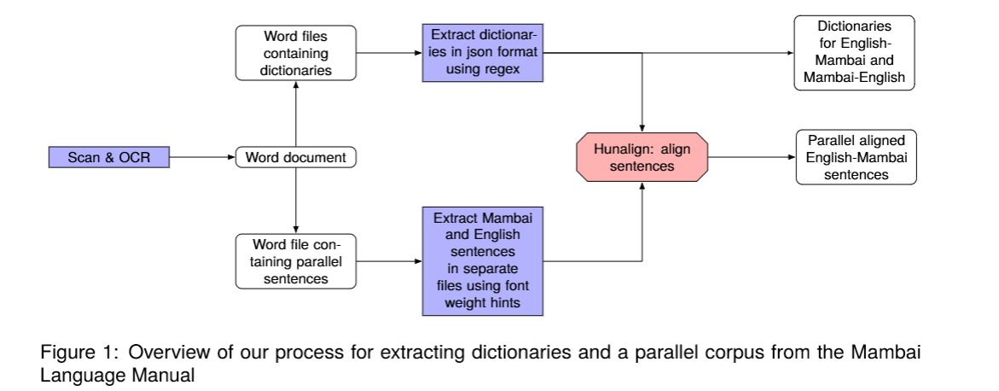
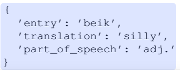
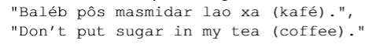
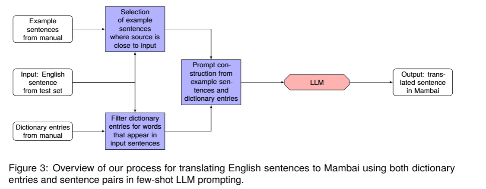
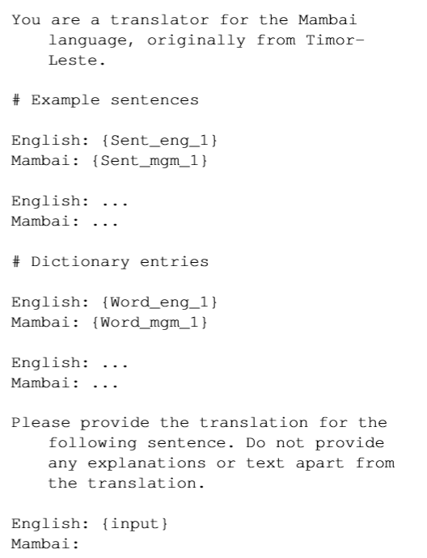
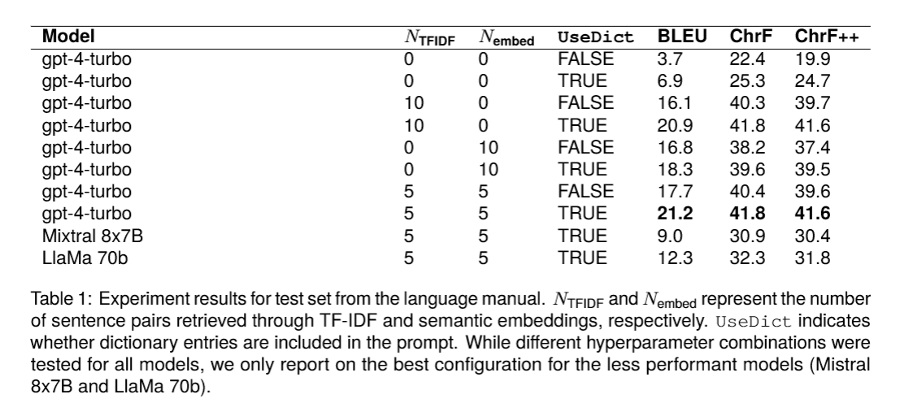
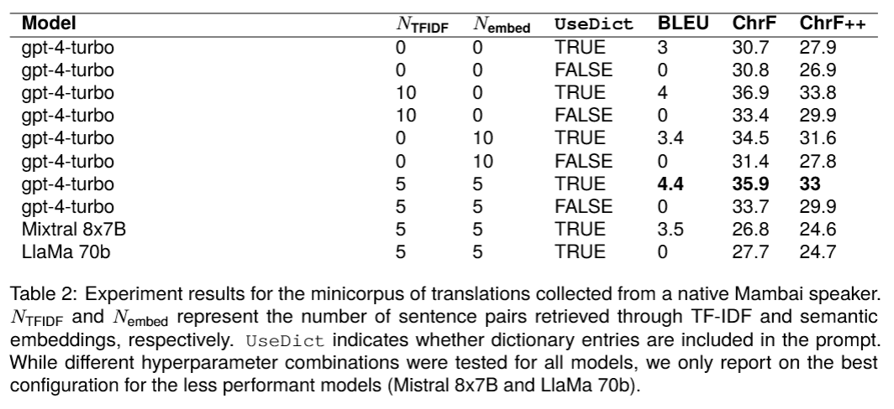
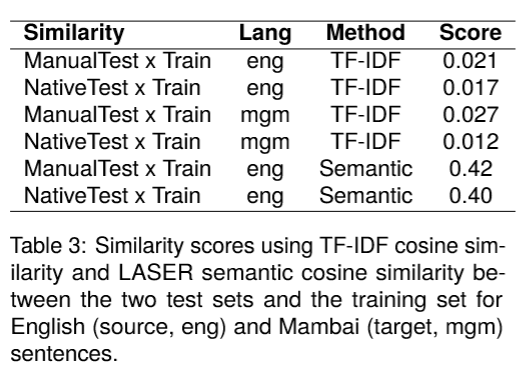

# 基于检索增强大语言模型提示的低资源机器翻译 —— 以曼拜语为研究对象

Low-Resource Machine Translation through Retrieval-Augmented LLM Prompting: A Study on the Mambai Language

LREC‑COLING 2024 CCF-B

# Abstract

本研究探究利用大语言模型（LLM）实现<u>英语向曼拜语</u>的机器翻译。曼拜语是东帝汶使用的一门低资源南岛语，母语使用者约 20 万人。研究基于一份曼拜语语言手册构建全新语料，并补充由母语者翻译得到的句子，以此考察低资源场景下，大语言模型少样本提示在机器翻译任务中的实际效果。本研究选取<u>开源与闭源大模型</u>（LlaMa 2 70b、Mixtral 8x7B、GPT‑4）开展实验，方法上策略性挑选平行句对与词典词条构造提示，旨在提升翻译准确度。实验表明，在提示中加入词典词条，同时混合使用 TF‑IDF 与语义嵌入两种方式检索示例句子，能够显著提升翻译质量。但实验结果同时显示，模型在不同测试集上的翻译性能存在巨大差距：在语言手册来源的测试数据上，BLEU 分数最高可达 21.2；而在母语者提供的测试集上，BLEU 分数最高仅为 4.4。该结果凸显，在对低资源语言机器翻译开展评测时，必须使用多样化、具备代表性的语料。本研究为低资源机器翻译的大模型少样本提示方案提供研究参考，并公开了首份曼拜语基础语料。

**关键词**：低资源语言、南岛语、大语言模型、提示、词典、平行数据

# 1 Introduction

大语言模型（LLM）展现出强大能力，能够完成并未经过专门训练的各类自然语言处理（NLP）任务，包括命名实体识别（Mehta 和 Varma，2023）、文本分类（Sun 等人，2023）、文本摘要（Zhang 等人，2023b）以及机器翻译（Hendy 等人，2023；Kocmi 等人，2023；Chowdhery 等人，2022）。在高资源语言的翻译任务上，大语言模型可以与传统编码器‑解码器机器翻译模型相媲美；但在处理低资源语言的互译时，其性能却不及传统机器翻译模型（Robinson 等人，2023；Hendy 等人，2023；Garcia 等人，2023）。

尽管大语言模型可以通过零样本提示获得中等偏上的翻译精度（Wang 等人，2021），但少样本提示能够进一步提升翻译效果（Zhang 等人，2023a）。针对大模型提示中示例句选取的相关研究表明：与源文本相似度高的示例，翻译效果未必优于随机选取的示例（Vilar 等人，2023）；不过域内示例能够提升技术领域下的翻译精度（Agrawal 等人，2023）。具体来看，在英语转基尼亚卢旺达语的机器翻译任务中，Moslem 等人（2023）发现，使用域内示例替换随机示例后，ChrF 指标提升了 11 个点。

本文借鉴域自适应的思路，探究通过精心挑选与源文本相近的句子和词汇作为提示素材，能否借助大语言模型实现面向极低资源语言的翻译。本文的研究对象为曼拜语，这是东帝汶一门以口头使用为主的语言，母语使用者约 20 万人（东帝汶总统计局，2015）。本研究全部提示示例均取自 Hull（2001）编写的语言手册，该手册包含英‑曼拜平行句对以及双语词典。我们分别基于从该手册中随机抽取的句子子集、以及由曼拜语母语者整理得到的小型翻译语料，对机器翻译质量开展评测。

我们发现翻译精度受三大因素影响，差异十分显著：(1) 评测所使用的测试集；(2) 翻译所选用的大语言模型；(3) 提示词中所包含的示例。当采用 10 样本翻译设置，使用 GPT‑4，并且在提示词中混合引入通过语义嵌入与 TF‑IDF 检索得到的句子时，对于取自该语言手册的测试句子，BLEU 分数最高可达 23.5。但对于该域外测试句子（收集得到的全新句子……），**全部实验配置下的 BLEU 分数均降至 5 以下**。

本研究结果揭示了在对低资源语言机器翻译开展评测时，仅依赖单一数据源所存在的风险。尤其对于曼拜语这类**词汇、正字法、句法均未标准化**的语言，单一语料库会对自然语言处理实验产生巨大影响，却未必能够代表该语言各类变体的真实情况。

# 2 曼拜语

东帝汶（也作 East Timor）是东南亚的一个半岛国家，截至 2022 年人口为 130 万（东帝汶总统计局，2022）。该国官方语言为葡萄牙语与帝力德顿语（东帝汶政府，2002，也写作 Tetum），境内拥有 30 余种本土语言，分别属于南岛语系与巴布亚语系（Kingsbury，2010）。

曼拜语（也拼作 Mambae）是该国使用规模第二大的母语，仅次于德顿语，母语使用者约 20 万人（东帝汶总统计局，2015）。该语言属于南岛语系，主要在埃尔梅拉、阿伊莱乌、马努法希和艾纳鲁行政区使用（Berlie，2008），**没有标准化的正字法**（Hull，2001）。曼拜语存在三种差异明显的变体，本文重点研究其南部变体，该变体主要通行于艾纳鲁、萨梅以及哈图‑布伊利库行政辖区（Fogaça，2013）。

将文本翻译为曼拜语，能够让曼拜语社群获取更多有价值的资料。例如，东帝汶政府设有名为 EMULI 的母语教育项目。该项目研究发现，接受母语授课的学生，其阅读理解与数学水平要高于接受葡萄牙语授课的学生。该项目会使用翻译后的文本作为课程教学材料（Gusmão，2023；Walter，2016）。

遗憾的是，按照 Joshi 等人（2020）提出的分类体系，曼拜语被划为 0 类 ——“被遗忘语言”，即 “在语言技术领域过去一直、如今仍然被忽视的语言”。在 OPUS 语料库（Tiedemann，2009）中检索曼拜语句子，仅能得到 36 条句子，全部来自 Tatoeba²。据本文所知，目前宣称支持曼拜语的自然语言处理工具仅有语言识别模型 GlotLID（Kargaran 等人，2023）与 MMS（Pratap 等人，2023）。在 MT560（Gowda 等人，2021）、FLORES‑200 评测基准（NLLB 团队，2022）这类主流低资源语言数据集当中，均未收录曼拜语。

# 3 数据提取方法

由于该语言没有任何机器可读格式的资源，我们首先对现有资料进行数字化处理。数据提取的整体流程如图 1 所示。

## 3.1 实验材料

本研究的主要数据源为《曼拜语语言手册》（Hull，2001）。该手册以艾纳鲁变体为基准，面向外国学习者讲授曼拜语基础知识。这份共计 109 页的资料包含发音指南、语法说明、常用会话手册以及英‑曼拜双语词典。

为验证实验结果的泛化能力，我们与一名曼拜语母语者开展合作，由其将 50 条英语句子翻译为曼拜语，构建小型测试语料。由于曼拜语不存在规范化的正字法，我们尽量使拼写方式与手册保持一致，但并未要求译文复刻手册中的句法结构。

## 3.2 OCR 处理流程

我们拿到的《曼拜语语言手册》为纸质版本，针对该手册，我们执行了如下 OCR 处理流程：

- 使用光学变焦相机对该书进行扫描，以降低径向畸变效应，提升 OCR 识别质量；
- 使用开源软件 ScanTailor⁴对图像进行半自动纠偏，并将图像处理为平整的黑白图像；
- 在商业软件 ABBYY FineReader 15⁵中，我们参照手册所使用的字符集自定义了语言字母表；选用同为南岛语系的印尼语作为备用语言，具体设置如图 2 所示。OCR 识别结果保存为 Word 文档，保留字体格式。
- 随后我们将提取得到的数据人工划分为三个数据集：
  - 手册中包含平行句对的部分（共计 14347 词）
  - 手册中英‑曼拜双语词典部分（共计 4023 词）
  - 手册中的曼拜‑英语词典部分（共计 4522 词）

## 3.3 文本语料库

本小节介绍语料库构建流程：基于 3.2 节生成的 Word 文档，我们构建 JSON 格式的英‑曼拜双语词典以及英‑曼拜平行句对语料库。

### 3.3.1 词典提取

针对词典文件，我们通过下述流程提取三元组（词条、词性、译文）：

- 借助 python‑docx 库⁶读取文件，保留字体粗细信息，并将**粗体文本识别为词典词条**；
- 使用正则表达式匹配词性（若存在词性信息）。
- 将剩余文本作为该词条对应的释义内容。
- 如果一个词条存在多条释义，则以分号 “;” 和逗号 “,” 作为分隔符对其进行拆分，完成数据反规范化处理。

该流程输出 JSON 格式词典，其中英‑曼拜方向词典包含 1790 个词条，曼拜‑英方向词典包含 1592 个词条。各词条在有对应信息的情况下还会附带词性信息，例如：

### 3.3.2 平行句对提取

由于没有嵌入模型或机器翻译系统支持曼拜语，因此我们无法借助句子嵌入方法（Thompson and Koehn, 2019）或回译技术（Sennrich and Volk, 2011）从提取得到的文档中挖掘平行句对。为此，我们结合 Gale‑Church 句子长度特征（Gale and Church, 1993）与基于 Hunalign⁷句子对齐工具的词汇相似度完成句对抽取（Varga et al., 2007）。

我们依据字体粗细区分句子：粗体文本识别为曼拜语句子，常规字体识别为英语句子，大写文本则用作章节分隔标记。针对每个章节，将曼拜语句子与英语句子分别存放至独立文本文件，连同 3.3.1 节抽取得到的双语词典一同输入 Hunalign 工具。Hunalign 输出制表符分隔的对齐句对，每一组句对附带一个对齐分数。在人工核验 100 条抽样句子后，我们将分数阈值设定为 0.2：该阈值可以保留大量对齐质量良好的句对，同时过滤掉对齐效果差的样本。过滤掉分数低于该阈值的句对后，这本会话手册最终得到 1187 条平行句对；原始待对齐候选双语文本总计 1275 条。

由于句子取自语言教学手册，句子普遍偏短：曼拜语单句平均词数为 5.05，英语单句平均词数为 5.66。部分句子的括号内包含备选词汇，我们对此予以保留，示例如下：

# 4 基于检索增强大模型提示的曼拜语翻译

全部所需数据准备完毕后，接下来进入机器翻译环节。翻译的整体流程如图 3 所示。

## 4.1 设计思路

Adelani 等人（2022）的研究表明，数千条高质量句对就能够显著提升低资源机器翻译的性能。这给予我们启发：一份数据规模处于同一数量级的语言手册，足以生成质量尚可的翻译结果。

借助大模型提示词范式，我们可以灵活地同时使用平行句对语料与词典词条。此外，相较于低资源语言往往只能获取的宗教领域语料（Haddow 等人，2022；Walter，2016），本研究所用会话手册具备更丰富的领域覆盖度。

本文开展英语‑曼拜语翻译研究，旨在回答以下研究问题：

- 给定一条英语句子，如何将双语句对语料与双语词典融入大模型提示词，从而最大化翻译准确率？
- 哪些大语言模型（开源或闭源）在向低资源语言做翻译时表现最优，不同模型之间实际观测到的性能差异如何？
- 翻译准确率在不同测试集上会呈现怎样的变化？

## 4.2 研究方法

### 4.2.1. Data setup

我们拥有包含 1187 条曼拜语‑英语平行句对的双语语料，将其随机划分：119 条（占比 10%）句子用作翻译测试集，剩余 1068 条（占比 90%）句子经过检索筛选后可用于提示词构造。由于本研究目标是完成完整句子的翻译，而非单个词汇翻译，曼拜语词典中的全部 1790 个词条均投入提示词使用。

我们还使用另一套测试语料评估翻译系统性能：该语料包含 50 条由曼拜语母语者完成的英语‑曼拜语翻译句子。这套小规模语料中的句子相对简单，但句子长度略长，单句平均词数为 9 个。英语源句的设计覆盖广泛领域，包括日常生活、教育、健康福祉、家庭关系、宗教、政治、天气、就业、饮食与农业、科技、人物性格，以及东帝汶特有历史事件。

通过使用这两套测试集，我们旨在评估模型对领域差异的鲁棒性，同时评估一类过拟合风险：即测试语料与提示词所用数据来源于同一套原始资料所带来的过拟合风险。两套测试集之间预期存在性能差异，其来源包括作者不同、出版年份不同（2001 年对比 2024 年），也可能源于二者覆盖的领域各不相同。

### 4.2.2. Prompt

我们采用 Peng 等人（2023）提出的最优提示模板，并在该模板中补充待译句子内出现词汇的词典词条，最终得到如下提示模板：

### 4.2.3. Models

本实验选用三个模型：Mixtral，该模型是机器翻译基准评测（MT‑bench）得分最高的开源模型（Jiang 等人，2024）；LlaMA‑70B（Touvron 等人，2023），其许可协议宽松，并且展现出优异的零样本翻译能力（Xu 等人，2024a）；以及 GPT‑4，尽管属于闭源专有模型，但同样具备很强的零样本翻译性能（Xu 等人，2024a）。

针对每一个模型，我们测试了如下实验配置：

- UseDict（取值为 True 或 False）：对于源语言输入（英语）中出现的每一个单词，如果该单词存在于英语‑曼拜语词典中，则将该词对应的词典释义加入提示词。
- \(N_{\text{TFIDF}}\)：通过 TF‑IDF 检索得到的句对数量。其中英语句子按照与输入文本的 TF‑IDF 相似度进行排序。该设置的设计依据为：低频词翻译难度通常更高，因此应当更频繁地在提示词中提供这类例句。\(N_{\text{TFIDF}} \in \{0,5,10\}\)
- \(N_{\text{embed}}\)：基于 LASER 语义嵌入向量检索得到的句对数量。训练集中的英语句子首先依据与输入句子的余弦相似度完成排序。\(N_{\text{embed}} \in \{0,5,10\}\)，该参数设置参照已有研究（Zhang 等人，2023a；Vilar 等人，2023；Hendy 等人，2023）。

针对上述特征参数的每一种组合，我们在两套测试集上分别计算 BLEU 与 chrF++ 指标得分：一套测试集取自语言教学手册，另一套由母语者人工翻译构建。

## 4.3. Translation Results

来自语言手册的测试句实验结果如表 1 所示，表 2 展示的是由母语者整理得到的测试集实验结果。

综上，我们得到如下实验结论：

(1) 两套测试集上的翻译准确率差异巨大。取自语言手册的测试集最高可达 23.5 BLEU（41.9 chrF++），而母语者构建的测试集上，BLEU 最高仅为 4.4（33.1 chrF++）。要解释该差异还需开展更多分析，但该结果充分说明：当测试集与提示词所用示例来源于同一套原始资料时，存在严重的过拟合风险。特别地，我们认为该结果在一定程度上对 Tanzer 等人（2024）的研究结论提出质疑。该工作同样利用单本语法手册构造提示词，开展极低资源语言翻译，但其测试集全部取自这本语法手册。

(2) 词典词条有助于提升翻译质量。在提示词中加入源文本所出现词汇对应的词典词条时，我们观测到翻译质量得到显著提升。固定其余超参数不变，在全部实验条件下均呈现该效果，BLEU 指标平均提升 3.25 个点，chrF++ 指标平均提升 2.7 个点。

(3) 将语义嵌入检索与 TF‑IDF 检索得到的句对进行混合使用，可以取得最优翻译准确率。尤其对于语言手册句子的随机划分数据集，采用 5 条 TF‑IDF 检索句对搭配 5 条语义嵌入检索句对的组合方案，性能优于单纯依靠其中任意一种检索方式获取 10 条句对的设置。本实验测试的三个大模型均呈现该规律。

(4) GPT‑4 的性能始终优于其余大语言模型。固定 \(N_{\text{TFIDF}}\) 与 \(N_{\text{embed}}\) 参数不变，对比 LlaMA‑70B 和 Mixtral‑8x7B，GPT‑4 不仅取得整体最优翻译得分，并且在每一组实验条件下翻译得分均为最高。

## 4.4 错误分析

我们发现，不同测试集之间巨大的性能差距，主要源于模型翻译输出的差异，而非英语源文本本身的差异（见表 3）：

- 我们利用英语句子的 TF‑IDF 表示，分别计算全部训练集与两套测试集之间的余弦相似度：语言手册测试集为 0.021，母语者测试集为 0.017，二者差距相对较小。但针对曼拜语目标参考译文，手册测试集、母语者测试集对应的余弦相似度分别为 0.027 和 0.012，差异要大得多。
- 在英语源语言侧，两套测试集与训练集之间的 LASER 语义相似度大致相当：手册测试集为 0.42，母语者测试集为 0.40。

通过人工审阅两套测试集上的翻译差异，我们进一步归纳出造成翻译质量指标出现巨大差距的几点潜在原因：

- 直译与意译：语言手册中的句子服务于语言学习，大多采用直译方式，这与大语言模型的输出风格相契合。与之不同，由母语者翻译得到的测试集译文往往带有更多个性化表达，和源文本用词的偏离程度更大。
- 语言变体：曼拜语语言手册于 2001 年出版，自那时起曼拜语本身已经发生演变。我们尤其注意到，本测试集的参考译文中出现了更多葡萄牙语与帝力德顿语词汇。这一现象或许表明：2002 年《东帝汶宪法》将葡萄牙语和帝力德顿语定为官方语言之后，曼拜语使用者在使用曼拜语时会更多混杂这两种语言的词汇（东帝汶政府，2002）
- 拼写差异：尽管我们尽量沿用《曼拜语语言手册》中的拼写规范，但发现本测试集部分用词的拼写形式与手册存在出入（例如连字符使用更少、部分字母省略）。这进一步印证了我们的观点：对于曼拜语这类口头使用为主的语言，语音数据集能够更好地覆盖其语言实际面貌。

# 5 Related Work

传统上，神经机器翻译系统基于对齐句对构成的平行语料库开展训练（Duong，2017）。低资源语言可用句对数量相比高资源语言往往相差数个数量级（Arivazhagan 等人，2019）。为弥补数据匮乏问题，已有研究表明，可以借助包含资源更充足的亲缘语言的多语言翻译模型，提升低资源机器翻译的性能（Arivazhagan 等人，2019；Fan 等人，2020；Team 等人，2022）。其他技术方案包括：利用单语数据进行预训练（Lample 等人，2018）；引入与文本数据共享嵌入空间的音频数据（Communication 等人，2023）；生成合成平行句对（Edunov 等人，2018），其中也包含利用双语词典构建合成语料的方法（Duan 等人，2020）。

与此同时，大语言模型的翻译能力持续提升，部分场景下性能甚至超过专用的编码器‑解码器架构机器翻译系统（Robinson 等人，2023）。如何设计合适的提示方案以提升大模型机器翻译效果已成为研究热点（Zhang 等人，2023a；Li 等人，2022）。现有研究表明，少样本提示通常能够提升机器翻译性能（Zhang 等人，2023a），并且用作少样本示例的句子类型会对翻译效果产生很大影响（Moslem 等人，2023）。<u>通过检索与输入文本相近的示例句（Kumar 等人，2023），或是获取源文本中词汇对应的词典词条（Ghazvininejad 等人，2023）来动态调整提示词，可以进一步改善机器翻译质量。</u>

鉴于极低资源语言在大语言模型预训练阶段可能完全没有对应语料覆盖，通用大模型提示技术在这类语言翻译任务上的适用性尚不明确。Tanzer 等人（2024）围绕英语‑卡拉芒语（一门濒临消亡的巴布亚语言）的机器翻译开展研究，仅依靠一本语法手册，对该问题进行了部分探索。该工作测试了多种模型（Claude 2、LlaMA、GPT‑3.5、GPT‑4）以及不同提示配置方案（注入与输入相近的例句、词典词条、手册中的语法说明），在英语译卡拉芒语方向取得最高 45.8 chrF 得分。但该研究的测试集是从这本语法手册中随机抽取的句子子集，因此其研究结论能否推广至其他作者产出的文本，或是语法手册未覆盖的领域，存在一定疑问。

认识到大语言模型在机器翻译任务上的应用潜力，以及提示词中上下文示例的重要性，本文针对低资源语言翻译开展检索增强式大模型提示实验。我们分别在两套数据集上测试翻译效果：一套取自作为语料来源的语言手册的句子子集，另一套是由曼拜语母语者为本项目专门翻译构建的测试集。

# Conclusion

本文构建了一套全新的曼拜语语料库。曼拜语约有 20 万名母语使用者，此前几乎没有可用的自然语言处理资源。该语料库包含英‑曼、曼‑英双向双语词典、取自 2001 年出版语言手册的 1187 条平行句对，以及由曼拜语母语者翻译得到的 50 条平行句对。针对英语到曼拜语翻译任务开展的大模型少样本提示实验表明：当<u>测试句子与原始语料来源高度接近时，模型可以取得中等水平的机器翻译效果；但测试句子取自独立外部语料时，翻译性能会出现显著下降</u>。该结果着重说明，测试集不应与提示词所用示例来源于同一套原始材料。我们认为，大语言模型提供了一种灵活方案，能够整合词典词条、平行句对等不同形式的稀缺语言资源；基于通用大模型的少样本提示，在低资源机器翻译任务上具备发展潜力。

# Limitations

训练集（取自《曼拜语语言手册》）与两套测试集中所使用的句子普遍偏短、句式简单。这就引出一个问题：对于长句，或是本语料库覆盖极少的专业领域文本（例如医疗、法律文本），模型的翻译效果究竟如何。

曼拜语没有标准化正字法。尽管与我们合作的曼拜语母语者尽量参照语言手册中的拼写方式，但我们推测拼写层面的差异仍然对测试集的 BLEU 得分造成了负面影响。这进一步说明，对于曼拜语这类以口语为主的语言，需要更加重视语音资源的作用（Chrupała，2023）。

曼拜语没有统一的标准正字法。尽管与我们合作的曼拜语母语者尽量沿用语言手册中的拼写规范，但我们认为拼写差异依旧拉低了测试集的 BLEU 分值。这凸显出，对于曼拜语这类主要依靠口头传承的语言，应当更加重视语音资源（Chrupała，2023）。

虽然我们获取了由曼拜语母语者构建的测试集，但该母语者并未对机器翻译生成的译文开展人工质量评估；本研究完全依靠机器翻译自动评价指标。尽管对于曼拜语这类形态变化简单的语言，BLEU 通常是较为可靠的机器翻译评价指标（Reiter，2018），但我们仍希望能够更加深入地剖析大模型生成译文存在的各类缺陷。

最后，曼拜语的语法与形态系统较为简单，这或许使得该语言能够通过少样本提示显著提升机器翻译效果。因此，本文得出的研究结论未必能够直接迁移到形态更为复杂的语言上。

# Future Work

本研究仅针对曼拜语开展实验，并未利用帝力德顿语、葡萄牙语、印尼语等资源更丰富的亲缘语言资源。在未来工作中，我们计划探究在提示词中引入帝力德顿语句子的效果；尤其是针对那些在规模有限的曼拜语语料库中覆盖度极差、但可被规模更大的帝力德顿语语料库所覆盖的领域专用文本。

在提示策略的优化方面，未来研究可以采用更加系统化的方案，例如参考 Kumar 等人（2023）的工作，该研究使用回归模型完成示例的筛选。此外，还可以测试更多检索技术，例如词袋模型，甚至可以计算输入文本与英语源端之间的 chrF 相似度用于检索。

本文使用的是通用大语言模型，这类模型在预训练阶段几乎没有接触过曼拜语文本。我们认为后续研究可以参考 Xu 等人（2024b）与 Alves 等人（2024）的方案，在执行提示推理之前，针对曼拜语或是其亲缘语言开展持续预训练，以此开展相关实验。