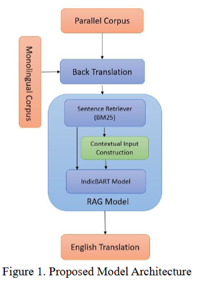
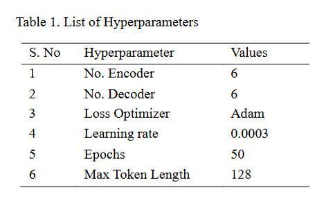
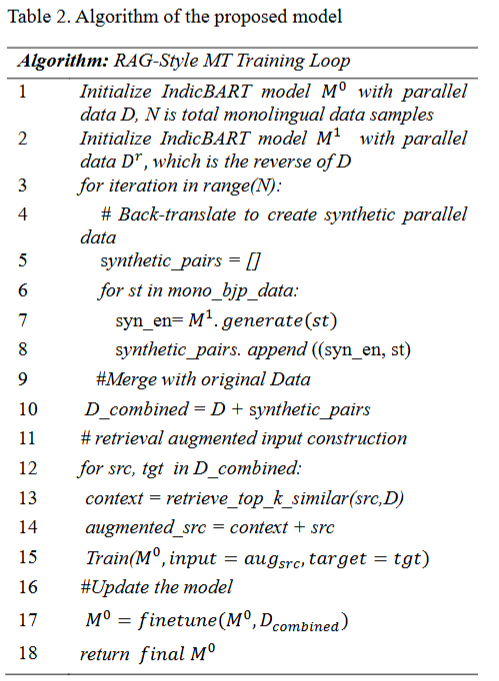
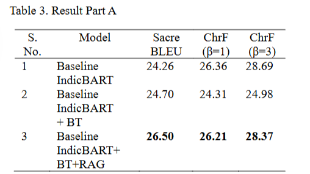
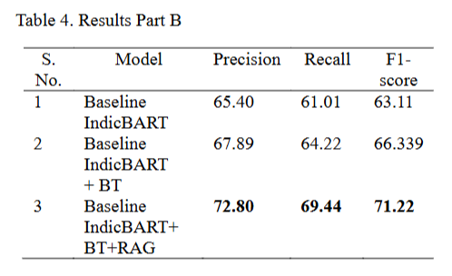

# 利用检索增强生成技术实现印度低资源语言的机器翻译

关键词：检索增强生成（RAG），低资源机器翻译，回译，BM25 检索，合成数据生成

# Abstract

由于平行语料匮乏，**低资源机器翻译（MT）**始终是一项具有挑战性的任务。本文将回译与检索增强生成（RAG）技术融入基于 Transformer 的流水线，开展英语‑博杰普尔语翻译研究。研究首先使用包含 3 万组英语‑博杰普尔语句对的平行语料对 IndicBART 模型进行微调，并采用迭代回译方法，依托博杰普尔语单语语料生成额外训练数据。为进一步提升模型性能，本文采用基于 BM25 检索的 RAG 框架，在生成阶段为模型提供上下文支持。基于 SacreBLEU、ChrF 以及 F1 值开展的评估实验表明，该方法相比传统基线模型取得显著性能提升，验证了检索增强策略在印度低资源语言任务中的有效性。

# 1 Introduction

随着深度学习的出现，机器翻译（MT）取得了显著进展，BERT、BART 等基于 Transformer 的模型更是推动了这一发展 [1][2]。但各类语言之间的发展并不均衡。博杰普尔语等资源匮乏的地方本土语种，由于缺少大规模、高质量的平行数据集，机器翻译任务依旧面临诸多难题 [3][4]。博杰普尔语是一门使用人口众多的印度‑雅利安语，但在计算语言学领域研究较少。传统的监督式机器翻译方法在低资源条件下效果很差，因此需要回译 [5]、单语数据增强 [6] 以及检索增强生成（RAG）[7] 这类半监督策略。本文提出一套面向英语‑博杰普尔语翻译的混合流水线：首先使用 3 万组句对的平行语料对 IndicBART 模型进行微调 [8]；参考 Hoang 等人的工作 [9]，利用博杰普尔语单语语料执行迭代回译，扩充训练数据；此外，将基于 BM25 的检索系统集成到 RAG 框架中，在生成阶段提升上下文相关性 [10]。

在本研究工作中，本文的主要贡献如下：

1.融合 IndicBART、迭代回译与检索增强生成（RAG）的混合机器翻译流水线。

2.利用博杰普尔语单语数据构建合成平行语料库。

3.集成基于 BM25 的句子检索模块。

4.借助 SacreBLEU、ChrF 以及 F1 分数，验证了翻译质量的提升。

## 1.1 方法概述

该流水线首先利用初始 3 万组英语‑博杰普尔语平行句语料训练 IndicBART 模型。针对博杰普尔语的低资源问题，本文使用包含 2 万条句子的博杰普尔语单语语料，通过迭代回译构建合成平行数据集。回译过程借助经过训练的反向翻译模型实现由博杰普尔语生成英语，经过多轮迭代，模型性能逐步提升。除此之外，系统集成基于 BM25 的检索系统，在推理阶段获取相关英语句子，帮助 RAG 解码器生成具备丰富上下文信息的译文。

# 2 Literature Review

## **低资源机器翻译（MT）的挑战** 

随着深度学习技术的出现，机器翻译（MT）取得了飞速发展 [11]。然而，由于高质量平行语料匮乏，要为包括印度诸多地方语言及其方言变体在内的低资源语言构建有效的机器翻译系统，依旧是一大难题 [12]。这类语言通常缺少充足的标注数据、领域覆盖素材以及语言学资源，致使传统神经网络方法效果不佳。

回译是解决低资源机器翻译数据匮乏问题最有效的策略之一 [5]。该方法利用反向机器翻译模型，将大量目标语言单语文本翻译为源语言，以此生成合成平行数据 [6]。在真实平行语料有限的场景下，该方法被证实极具价值，能够更好地训练正向翻译模型。回译（BT）让模型接触多样化的目标语言句式结构，有助于提升译文的流畅度与充分性，现已成为面向低资源场景的现代机器翻译系统的核心手段。

## 2.2 RAG and MT

检索增强生成（RAG）最初被提出用于开放域问答任务 [7]，它将检索器与生成器相结合，在生成过程中引入外部知识。尽管 RAG 在知识密集型任务中展现出良好应用前景，但它在机器翻译领域的潜力尚未得到充分挖掘。近期已有研究将类似的检索技术应用于翻译任务，用以提升具备上下文感知能力的生成效果 [13]，不过相关研究主要面向高资源语言场景。

## 2.3 研究缺口与本文贡献

据我们所知，目前尚未有研究将检索增强生成（RAG）与回译结合，应用于印度低资源语言。本文提出一种新颖流水线，从翻译记忆库中检索双语片段，同时为合成数据生成与推理阶段提供支持。该检索引导的数据增强策略，旨在同时优化训练语料与推理上下文，进而提升低资源场景下的翻译效果。

回译虽能够扩充低资源语言的训练数据，但生成数据往往缺少与真实使用场景的上下文对齐 [14][15]。基于检索的增强方法可以弥补该缺陷，复用已有语料库中相似句对，为模型训练与推理提供贴合实际语境的支撑。Khandelwal 等人 [13] 的研究表明，检索技术通过提供词汇与句法参考，能够提升翻译质量。但绝大多数检索类技术都应用于高资源语言，在低资源语种上的融合应用仍有待探索。将检索技术与合成数据生成方法相结合，进一步凸显了本研究的创新性。基于上述背景，本文构建该框架，把检索增强回译与微调后的神经机器翻译（NMT）模型相结合，以此提升低资源语言的翻译性能。

# 3 Methodology

本节介绍本文所提出的框架，该框架将检索增强生成（RAG）与回译相结合，用于提升印度低资源语言的机器翻译（MT）效果。

## 3.1 Overview

We propose a two-phase pipeline:

1 **基于回译的数据增强**：利用单语语料进行翻译，生成源语言‑目标语言的合成句对。

2 **检索增强训练**：从双语语料库中检索语义相近的句子，在机器翻译模型训练阶段将其作为上下文辅助信息使用。本文所提框架示意图如图 1 所示。

这种混合方法使机器翻译模型能够在**训练和推理阶段**，同时从合成数据以及相关领域实例中学习。

## 3.2 Back translation for Data Augmentation

我们首先收集目标语言（例如博杰普尔语）的单语数据，使用经过博杰普尔语‑英语平行语料微调得到的 IndicBART 机器翻译模型\(M^{1}\)来生成源语言（英语）。随后将得到的源‑目标合成句对加入平行语料库。该方法能够扩充训练数据，尤其适用于低资源语言及其方言。本文采用 Hoang 等人 [9] 提出的迭代回译策略，经过多轮迭代对翻译模型持续优化，以此提升合成数据的流畅度与可靠性。

## 3.3 Data Collection

如 3.2 节所述，本文使用包含 30000 组英语‑博杰普尔语句对的初始平行语料，训练用于生成英语的 IndicBART 模型。为进一步扩充训练数据，引入合成数据生成模块。具体来说，将由 20000 条博杰普尔语句子构成的单语语料输入已训练完成的模型\(M^{1}\)，由该模型输出对应的英语译文，以此生成额外的合成平行数据，供后续多轮训练使用。

## 3.4 Sentence Retrieval Module

为提升低资源场景下的翻译质量，本文在生成阶段之前接入句子检索模块。该模块依据输入文本的语义相似度，从经过整理的平行语料库中召回相关句对。本文首先选用 BM25 [10] 作为基线检索方法，借助词频‑逆文档频率（TF‑IDF）实现词汇层面的匹配。BM25（Best Matching 25）是信息检索系统广泛使用的排序函数，依据查询语句的相关度对文档（或句子）打分与排序，它是 TF‑IDF（词频‑逆文档频率）的扩展算法。

（逆文档频率）模型，属于概率相关性框架。为捕获更深层的语义相似度，本文采用 Sentence‑BERT 模型，该模型将句子编码为稠密向量表示，并通过计算余弦相似度筛选出上下文最匹配的样本 [16]。推理阶段，将召回得到的前k个句对与输入句子进行拼接，构造经过上下文增强的输入，送入翻译模型。该检索增强框架使模型可以调用外部知识，有助于处理稀有表达以及领域专属表达，尤其适用于本文博杰普尔语这类低资源语言场景。

## 3.5 RAG-Style Translation Integration

受 RAG 框架启发 [7]，本研究将检索得到的句对与源端输入相结合，以此提升翻译质量。通过 BM25 或 Sentence‑BERT 检索得到的前k条相似句子，会和输入句子进行拼接。这种经过丰富的上下文信息随后送入 IndicBART 模型，使模型在解码阶段能够参考相关样例。该增强方式在监督数据有限的低资源场景下效果尤为突出。

## 3.6 Model Training

IndicBART 模型\(\boldsymbol{M^{0}}\)在**英语→博杰普尔语**平行语料上完成微调；模型\(\boldsymbol{M^{1}}\)用于博杰普尔语到英语方向的训练。

本文采用迭代方式开展训练，借助 RAG 形式的输入增强对模型\(M^{1}\)进行优化。将检索得到的上下文样例**前置拼接**到源语言输入之前，强化语义引导。模型所使用的超参数如表 1 所示

训练算法如表 2 所示。本实验在 Google Colab Pro 平台上基于 Tesla T4 GPU 完成训练，优化器选用 Adam，学习率设置为 0.0003，批次大小为 16，并依据验证集 BLEU 分数执行早停策略。训练共运行 5 个轮次，分词工具采用 IndicBART 模型自带的 SentencePiece 分词器。

# 4 Results and Evaluation

本节采用主流的评价指标对模型的翻译质量开展测试。SacreBLEU [17] 是标准化的 BLEU 分数计算工具，用于保证实验结果的可复现性。本文同时使用 ChrF [18] 指标，该指标基于字符 n‑gram 的 F 值进行评测，更适合形态丰富型语言。实验还计算精确率、召回率以及 F1 值，用以衡量译文的覆盖度与准确率。

## 4.1 Experimental Setup

实验使用搭载 T4 GPU 的 Google Colab Pro 平台完成模型训练与评测。性能评估采用约 5000 组未参与训练的英语‑博杰普尔语句对构成的测试集。仅在平行语料上微调的标准 IndicBART 模型作为基线模型。与之相比，本文提出的检索增强 IndicBART 模型，结合回译生成的额外合成数据开展训练，取得了更优的性能。量化提升结果详见后续评测表格。

本研究采用 ChrF [18]（字符 n‑gram F 值）作为评测指标，这是基于字符级 n‑gram 精确率与召回率的机器翻译评价指标，对形态丰富语言以及低资源语言评测效果尤为出色。ChrF 计算公式如下： \(ChrF=\left(1+\beta^{2}\right) \frac{ Precision \times recall }{\beta^{2} \cdot Precision + Recall }\) 式中，精确率衡量模型输出译文的匹配相关程度；召回率衡量参考译文内容被译文覆盖的程度；\(\beta\)参数控制精确率与召回率之间的权重平衡。

当\(\beta=1\)（ChrF‑1）时，精确率与召回率权重相等，可以均衡评估译文过译与欠译问题。与之相对，\(\beta=3\)（ChrF‑3）将召回率权重设置为精确率的三倍，优先看重译文的完整度，而非简洁度。该指标适合需要保证译文完整还原源文本语义的场景，即便译文会附带少量冗余内容。

本文同时采用\(ChrF(\beta=1)\)与\(ChrF(\beta=3)\)开展评测，更加细致全面地衡量翻译质量，兼顾译文忠实度与内容完整度。表 3 结果表明，结合回译（BT）与 RAG 的 IndicBART 模型性能优于原始 Vanilla IndicBART 基线模型。表 4 给出\(\beta=3\)条件下模型的精确率、召回率与 F1 分数。

本研究刻意选择\(\beta=3\)，目的是提高召回率权重，这对于低资源机器翻译场景尤为关键。在低资源条件下，受训练数据限制，译文容易丢失关键语义信息 [14‑15]。精确率会因译文出现额外但语境合理的内容而扣分；而召回率可以衡量源文本核心语义是否在目标译文中得到充分体现。使用\(\beta=3\)计算 F1 分数，提高召回的权重，得到更贴合语境、更有参考价值的评测结果。该评测方式兼顾完整度与准确度，能够更加可靠地评估低资源、形态复杂语言对的翻译质量。

由表 4 结果可以明显看出，本文模型在精确率、召回率以及 F1 分数上均取得更优表现。

本研究验证了检索增强 IndicBART 模型在低资源语言翻译任务上的有效性，相比基线模型取得显著提升。引入回译生成的合成数据以及句子检索模块能够明显改善翻译质量。未来工作将探索领域自适应与多语言检索机制，进一步提升模型性能。