# 面向波斯语的检索增强生成技术进阶：语言模型开发、综合基准评测及优化最佳实践

Advancing Retrieval-Augmented Generation For Persian: Development Of Language Models, Comprehensive Benchmarks, And Best Practices For Optimization

# ABSTRACT

本文研究了在低资源语言环境下构建检索增强生成（RAG）系统所面临的特有难题，重点关注波斯语复杂的形态变化与灵活多变的句法结构。本研究旨在通过推出波斯语专用模型 ——MatinaRoberta（掩码语言模型）与 MatinaSRoberta（经过微调的 Sentence‑BERT 模型），并搭建一套完整的基准评测框架，提升检索与生成任务的准确率。研究基于包含 731.1 亿波斯语词元的多类型语料完成模型训练，随后采用三套数据集（通用知识数据集 PQuad、专业科学文本数据集、机构报告数据集）对模型开展评测。研究方法包含大规模预训练、基于定制损失函数的微调，同时结合传统评价指标与检索增强生成评估框架（RAGAS）开展系统性评测。实验结果表明，MatinaSRoberta 的性能优于以往的嵌入模型，在全部数据集上均取得更优的上下文相关性与检索准确率。为优化 RAG 系统配置，本文探究了温度调参、文本分块尺寸调整以及文档摘要索引等优化手段。Llama‑3.1（70B）这类大参数模型始终表现出最高的生成准确率，而小规模模型在处理专业领域与正式文本场景时存在明显短板。研究结果表明，借助定制化嵌入模型以及检索‑生成配置方案，波斯语 RAG 系统具备良好的发展潜力，同时也为低资源语言下搜索引擎、法律文档分析等自然语言处理应用的性能提升提供参考。

KEYWORDS:检索增强生成、大语言模型、基准评测、波斯语、句子嵌入

# 1 INTRODUCTION

在自然语言处理（NLP）领域 [1]，检索增强生成（RAG）[2] 系统通过引入外部知识库来优化生成结果，以此解决独立大语言模型（LLMs）[3] 时常存在知识过时或知识储备不足的缺陷。最新研究进展表明，将高质量检索机制与微调后的语言模型相结合，有望减少模型幻觉问题 [4]，提升内容的事实一致性。但将上述技术应用于波斯语这类低资源语言会面临特殊难题。波斯语形态体系复杂、句法灵活，且标注资源匮乏，因此检索环节与语言建模都必须采用专门定制的技术方案。

尽管利用检索增强框架优化大语言模型的相关研究已取得进展，但该技术在波斯语这类低资源语言上的应用仍不够成熟。主要障碍在于：缺乏面向特定领域的预训练语料以及句子级嵌入的定制模型，这就迫使研究人员只能依赖高资源语言的通用嵌入模型，而这类模型难以保障检索准确率与生成文本的连贯性。此外，目前缺少能够在各类领域下评测波斯语 RAG 系统的可靠基准，也制约了这些框架的实际应用。虽然已经涌现出 PersianLLama [5] 等波斯语专属大语言模型，但现有成果大多侧重语言建模与文本生成，并未融合检索增强功能，造成波斯语 RAG 系统的研发存在显著空白。

本项目针对上述挑战，开发了波斯语专用模型（包括 Sentence‑BERT [6] 与掩码语言模型），旨在优化检索增强生成（RAG）系统中的检索流程。研究搭建了一套完备框架，用于在正式文本、专业技术内容以及通用知识场景下对模型性能开展系统性评估。该研究还探究了各类检索与生成配置（例如文档分块、温度参数设置、基于摘要的索引）会如何影响生成忠实度、上下文相关性、检索准确率等关键性能指标。

通过实现上述研究目标，本研究推动了低资源场景下大语言模型的发展，所得到的研究结论也可迁移应用于其他代表性不足的语言。研究采用三组具有代表性的数据集对波斯语检索增强生成系统开展评测：（1）用于通用知识任务的 PQuad 数据集 [7]；（2）面向技术内容的专业科学数据集；（3）正式机构报告数据集。这三组数据集分别对应不同的语言难点与场景需求。本研究对比评测了波斯语专用掩码语言模型、Sentence‑BERT 模型以及其他当前主流的大语言模型的性能。

本研究做出如下贡献：

- 开发波斯语专用掩码语言模型与 Sentence‑BERT 模型，填补自然语言处理资源方面的关键空白。
- 构建一套综合基准，用于对低资源语言下的检索增强生成（RAG）系统开展系统性评测。
- 总结 RAG 系统优化的最佳实践，为模型配置以及检索与生成之间的权衡取舍提供实用参考。

上述研究贡献加深了学界对检索增强生成（RAG）系统的理解；通过针对波斯语的语言特性定制解决方案，也为搜索引擎、法律文档分析以及领域专用检索系统的性能优化开辟了道路。

本文结构安排如下：第 2 章综述检索增强生成系统以及大语言模型在低资源语言中的应用相关研究工作。第 3 章介绍波斯语专用掩码语言模型 MatinaRoberta 的开发过程；紧接着第 4 章介绍面向波斯语检索任务、经过微调的 Sentence‑BERT 模型 MatinaSentenceRoberta。第 5 章阐述用于评估 RAG 性能的基准评测方法、数据集以及评价指标。第 6 章展示实验结果并展开讨论，分析模型在各类任务与配置条件下的表现。最后，第 7 章对全文进行总结，归纳研究贡献、阐述该研究对低资源场景下自然语言处理的启示，并展望未来研究方向。

# 2 RELATED WORK

## 2.1 检索增强生成的最佳实践探究

王晓华等人 [8] 探究了基于查询相关检索流程实现检索增强生成（RAG）系统的优化方法。为提升系统效率与准确率，他们分析了 RAG 流水线的各个组成模块，包括查询分类、文档检索、重排序以及摘要生成。作者强调多模态检索方案的应用，例如融合文本到图像、图像到文本的检索技术，这一点在视觉领域的问答任务中尤为重要。通过开展系统性对比实验，他们提出了兼顾系统性能与复杂度的最佳实践。该研究对检索增强生成系统的发展具有重要意义，其得出的研究结论可适用于多种场景，既包括多模态场景，也包括纯文本场景。

## 2.2 检索增强生成场景下大语言模型的基准评测

陈等人 [9] 对大语言模型在检索增强生成任务中的性能开展了评估。该研究深入分析了大语言模型在借助检索接入外部知识时面临的各类核心挑战。研究构建了检索增强生成基准（RGB），用于评估一套高性能 RAG 系统所需的四项核心能力：噪声鲁棒性、负样本拒绝能力、信息融合能力以及反事实鲁棒性。作者利用该基准对六款前沿大语言模型进行评测，结果表明：尽管大语言模型对噪声具备一定的鲁棒性，但在拒绝错误信息、融合多源信息以及处理反事实错误方面仍然存在很大困难。

该研究指出当前大语言模型存在的性能短板，并提供一套全新评测基准，为持续优化检索增强生成（RAG）系统的相关研究作出贡献。研究强调检索技术具备提升大语言模型性能的潜力，尤其在缓解模型幻觉、解决知识过时问题方面效果突出。但该研究同时也指出现存难题，重点体现在大语言模型如何处理外部错误信息、以及如何融合多篇文档中的复杂信息。该研究得出的结论，可为后续围绕提升 RAG 系统可靠性与鲁棒性开展的研究提供宝贵参考。

## 2.3 CRUD‑RAG：面向 RAG 系统的中文评测基准

吕等人 [10] 提出了一套用于评估检索增强生成系统性能的综合基准，专门面向中文任务。作者将 RAG 任务划分为 CRUD 四类操作：创建（Create）、读取（Read）、更新（Update）与删除（Delete），并为每一类分别设计评测任务，具体包括文本续写、问答、多文档摘要以及幻觉修正等。现有 RAG 评测大多仅聚焦问答任务，忽略了更加广泛的实际应用场景，该基准弥补了这一缺陷。该研究充分考虑检索器、分块大小、嵌入模型等诸多组件，为不同任务与应用场景下 RAG 系统的优化提供了有价值的参考.

与以往研究不同，本研究提出了一套面向低资源语言的全新 RAG 框架，重点关注波斯语自身带来的结构与形态层面的难题及约束。该工作围绕检索‑生成流水线展开研究，为波斯语自然语言处理建立了新的评测基准，同时对其他低资源语言的检索增强生成研究也具备更为广泛的借鉴意义。

# 3 MATINAROBERTA

==高性能的检索增强生成系统高度依赖高质量的句子嵌入，以此实现精准检索与上下文相关的生成效果==。Sentence‑BERT 在该流水线中起到关键作用：它生成稠密向量表征，捕捉文本片段之间的<u>语义相似度</u>，这对于 RAG 框架下的精准检索至关重要。但 Sentence‑BERT 的实际效果，取决于是否具备一个强大的底层语言模型，该底座模型需要在多样化、高质量的语料上完成预训练。

为满足这一需求，本文基于规模达 546.9 亿波斯语 token 的大规模语料，对 XLM‑RoBERTa‑Large [11] 开展继续预训练。掩码语言建模（MLM）任务用于后续微调为 Sentence‑BERT 架构。值得注意的是，本研究舍弃了下一句预测（NSP）任务，这与已有研究结论保持一致 —— 移除 NSP 任务训练的模型能够取得更优性能。该预训练方案能够让模型充分学习波斯语复杂的形态变化与灵活的句法结构，为后续生成 RAG 系统所需的高质量嵌入向量奠定坚实基础。

## 3.1 Corpus Details

预训练语料取自多种波斯语文本数据源，以保证充分覆盖各类语言变体与语境变体，具体信息如表 1 所示。科技文献贡献 35.5 亿 token，提供正式、结构化的文本内容；普通读物、教育及宗教类书籍贡献 28.4 亿 token，覆盖多种文体与领域；社交媒体提供 23.4 亿 token，用于学习非正式会话类语言；波斯语网页提供 147.8 亿 token，涵盖新闻、博客与论坛内容。此外，还从 Common Crawl 数据集获取 496 亿 token，保障模型能够学习现代动态变化的语言表达。上述各类数据源覆盖了丰富多样的波斯语文本类型，使模型具备良好泛化能力。下方表 1 完整列出各数据集及其对应的 token 数量，展示预训练阶段所使用的多元化文本来源。

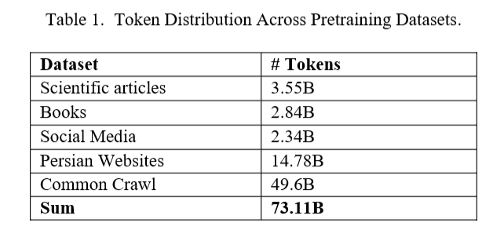

## 3.2 数据预处理

为保障数据质量，训练前对语料开展了大规模预处理，包括去重与噪声去除，以此提升语料整体完整度。对于波斯语这类低资源语言而言，上述步骤对保证预训练数据的相关性与准确性至关重要。

## 3.3 训练流程

为保障数据质量，训练之前对语料进行了充分预处理，主要包括去重和噪声过滤，以此提升语料整体质量。对于波斯语这类低资源语言来说，上述处理步骤是保障预训练数据相关性与准确性的关键。

训练在 8 张 NVIDIA A800 GPU 上完成，耗时一周，采用 DeepSpeed Stage 0 [12] 优化框架提升计算性能。训练过程设置最大序列长度为 512 token，并使用 FP16 混合精度实现高效计算。为优化模型收敛效果，学习率设置为 5e‑5，采用线性预热策略。训练批次大小配置为单卡 30，梯度累积步数为 2，由此得到的有效批次大小为 480。评估阶段的单卡批次大小设置为 8。

优化过程采用 AdamW 优化器，β 参数设置为 (0.9, 0.999)，epsilon 值为 1e‑8。学习率由线性调度器进行调控。模型训练 1 个轮次，使模型能够充分学习全部数据集的内容。

## 3.4 应用与影响

MatinaRoberta 模型在多项波斯语自然语言处理任务上表现优异，包括文本分类、问答、语义搜索以及上下文嵌入生成。该模型在检索增强生成系统中效果尤为突出，其输出的嵌入向量能够实现精准检索，生成内容也具备事实依据。这对波斯语搜索引擎、知识助手以及领域专用检索等应用带来性能提升，可为低资源语言提供前沿水平的效果。该模型与其他模型的对比评测结果如表 2 所示。

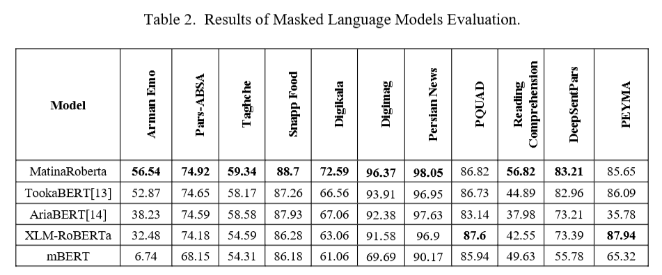

# 4 MatinaSRoberta

完成掩码语言建模预训练之后，该模型进一步开展微调，将其改造为<u>基于相似度的文本嵌入模型</u>，以提升其在检索增强生成系统中的性能。本次微调的核心目标是让语义相关的文本对生成对齐的嵌入向量，同时能够有效区分语义不相关的文本对，这对于提升 RAG 流水线的检索精度与生成质量至关重要。微调过程使用了经过精心筛选的多类数据集，覆盖各类语言及语义任务，包括问答匹配、蕴含分类、复述识别以及基于三元组的语义相似度任务。上述工作大幅优化了模型检索与整合相关信息的能力，使其能够生成上下文准确、语义信息丰富的回复，成为 RAG 框架下的一款前沿方案。

微调阶段用到的核心数据集包含多语言资源，例如 Miracle 项目的三元组数据集，该数据集包含英语、阿拉伯语以及波斯语子集。此外，ParsiNLU [15] 数据集（如问题对相似度、文本蕴含分类任务）提供了丰富多样的语言与语境变体。领域专用波斯语数据集对增强模型对专业场景的理解起到关键作用，包括 PQuad 数据集的问答对、复述句对、来源于维基百科的三元组与配对数据，以及面向宗教、法律、教育、旅游类文本的数据集。波斯语指令数据集以及波斯语‑英语双语翻译配对数据，则提升了模型处理各类语言结构与语义关系的能力。

微调过程根据数据集结构与任务类型选用了多种损失函数。对于包含锚样本‑正样本对的数据集，采用**多负样本排序损失（Multiple Negatives Ranking Loss）**，将批次内其余样本当作负样本，优化模型的语义相似度学习。针对需要对语义相似度做二分类的数据集，使用对比损失（Contrastive Loss）；涉及三分类文本蕴含任务时，则采用 Softmax 损失。对于具备锚样本、正样本、负样本的数据集，使用三元组损失（Triplet Loss），保证锚样本与正样本的嵌入向量距离小于锚样本与负样本之间的距离。借助上述多种损失函数，模型可以高效适配各类语义任务。

微调流程根据数据集的结构与任务特点，采用了多种适配的损失函数。对于包含锚样本‑正样本对的数据集，使用多负样本排序损失，将同一个批次内的其他样本作为负样本，以优化语义相似度学习。针对需要对语义相似度进行二分类的数据集，采用对比损失；而涉及三分类文本蕴含任务时，则使用 Softmax 损失。对于同时包含锚样本、正样本、负样本的数据集，采用三元组损失，确保锚样本与正样本的嵌入向量距离小于锚样本与负样本的嵌入向量距离。通过以上各类损失函数，模型能够有效适配多种多样的语义任务。

该过程生成的嵌入为1024 维稠密向量，通过对 Transformer 各层输出的 token 嵌入做均值池化得到。模型架构与训练方案借鉴自 Sentence‑BERT，由此产出高效、高质量的语义表征。训练使用 8 张 NVIDIA A800 GPU，耗时 7 天，并借助 DeepSpeed 对计算资源进行优化。表 3 列出了完整训练参数，构建了一套规范且高效的训练方案。

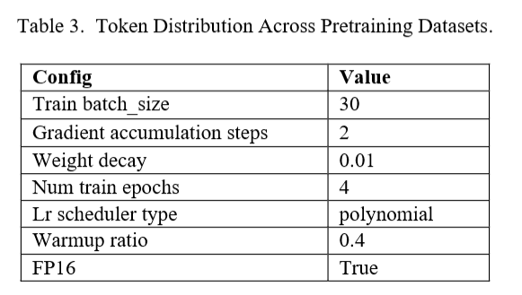

# 5 RAG 基准测试

本节介绍用于评估波斯语检索增强生成性能的实验设计与实验方法。本研究在通用知识、专业科技文本、正式机构文档这三类数据集上，对多种嵌入模型与大语言模型开展系统性测试，旨在找出波斯语场景下优化 RAG 系统的最优方案。本次评测不仅关注语言层面存在的各类难题，同时也考察模型对不同内容类型的适配能力。

## 5.1 评测数据集

为全面评估模型的检索与生成能力，研究使用了三套不同的数据集，每套数据集对应一类不同的文本内容以及语言复杂度。

### 5.1.1 通用知识数据集

该通用知识数据集取自 PQuad，这是一套源自维基百科文章的波斯语阅读理解数据集。该数据集约包含 8 万条问题，其中 25% 为不可回答问题。数据集划分为训练集（63994 条）、验证集（7976 条）与测试集（8002 条）。维基百科覆盖的主题范围广泛，使得该数据集非常适合评测 RAG 模型在多样化开放域内容中检索与生成信息的泛化能力。丰富多样的主题有助于测试模型处理具备不同上下文需求与语言特征的波斯语文本时的鲁棒性。

### 5.1.2 专业科技数据集

专业科技数据集基于波斯语教材《普通体育教育学》[16] 的内容构建。该教材涵盖体育教育哲学、运动生理学以及健康科学等方面的完备知识，是评测模型处理领域专用语言能力的理想数据源。数据集构建过程中，首先对文本进行预处理，清理冗余章节，并借助 GPT‑4 模型抽取有实际意义的多选题（MCQ）。该数据集用于评估大语言模型检索与处理专业术语和专业知识的能力，这也是 RAG 系统应用于技术或学术领域时需要重点考量的方面。文本本身包含专业术语与专业概念，结构化的文本形式进一步提升了检索精度的测试难度，因此该数据集能够对模型形成严苛的检验。

### 5.1.3 机构报告数据集

第三份数据集基于《伊朗教育根本转型文件》构建，这是一份正式政策文件，详细阐述了到伊朗历 1404 年（公历 2025 年）全面改革伊朗教育体系的核心策略与框架。该文档文本结构化、语言正式，同时包含大量社会政治与文化类专有术语，是评测模型从高度规范化、强场景限定文本中完成检索与信息生成能力的重要测试样本。研究基于 GPT‑4o 从该文档生成多选题，以此评估模型处理篇幅较长、面向政策类文本的能力，这类文本包含复杂的文化与机构相关指代。文档严谨的行文结构加之专有词汇，为 RAG 系统带来较大挑战，可同时检验模型对正式句法的理解能力以及对信息进行上下文解读的能力。

## 5.2 嵌入模型评测	

本研究评测的嵌入模型包括 MatinaSRoberta、LaBSE [17]、L12‑V2、Qwen2‑7 [18] 以及 Alibaba/gte。选择上述模型的依据是：它们已在低资源语言相关任务中表现出可靠性能，并且能够生成可捕捉波斯语复杂语言特征的嵌入向量。此外，所选模型均兼容 Sentence‑Transformers 框架，可支持生成高质量句子嵌入。这种兼容性进一步提升了模型在 RAG 系统中处理检索与生成任务的效果。研究在三套数据集上分别对各个模型开展评测，以此衡量模型检索波斯语相关内容的实际效果；评测重点关注低资源场景下的检索精度，该场景通常存在可用数据稀缺、语言结构复杂等问题。

## 5.3 Experimental Setup

### 5.3.1 大语言模型基线评测

本研究基于 LlamaIndex 框架构建多选题问答（MCQA）任务，在上述三套数据集上对各大语言模型的能力开展评测。参与评测的模型包括 LLaMA 3.1（8B、70B）[19]、Qwen 2（7B、72B）、Gemma 1.1 [20] 以及 Gemma 2 [21]。选取这些模型的原因是它们在其他低资源语言任务上具备优异表现，有望处理波斯语复杂的语言特性，包括灵活的词序、丰富的形态变化以及多样化的词汇。本研究在 RAG 框架的静态实验条件下对上述模型进行测试，建立起一套基线，用以衡量模型基于检索信息生成准确、符合上下文的答案的能力。该基线为理解模型在多种文档类型与语言领域下的泛化能力提供参考依据。表 4 给出评测使用的基础参数，完整展示了基线测试阶段各个模型的配置信息。

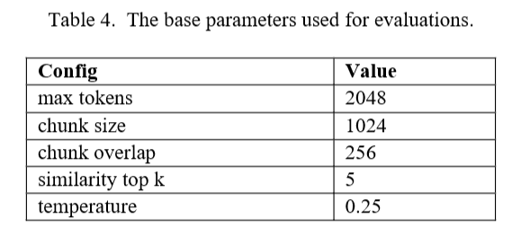

### 5.3.2 Temperature 调优

为优化所选大语言模型的性能，研究开展了温度参数调优，重点针对 LLaMA 3.1 8B 模型。温度参数用于控制模型输出结果的随机程度：较低的温度会生成确定性更强、更严谨的答案；较高的温度则会让回复的多样性有所提升。波斯语的句子结构相比其他语言更为灵活，在此场景下，温度调优对于平衡输出结果的准确性与多样性起到十分关键的作用。

实验测试了四组温度参数（0、0.25、0.5、0.75），用以确定回复在准确性与多样性之间的最优平衡点。较低的温度（接近 0）能够输出更加精准，但多样性不足的答案，该设置在处理波斯语灵活的词序与多义词时偶尔会出现问题。与之相反，较高的温度会提升回复的丰富度，但会牺牲事实一致性。

### 5.3.3 分块大小测试

研究同样考察了文本分块大小对检索性能带来的影响，尤其针对上述三套数据集各不相同的内容结构展开分析。实验基于 LLaMA 3.1 8B 模型，测试了 512、1024、2048 token 这三种分块大小，以此评估检索精度与模型性能随文本切分策略变化的规律。

较小的分块大小（例如 512 个词元）通常可以实现更精准的检索，因为它能够让模型聚焦粒度更细的文本片段。但该精度是以更高的计算开销为代价的，更小的文本块需要更多轮次处理。更大的分块大小（例如 2048 个词元）可以提升计算效率，却会降低检索精度；对于正式文本与专业技术文本而言，局部片段中的细微信息往往至关重要，该问题在此类文本上表现尤为突出。

### 5.3.4 文档摘要索引

为进一步优化检索流程，本文测试了文档摘要索引方法。该方法在索引构建阶段利用大语言模型为每份文档生成简洁摘要。这些摘要与较小的文本分块（节点）一同存储，并在查询处理阶段参与后续检索。该方法区别于传统检索方案，能够降低计算负载、提升响应速度，在处理大规模或复杂文档时效果尤为明显。

发起查询请求时，模型会先评估文档摘要，判断其相关性，之后再检索并分析对应的文本分块。该方式能够实现速度更快、效率更高的检索，对于《伊朗教育根本转型文件》这类长文档而言效果尤为突出。

此外，研究还引入查询分类提示词，用以区分通用查询（需要宽泛的摘要信息）与特定查询（需要精细检索细节内容）。该区分机制能够让查询匹配文档中最相关的片段，以此优化检索精度与检索效率，进而同时提升检索环节的准确率与相关度。

## 5.4 RAGAS 框架

本研究采用检索增强生成评估框架 RAGAS [22] 对各类检索增强生成（RAG）模型开展性能评测。RAGAS 提供一套结构化的自动化多指标评测方案，便于对模型的检索能力与生成能力进行全面评估。选择该框架的原因在于其具备良好的适用性，开展模型评测时无需大量依赖真实标准答案；而波斯语这类低资源语言的真实标准答案数据十分稀缺。这类语言通常缺少传统基准评测数据集，因此 RAGAS 这类更加灵活的自动化评测工具十分必要。

MCQA 框架用于评估模型的生成能力，而 RAGAS 则可对检索与生成两个维度开展更为全面的评测。RAGAS 的核心指标包括事实一致性、上下文相关性、检索准确率以及模型处理查询时的精确率。本研究采用 MCQA 与 RAGAS 相结合的双重评测方案，覆盖多类任务，既包含结构化程度很高的多选题测试，也包含覆盖面更广的生成与检索性能指标。借此，本研究能够评估模型在真实业务场景下的实际效果，而在真实场景中，事实准确性与上下文相关性均至关重要。

## 5.5 评价指标

### 5.5.1 嵌入模型的评价指标

为衡量各嵌入模型的性能，本研究采用了以下评价指标：

- b首结果准确率：正确答案被检索为第一条结果的查询占比。
- 次位结果准确率：正确答案出现在第二条检索结果中的查询占比。
- 第三位结果准确率：正确答案出现在第三条检索结果中的查询占比。
- 全部检索结果中正确检索的总数量。
- 综合得分：一项基于正确检索数量计算得到的复合指标，用于综合反映各模型的整体性能。

为计算综合得分，本研究为各条检索结果分配了不同权重：首结果准确率权重系数为 3，次位结果准确率权重系数为 2，第三位结果准确率权重系数为 1。该加权得分能够对模型的检索能力开展更精细化的评估，在评测模型效果时赋予排名靠前的检索结果更高优先级。设计上述指标，旨在分析嵌入模型在各类文本上检索相关信息的能力，同时反映模型的泛化能力与专项适配能力。

### 5.5.2 大语言模型的评价指标

本研究采用 RAGAS 框架，同时搭配一项面向多选题问答任务的额外指标，对大语言模型开展评测。所使用的指标包括：

- 准确率：该指标用于评估大语言模型在多选题问答任务上的表现。准确率定义为正确回答的数量占总问题数量的百分比。该指标可以直接衡量大语言模型基于检索到的信息理解问题并生成正确答案的能力，是模型在结构化问答场景下的一项关键性能指标。
- 忠实度：该指标评估生成答案与检索上下文之间的事实一致性。通过将生成答案与检索上下文进行比对计算得到该指标，分值区间为 0‑1。分数越高，代表生成回复与上下文的匹配程度越高，说明事实准确性越好。
- 答案相关性：该指标用于评估生成答案对给定提示的响应效果。完整、简洁且无冗余内容的答案会获得更高分数；反之，答案不完整或包含无关信息则得分较低。答案相关性依据问题、检索上下文以及生成答案三者进行计算。
- 上下文精确率：上下文精确率用于衡量检索上下文是否正确地对相关条目做优先级处理，将其在结果集中排在靠前位置。该指标评估检索过程能够多有效地输出最相关的文本片段。得分区间为 0‑1，分数越高代表相关条目的排序效果越好。
- 上下文召回率：该指标评估检索上下文对作为参考的标准答案的支撑程度。其计算方式为判断标准答案中的各个论断可溯源至检索上下文的程度。得分取值范围为 0‑1，分数越高代表性能越优。该指标还有一种无参考版本，即上下文利用率，适用于没有明确提供标准答案的场景。

上述指标能够综合反映大语言模型生成准确、相关答案以及检索支撑性上下文的实际效果，同时保障答案质量与事实一致性。

# 6 结果与讨论

本研究对各嵌入模型从前述三个数据集当中检索相关信息的能力开展评测。本次评测结果（包含各模型的检索准确率及其他性能指标）如表 5 所示。各模型的检索准确率，依据其在第 1、2、3 位返回相关结果的表现进行测算。该排序评测体系有助于分析模型在不同上下文场景下的检索效率，覆盖开放域内容以及专业技术文本。

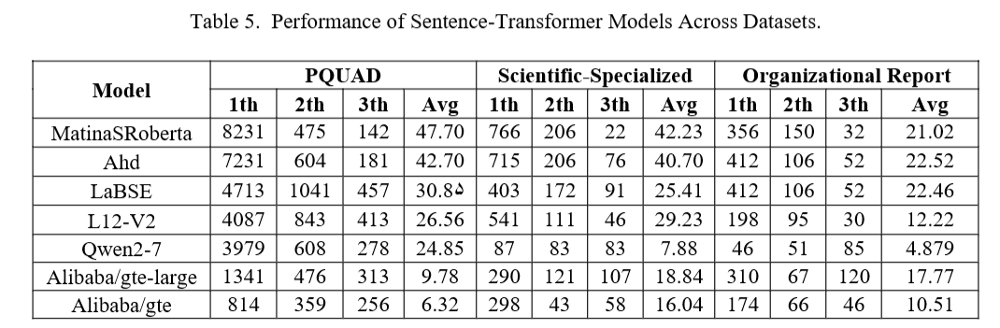

## 6.1 嵌入模型评测

本研究对各嵌入模型在上述三个数据集上检索相关信息的能力进行评估。本次评估结果，包括各模型的检索准确率及其他性能指标，如表 5 所示。各模型的检索准确率依据其在第 1、2、3 位返回相关结果的表现进行测算。该排序评测体系有助于剖析模型在不同场景下的检索效率，覆盖开放域内容与专业技术文本。

MatinaSRoberta 模型在全部三个数据集上均取得更优的表现，在 PQuad 数据集和专业科技数据集上优势尤为明显，性能优于 LaBSE、L12‑V2 等模型。该性能优势得益于 MatinaSRoberta 能够更好地处理波斯语的语言特征，包括灵活的句子结构、形态变化以及黏着构词特性。

MatinaSRoberta 模型在 PQuad 数据集上取得良好效果，很大程度上得益于其处理多样化开放域主题的能力。波斯语灵活的词序与丰富的形态变化会给文本检索带来困难，但 MatinaSRoberta 能够很好地对这类语言变体实现泛化。与之相比，LaBSE 与 OpenAI 嵌入模型泛化能力不足，经常无法检索到上下文最匹配的内容，或将相关内容误判别为无关内容。

在包含领域专有行话与技术术语的专业科技数据集上，MatinaSRoberta 凭借检索相关信息时保持的高精确率，性能优于其他模型。其优异表现可归因于该模型处理波斯语专业术语的能力更强，能够有效应对复杂句式结构。相比之下，LaBSE 模型在检索高度专业化信息方面存在短板，这可能是因为其训练数据偏向通用语言场景。

针对由含有社会政治与文化相关表述的正式文档构建而成的机构报告数据集，MatinaSRoberta 的表现再次优于 LaBSE 以及 OpenAI 嵌入模型。该数据集因其正式的语言句式结构和上下文专属术语而带来较大挑战。MatinaSRoberta 能够处理这类复杂语言特征，说明该模型十分适用于结构化正式文本的检索任务；而 LaBSE 则表现欠佳，有可能会遗漏重要的文化细节。

MatinaSRoberta 在绝大多数数据集上均持续取得最优性能，这凸显出采用针对波斯语复杂语言特性定制的嵌入模型的重要性。上述研究结果表明，针对波斯语这类低资源语言，专用嵌入模型对优化检索任务具备重要价值，在领域专属场景与正式文本场景下尤为突出。

## 6.2 RAG 场景下大语言模型的评测

### 6.2.1 基线评测

基线评测旨在评估大语言模型依据嵌入模型检索得到的信息，生成准确且上下文相关答案的能力。表 6 汇总了各类大语言模型的性能结果，可以看出，LLaMA‑3.1（70B）、Qwen2 Instruct（72B）等大参数模型在全部数据集上均展现出更优异的生成能力。

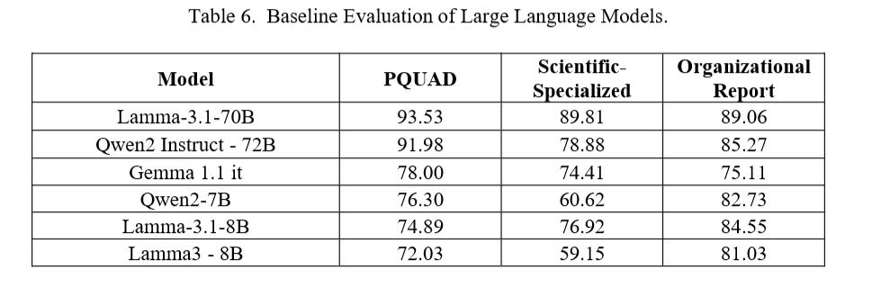

在面向通用知识的 PQuad 数据集上，LLaMA‑3.1（70B）这类大参数模型生成上下文适配回复的准确率显著更高。更大的参数量使这类模型可以更有效地处理多样化的主题，能够基于检索信息输出精准答案。与之相对，Qwen2（7B）、Gemma 1.1 等小参数模型难以处理覆盖面广泛的内容，在满足通用知识任务所需的广域领域覆盖能力上存在局限。

在专业科技数据集上，LLaMA‑3.1（70B）依旧保持优势，生成的回复准确，能够很好契合该数据集的技术用语与领域特定要求。这些大参数模型在检索与生成相关答案两方面均具备较高精确度，体现出它们处理波斯语科技文本复杂内容的能力。但小参数模型生成准确回复的能力存在明显差距，经常错误解读专业术语，或是输出事实不一致的答案。

以正式语体与政策导向内容为特征的机构报告数据集带来了额外的挑战。在此场景下，LLaMA‑3.1（70B）与 Qwen2 Instruct（72B）再次优于小参数模型，生成的回复能够准确还原文档正式、结构化的文本特征。这些大模型可以有效捕捉数据中蕴含的社会政治层面细微内涵，而小参数模型在处理这类高度规范化的文本结构时表现出明显短板。

综上，在全部数据集上，大参数大语言模型的性能均持续优于小参数模型。本次评测凸显了模型规模与复杂度的重要意义，对于需要在专业领域及正式场景下实现高精确度的任务而言尤为如此。面向法律、学术或政策研究类应用，LLaMA‑3.1（70B）这类大模型更能够胜任波斯语内容的复杂处理工作。

### 6.2.1 温度系数测试

本文针对 LLaMA‑3.1 8B 模型开展温度测试，用以评估随机性对文本生成效果的影响（表 7）。实验结果表明，温度设置为 0.25 时，模型在全部数据集上均可实现准确率与回复多样性之间的最优平衡。随着温度升高，生成随机性随之增大，会对生成回复的精确度产生负面影响，在机构报告这类结构化程度高、语体正式的数据集上该问题尤为突出。较高的温度（例如 0.75）会带来精确度更低但多样性更强的输出，往往会牺牲正式场景与专业场景所必需的事实一致性。

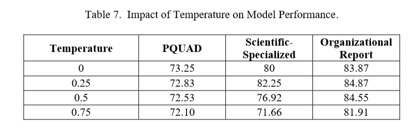

### 6.2.2 分块大小测试

本文同样评估了分块大小对检索性能的影响（表 8），重点考察其与各数据集不同内容结构之间的关联。分块大小测试结果显示，512 token 的较小分块取得了整体最优效果，在机构报告数据集这类正式、结构化数据集上表现尤为突出。较小的文本块能够实现更精准的相关信息检索，保持更高的上下文相关度。与之相反，更大的分块（例如 2048 token）会造成精确度下降，在专业领域数据集上该现象更为明显，这类数据集中细粒度信息对保障检索准确率至关重要。

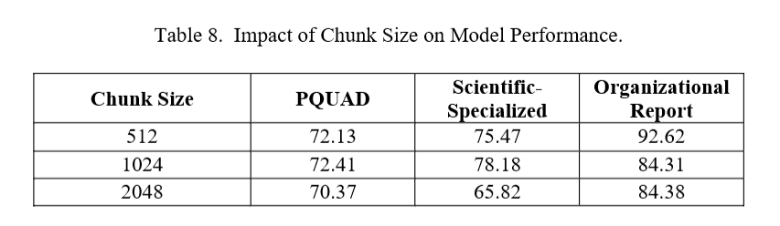

## 6.2.3 文档摘要索引测试

为优化检索流程，本文也对文档摘要索引方案开展了测试（表 9）。实验结果表明，文档摘要能够显著提升检索准确率，在 PQuad、机构报告数据集等通用类与正式语体数据集上效果尤为明显。文档摘要索引方法降低了计算开销，同时提升模型高效检索文本相关片段的能力。对于需要从文档多个片段中获取信息的复杂查询，将文档摘要与查询分类相结合，可以同时提升检索效率与检索准确率。

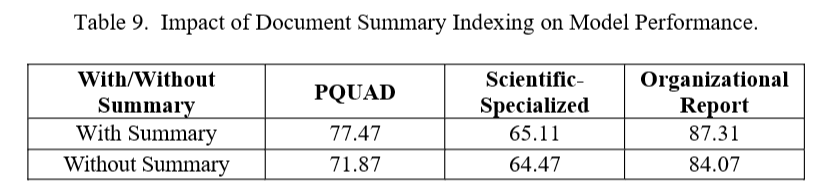

## 6.3 RAGAS Results

RAGAS 框架对全部数据集下的检索与生成性能开展了综合评估。实验结果显示，各模型性能差异显著；LLaMA‑3.1（70B）等大参数模型在所有数据集上，于答案相关性与上下文召回率指标上均持续取得最优表现。

如表 10 中 PQuad 数据集的结果所示，LLaMA‑3.1（70B）取得了最高的答案相关性（0.7455）与上下文召回率（0.9205），是开放域任务中表现最优的模型。与之相比，Gemma 1.1 这类小参数模型尽管检索能力较强，但难以生成连贯且相关的回复

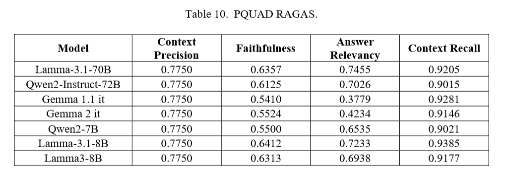

表 11 列出了专业科技数据集上的 RAGAS 评测结果，LLaMA‑3.1（70B）依旧表现领先，取得最高的事实忠实度（0.7322）与上下文精确率（0.8138）。值得注意的是，LLaMA‑3.1（8B）的上下文精确率达到最高值 0.9435；但该模型事实忠实度偏低，说明其虽然擅长检索相关内容，却难以生成事实一致的回复。Gemma 系列模型在该数据集上依旧表现不佳，在答案相关性指标上问题尤为突出，印证了该类模型处理复杂技术文本存在困难。

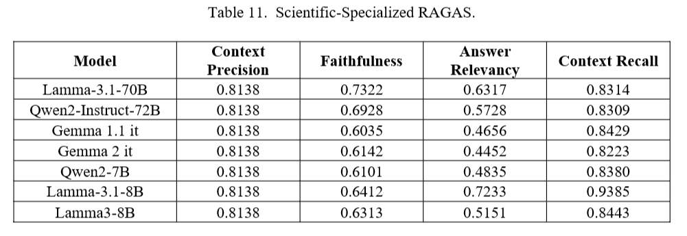

 如表 12 所示，在机构报告数据集上，LLaMA‑3.1（70B）再次表现优异，取得较高的答案相关性（0.7507）与事实忠实度（0.7388）。与之相反，Gemma 系列模型在该数据集上表现较差，尽管能够维持尚可的上下文召回率，但答案相关性仅为 0.2919，表现尤为糟糕。该结果表明，Gemma 系列模型在针对正式、高度结构化文档生成符合事实依据且具备相关性的答案方面，始终存在短板。

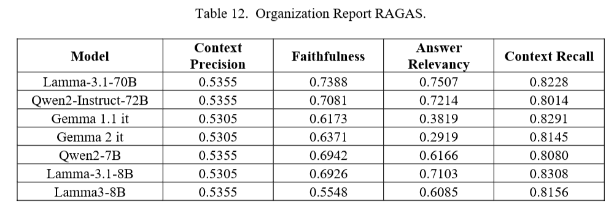

综上，RAGAS 评测结果清晰表明，LLaMA‑3.1（70B）在全部数据集上的表现均持续优于其他模型，兼具出色的检索能力、较高的事实忠实度与答案相关性。Qwen2 系列模型紧随其后，在通用场景与正式场景下均表现良好，但处理专业领域内容时性能略有下降。Gemma 系列模型虽然检索效果尚可，但在生成具备相关性且事实准确的回复方面存在显著困难，在复杂度更高、语体更正式的数据集上该问题尤为突出。上述结果强调，小参数模型仍需进一步优化，将其应用于波斯语这类低资源语言的正式任务与领域专属任务时更是如此。

# 7 Conclusion

本研究针对将检索增强生成（RAG）框架拓展至低资源语言所面临的重大挑战展开研究，研究重点聚焦波斯语。考虑到波斯语复杂的语言特性以及标注数据集稀缺的现状，本文旨在构建面向波斯语的专用语言模型、搭建完备的评测基准，并确定优化 RAG 系统的最佳实践方案。上述研究成果对于推动小语种自然语言处理发展、拓展检索增强框架的适用场景具有重要价值。

本研究提出了 MatinaRoberta 与 MatinaSRoberta 模型的构建工作，旨在捕捉波斯语丰富的形态学与句法层面细微语言特征。相较于现有主流最优嵌入模型，上述模型在检索任务上展现出更优异的性能。本文构建的系统化评测基准，为在通用、专业技术以及正式语体领域对 RAG 系统开展评测提供了可靠手段，进一步印证了该模型能够弥补现有自然语言处理资源存在的短板。此外，实验结果着重表明，需要针对低资源语言的需求定制模型架构与检索‑生成流水线；相关研究结论也可迁移应用于其他代表性不足的语言场景。

这些研究发现具有多方面的启示。在理论层面，本研究丰富了通过语言专属适配来优化检索增强生成（RAG）系统的相关研究成果。在实践层面，研究为改进波斯语领域专用应用奠定了基础，例如搜索引擎、法律文档分析以及教育内容检索。此外，从模型评测与参数配置（温度调优、分块大小优化、文档摘要索引的使用等）中得到的结论，可为希望在资源受限环境下优化 RAG 系统的工程从业者与政策制定者提供可落地的实践指导。

基于上述研究结论，未来研究可以着力拓展数据集覆盖范围，纳入更多样化的方言以及专业领域内容。此外，探究多语言与多模态方案能够进一步提升检索准确率与生成质量。验证本文所提方法向其他低资源语言迁移的可扩展性，同样是极具价值的研究方向，有望推动全球自然语言处理领域取得更广泛的进展。

综上，本研究在解决将 RAG 系统应用于波斯语这类低资源语言时所面临的语言层面与计算层面难题上迈出了重要一步。本研究将创新性的模型开发与严谨的评测框架相结合，不仅加深了学界对该类场景下 RAG 技术的理解，也为该领域后续的创新与发展奠定了基础。