# 在上下文语境中呈现每个词：将句法覆盖度作为大模型低资源机器翻译的优化目标

Every Word Presented in Context: Syntactic Coverage as Objective for Low-Resource Machine Translation with Large Language Models

奥地利 因斯布鲁克市，Technikerstraße 21a，邮编 6020 因斯布鲁克大学 计算机科学系

2026-CCF-B-LREC

# Abstract

大语言模型（LLM）在多语言机器翻译任务上展现出强大能力。但在低资源语言上，模型表现欠佳，这说明需要为模型提供更明确的指令引导。本文提出**片段示例提示（Fragment‑Shot Prompting）**，这是一种全新的小样本提示方法，目标是为待翻译句子中的每一个词检索对应的示例，展示这些词汇在上下文里的用法与语义。我们在意大利语、拉迪恩语（瓦尔巴迪亚变体）、拉迪恩语（格尔代伊纳变体）之间的翻译任务上对该方法开展评测，并将其性能与零样本提示、随机小样本提示，以及成熟的词法检索、语义检索策略进行对比。实验采用多款当前顶尖的大语言模型，包括 GPT‑3.5、GPT‑4o、o1‑mini、Llama‑3.3 与 DeepSeek‑R1。实验结果表明：<u>当翻译方向为**低资源语言译为高资源语言**时，大语言模型能够从有限数据中挖掘大量有效信息。</u>但该结论并不适用于**向低资源语言做翻译**的场景；在此类场景下，提示方法起到的作用要关键得多。其中，本文所提方法始终取得最优结果，实现了显著性能提升。尽管受现有数据制约，模型翻译成拉迪恩语的整体效果依旧有限，但实验结果证明：在低资源条件下，**句法覆盖度**对提升翻译准确率、适配特定语言变体具有重要意义。

**关键词**：低资源 / 濒危语言、机器翻译、自然语言生成

# 1 Introduction

近年来，大语言模型（LLM）在机器翻译（MT）领域取得重大进展，在高资源语言上达到了当前最优性能（Zhang 等人，2023）。然而，大语言模型实现有效的语言建模必须依托充足的训练数据。对于低资源语言，数据匮乏使得这种数据密集型的建模方式难以落地。具体而言，大模型对小众语言（及其各类变体）认知不足，很难生成连贯文本（Court 和 Elsner，2024；Ondrejová 和 Šuppa，2024）。模型翻译为这类语言时效果很差，也印证了这一问题（Robinson 等人，2023；Hendy 等人，2023；Bawden 和 Yvon，2023）。在低资源场景下，利用现有训练数据对预训练多语言机器翻译模型做微调被证实是一种行之有效的方案（Scalvini 等人，2025）。但如果句对数量不足 13000，不足以将神经机器翻译模型训练至可用水平（Pei 等人，2025；Gu 等人，2018）。与之不同，凭借**上下文学习（ICL）**能力，大语言模型可以通过精心设计的提示快速适配新任务（Rubin 等人，2022；Cahyawijaya 等人，2024；Dong 等人，2024）。因此，大模型有潜力更加高效地利用有限的现有数据。

本文旨在评估不同小样本提示方法，在多款大语言模型上完成意大利语与低资源语言拉迪恩语的两种变体之间机器翻译任务时的实际效果。我们并不对大语言模型进行微调（Yong 等人，2023；Zhu 等人，2024；Stap 等人，2024；Toraman，2024；Vieira 等人，2024），而是依靠单条提示，借助上下文学习（ICL）激发大语言模型的泛化能力。具体来说，本文探究在仅有约 18000 条平行句对的小规模检索语料库条件下能够取得怎样的效果，并将实验结果与使用相同数据训练得到的神经机器翻译系统做对比。

Our key contributions:

- 本文提出片段示例提示（Fragment‑Shot，FS），这是一种全新的小样本提示方法，其目标是为输入句子中出现的每一个独立单词检索对应的示例。
- 我们测试多款前沿大语言模型（GPT‑3.5、GPT‑4o、o1‑mini、Llama‑3.3 以及 DeepSeek‑R1）在拉迪恩语两种变体与意大利语互译任务上，使用片段示例提示（FS）时的性能，并将其与已成熟的提示范式进行对比。
- 我们通过分析**句法覆盖度**来探究句法特征在低资源翻译中的作用；句法覆盖度即源句 / 目标句中的单词，能够在提示所包含示例中得到实例化的占比。

上述研究贡献旨在探究大语言模型在低资源场景下的应用潜力，帮助我们更好理解检索得到的示例以及其他能够实现更高翻译准确度的影响因素所具备的重要作用。

# 2 Related Work

最晚自 ChatGPT 发布以来，将大语言模型用于机器翻译已经成为一个热门研究方向（Zhang 等人，2023）。越来越多的研究将大语言模型视作传统神经机器翻译（NMT）的替代方案；相关研究表明，部分场景下人工标注者相比神经机器翻译系统更认可 ChatGPT 的翻译结果（Manakhimova 等人，2023）。但大语言模型的提示方式起到关键作用，会直接影响翻译质量（Zhang 等人，2023；Agrawal 等人，2023；Vilar 等人，2023）。此外，已有实验证明，GPT 系列模型在低资源语言与非洲语言上表现不佳（Robinson 等人，2023），这也推动学界开展相关策略研究以改善该问题。下文将对该领域的相关工作展开论述。

基于大语言模型的机器翻译提示工程

零样本方法（Robinson 等人，2023）是对大语言模型做翻译任务提示的最简单方式，该方法仅依靠模型本身固有的语言理解能力，不提供任务专属示例。多项研究表明，向提示词中补充额外信息的各类策略能够提升翻译质量。这类策略包括：在提示中放入随机选取的翻译句对（Zhang 等人，2023）；在提示里加入词典条目、单词释义或者语法规则（Elsner & Needle，2023；Court & Elsner，2024；Guo 等人，2024；Merx 等人，2024；Zhang 等人，2024；Marmonier 等人，2025）；对单个词语进行翻译并检索相关句子（Shu 等人，2024；Zhang 等人，2024）；或是在提示中加入语义相近句子的翻译结果（Merx 等人，2024；Zebaze 等人，2025b；Tang 等人，2024；Kumar 等人，2023）。

针对满语的近期研究（Pei 等人，2025）表明，高质量词典与检索恰当的平行例句是影响翻译质量最重要的因素。在我们的初步实验中发现，向模型提供单个单词的词典条目对拉迪恩语翻译效果提升十分有限。造成该现象的部分原因是拉迪恩语存在很高的词义歧义，许多单词既可以充当形容词，也可以用作名词。因此，我们在主体实验中没有使用词典。

例句检索策略

以往相关工作依靠**句子级相似度**来筛选样例，所采用的指标包括 BLEU（Agrawal 等人，2023）、BM25（Robertson 等人，1995）以及语义嵌入（Merx 等人，2024；Zebaze 等人，2025b）。与之不同，本文的片段示例（FS）方法旨在让选中的样例实现最大化句法覆盖度。在无法获取可靠嵌入模型的场景下，该策略具备尤为突出的价值。Agrawal 等人（2023）此前已经强调过<u>词汇重叠</u>的重要性；<u>而我们采用更为直接的方式衡量覆盖度：统计能够检索到对应样例的完整源语言单词数量</u>。同时，借助片段示例设置下片段覆盖度与 BLEU 分数之间的相关实验结果，进一步佐证了这一结论。

本方法融合了==句法重叠与上下文感知检索==；Tang 等人（2024）与 Kumar 等人（2023）的研究表明，<u>将二者结合能够取得十分优异的效果</u>。Tang 等人（2024）提出通过融合用于计算词汇相似度的 BM25（Robertson 等人，1995）与样例层面的句法相似度来选取完整句子，以此提升翻译性能。与之不同，本文方法通过增大片段粒度来获取更高的句法重叠，从而检索到句法相关性更强的句子。该方法的设计灵感来源于 DecoMT（Puduppully 等人，2023），这是一种**分解式提示**方法，其性能显著优于传统小样本方法，尤其适用于亲缘关系相近的低资源语言之间的翻译。DecoMT 属于多阶段方法，需要对文本做切分，并为每一个片段补充上下文再分别翻译；而本文方法与之不同，采用**单提示**的实现形式。

Zebaze 等人（2025a）也提出过一种类似的多阶段思路：该方法先将句子拆解为更简单的短语，借助上下文学习（ICL）样例翻译这些短语，再把短语的翻译结果当作上下文学习样例，用于整句的翻译。与之不同，本文研究聚焦于**上下文学习样例的检索策略**，优先保证高句法重叠；实验证明，该策略在本文的低资源场景下效果尤为突出。

拉迪恩语的机器翻译

迄今为止，专门针对大语言模型机器翻译场景下的拉迪恩语开展的研究为数不多。Frontull 和 Moser（2024）探究了由包括 GPT‑3.5 在内的不同模型生成的合成数据，对下游神经机器翻译（NMT）系统性能带来的影响。与之类似，Valer 等人（2024）提出一套适用于法萨‑拉迪恩语的双向机器翻译系统，强调多语言训练以及从弗留利语等亲缘语言开展知识迁移带来的增益，并将系统输出结果与 GPT‑4o 的翻译结果进行对比。Frontull 等人（2025）的近期工作为瓦尔巴迪亚、格尔代伊纳这两种拉迪恩语变体构建了 FLORES + 评测基准，同时对比了经过微调的 NLLB 模型与基于 BM25 检索的小样本提示方法的性能。本研究可以视作上述系列实验的自然延伸：沿用相同数据集，同时提出一种全新的样例筛选策略，进一步探究大语言模型在该低资源场景下的能力。

# 3 提示技术与句法覆盖度

本节详细介绍实验中所采用的各类提示方法，并对本文提出的**句法覆盖度**这一概念给出精确定义。

## 3.1 提示技术

我们的实验包含零样本提示以及四种小样本提示技术，本节将对每一种方法逐一进行详细说明。

**零样本（ZS）** 零样本提示方法（Robinson 等人，2023；Hendy 等人，2023；Bawden 和 Yvon，2023；Gao 等人，2024）仅依赖模型已有的预训练知识。提示词直接指令模型将句子翻译为目标语言，不提供显式翻译样例，也不给予词汇层面引导。该基线方法用于测试模型对拉迪恩语句法与词汇的固有理解能力。

**随机小样本（RS）** 随机小样本技术（Agrawal 等人，2023；Robinson 等人，2023；Bawden 和 Yvon，2023）是最基础的小样本提示形式：在提示词中放入随机挑选的源语言‑目标语言翻译样例，其后再接待翻译句子。虽然这些样例不一定具备上下文关联性，但能够帮助模型推断翻译模式与语言结构。本实验中，我们使用了 16 个该类样例。

**语义检索（SR）** 语义检索（SR）方法依据与输入句子的语义相似度来筛选源‑目标语言翻译句对。为获取这类样例，我们采用了 Duquenne 等人（2023）提出的多语言句子嵌入模型，该模型支持 200 余种语言。==尽管该模型官方并未支持拉迪恩语，但考虑到拉迪恩语与多种该模型支持的语言（例如意大利语）拥有共同语言特征，有理由认为其生成的嵌入向量以及据此检索得到的样例仍然具备使用价值。在本实验中，语义检索小样本提示设置下我们使用 30 个样例。==

**词汇检索（BM）** 词汇检索（BM）方法采用 BM25 算法（Robertson 等人，1995）筛选翻译句对。该检索方法依据样例与输入句子在词汇层面的重叠度对样例排序，优先选择信息丰富的核心术语。在本实验中，词汇检索小样本提示设置下我们使用 30 个样例。

**片段小样本（FS）** 上述几种均为已成熟的方法，与之不同，片段小样本（Fragment‑Shot，FS）是<u>本文提出的全新技术</u>。该方法对连续单词序列（我们将其称为**片段**）执行分层滑动窗口搜索，以此检索样例，实现较高的句法覆盖度；算法优先匹配长短语，若匹配失败则逐步回退到更短的片段。通过这种方式，检索得到的样例既展示片段的用法，也给出该片段在不同上下文下合理的翻译结果。该概念的示意如图 1 所示。在我们的实现中，窗口初始大小设置为 7¹。如果检索到匹配样例，则从中随机选取至多 6 个句对放入提示词。若无匹配结果，则逐步减小窗口尺寸，直至退化为单个单词单元。同时片段选取过程会规避相互重叠，理想状态下实现对待译句子完整且无冗余的覆盖。为便于复现与后续研究，我们开源了实现该方法的 Python 工具包 ²。

表 1 汇总了不同语言对下得到的片段窗口大小，并统计了窗口大小为 1‑6 的占比（不存在大于 6 的片段）。检索得到的绝大多数片段均为单个单词，约占全部片段的 80%。

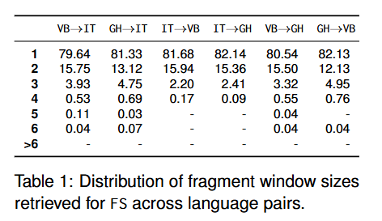

## 3.2 句法覆盖度

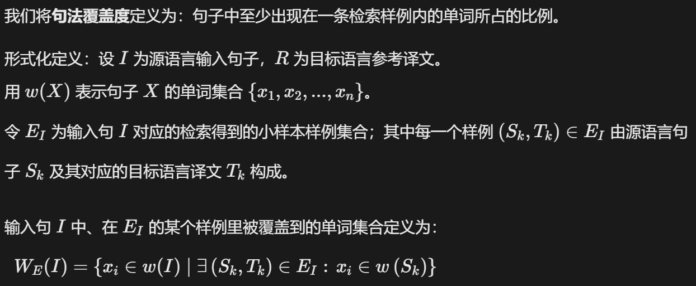

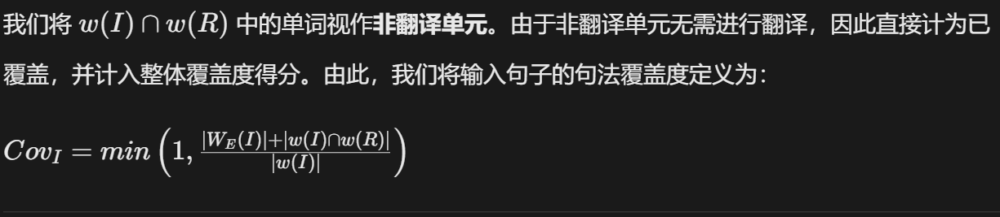

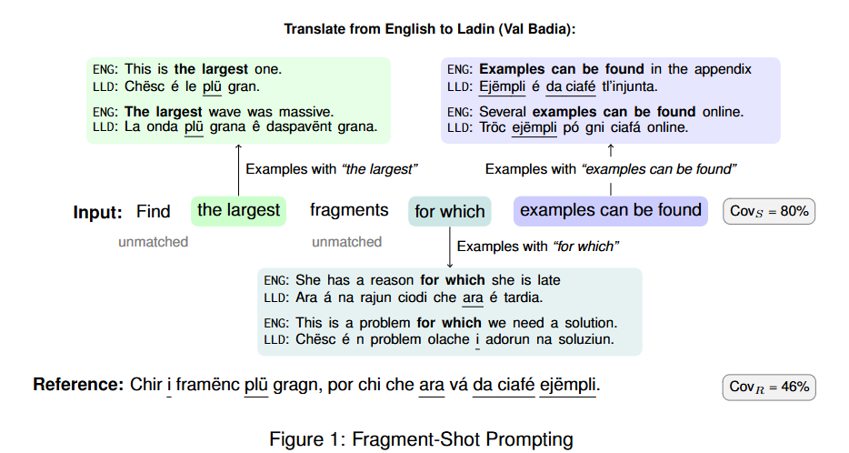

# 4 Experimental Setup

在本实验中，我们重点评估不同大语言模型在意大利语与瓦尔巴迪亚、格尔代伊纳书面标准变体（拉迪恩语五大主要地域变体中的两种）之间翻译时的性能表现。由于拉迪恩语可机读数据的数量十分有限，并且 ISO 639‑3 标准无法区分这两种语言变体，大语言模型对拉迪恩语的接触极少，也无法识别其内部不同变体。

**检索语料库** 我们使用以下数据集作为检索语料库：瓦尔巴迪亚‑意大利语平行语料共 18140 句⁴，格尔代伊纳‑意大利语平行语料共 19971 句⁵，瓦尔巴迪亚‑格尔代伊纳平行语料共 14953 句⁶。全部数据集均以 CC BY‑NC‑SA 4.0 协议公开可用。这些句子原本作为语言参考资料构建，整体句子偏短、句式简单。本语料库统计得到的平均句长如下： (i) 瓦尔巴迪亚语（VB）：22.83 字符，4.90 词； (ii) 格尔代伊纳语（GH）：22.69 字符，4.91 词； (iii) 意大利语（IT）：25.69 字符，4.36 词。

**测试数据** 评估环节我们采用 FLORES+ 开发集（dev split）中的 175 条句子（Frontull 等人，2025）。为直观体现两种语言变体与意大利语之间的相似度，同时反映翻译任务的难度，我们计算了**直接复用原文不做任何翻译**所得到的 BLEU 分数：瓦尔巴迪亚语‑格尔代伊纳语为 12.9，意大利语‑瓦尔巴迪亚语为 5.0，意大利语‑格尔代伊纳语为 4.3。

**大语言模型** 我们选取了以下五种当前主流的大语言模型： (i) GPT‑3.5：OpenAI 于 2022 年发布的 GPT‑3 系列通用语言模型，参数量 175B（Brown 等人，2020）； (ii) GPT‑4o：OpenAI 于 2023 年推出的模型，参数量 200B，推理能力得到增强（Hurst 等人，2024）； (iii) o1‑mini：OpenAI 面向推理任务优化的模型，参数量 50B，2024 年 9 月发布（Jaech 等人，2024）； (iv) Llama‑3.3：Meta AI 于 2024 年 12 月发布的纯文本模型，参数量 70B（Touvron 等人，2023）； (v) DeepSeek‑R1：深度求索（DeepSeek AI）推出的侧重推理能力的模型，参数量 658B，2025 年 1 月发布（DeepSeek‑AI 等人，2025）。模型均通过 API 服务调用：GPT‑3.5、GPT‑4o、o1‑mini 使用 OpenAI API⁷；DeepSeek‑R1 使用 DeepSeek API⁸；Llama‑3.3 使用 Together Inference API⁹。超参数（例如温度系数 temperature）均采用各 API 服务的默认配置。

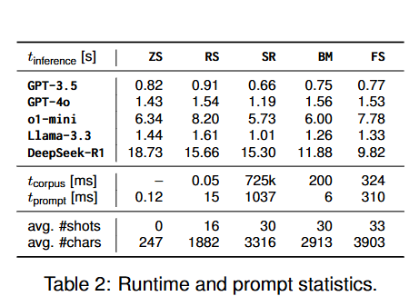

# 5 Results

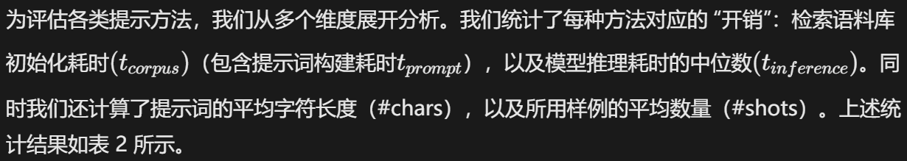

我们采用 BLEU 指标评估翻译质量。表 3 给出了选定大语言模型在瓦尔巴迪亚语、格尔代伊纳语与意大利语互译任务下，不同提示方法对应的 BLEU 均值（Post，2018）（通过 sacrebleu¹⁰ 计算）以及标准差。为判断不同提示策略之间的性能差异是否具备统计意义，我们借助 sacrebleu 开展两两显著性检验，并将 Fragment‑Shot（FS）作为基线。FS 行带下划线的数值代表存在统计学显著差异（\(p<0.05\)）。为进一步探究各类方法对样例筛选带来的影响，我们计算了平均句法覆盖度 \(Cov_{I}\) 与 \(Cov_{R}\)，并在表 3 中列出二者的均值与标准差。由表可见，FS 筛选得到的样例始终取得最高的覆盖度数值。

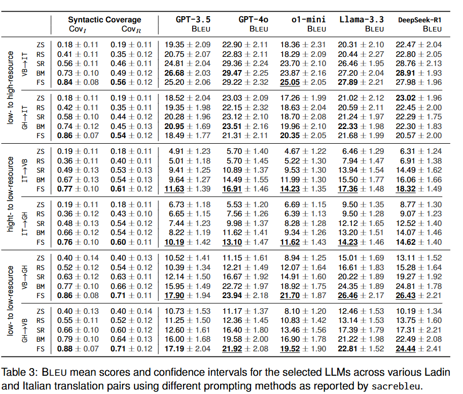

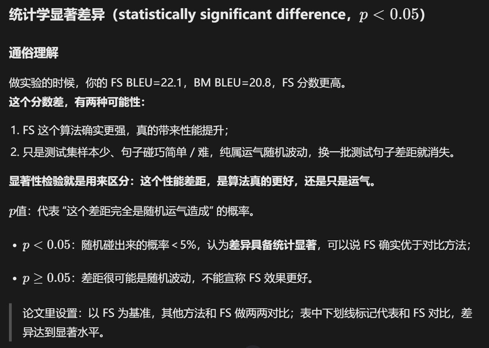

此外，针对译为意大利语的翻译任务，我们采用**大模型作为评判者（LLM‑as‑Judge）**开展定性评估（Kocmi 与 Federmann，2023），以便对模型产生的错误开展更深入分析。我们使用 Rubric‑MQM 评测框架（Kim，2025）¹¹，对两种拉迪恩语变体译为意大利语的全部 8750 条翻译结果（覆盖所有模型与提示方法）进行分析。分析结果表明，**错译是占比最高的错误类别**，约占全部检出错误的 70%。由于小样本提示主要就是为了改善错译问题，因此本文重点分析错译，而不对文体错误、语法错误、漏译等其他错误类型展开讨论。相关结果见图 2。

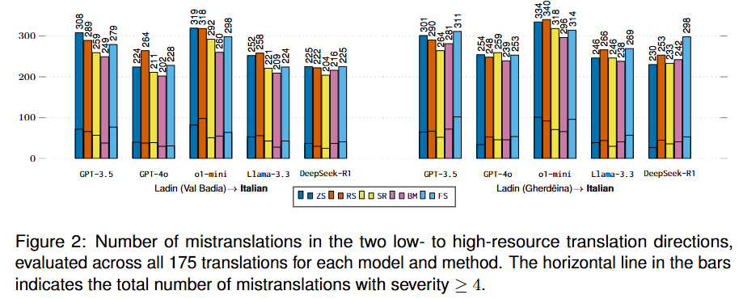

我们还对一部分拉迪恩语翻译结果开展人工复核，发现很难开展同类的定性错误分析。模型输出的错误密度很高（与较低的 BLEU 分数相一致），并且存在**正字法一致性缺失**的问题，模型难以保持统一的拼写规范。

因此我们转而统计通过拼写检查的单词占比 ¹²，结果如表 4 所示。作为参照基准：拉迪恩语参考译文中约 80% 的单词可以通过拼写校验。

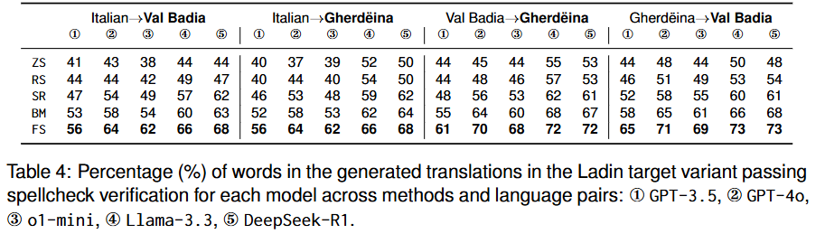

# 6 Discussion

我们的实验得到若干结论，可以总结如下：

- 句法覆盖度是低资源翻译的一个关键影响因素：在所有模型上，无论从 BLEU 指标还是译文生成的词汇准确度来看，片段小样本（FS）的表现均持续优于其他方法。
- 小样本提示在拉迪恩语译意大利语任务上仅能带来部分性能提升。但在该翻译方向下，大语言模型的效果优于神经机器翻译（NMT）方法，使其成为构建低资源数据集的重要模型。
- 尽管 Fragment‑Shot（FS）提示方法能够带来一定增益，但面向拉迪恩语的翻译任务中，经过微调的神经机器翻译（NMT）模型仍然更占优势，可以取得持平甚至更高的 BLEU 分数，同时具备更优的正字法准确度。

接下来，我们基于上述实验发现得出相关结论。

**句法覆盖度是低资源翻译的核心优化目标** 从零样本（ZS）下相当糟糕的性能可以看出，大语言模型似乎不具备拉迪恩语的先验知识，也无法识别该语言的不同变体。对于译为拉迪恩语的任务，提示方法的选择起到尤为关键的作用，能够对翻译结果产生很大影响。

本文所提方法不仅稳定取得最高的 BLEU 分数，同时句法覆盖度指标（\(Cov_I\) 与 \(Cov_R\)）也达到最优。此外，在模型生成的拉迪恩语译文中，该方法下通过拼写校验的单词占比始终最高。 我们还观察到，在瓦尔巴迪亚语与格尔代伊纳语互译任务中，覆盖度数值与 BLEU 分数之间存在显著相关性。 BM25 整体表现优于语义检索 SR，这一现象进一步印证了句法层面片段重合的重要性。因此，如 FS 方法那样，以句法覆盖度为目标来挑选小样本样例，在本实验场景下是合理且有效的。该结论与 Zebaze 等人（2025b）的已有研究结果形成对比：他们在斯瓦希里语、沃洛夫语任务上，基于 SONAR 嵌入的语义检索效果优于 BM25 检索。 由于实验设置不同，且本文未使用相同的嵌入模型，无法开展直接对比。尽管如此，该性能差异值得进一步深入探究。

除句法覆盖度之外，检索片段的长度同样是一项重要因素：更长的片段通常能够捕获更多上下文，因此理应带来更好的翻译效果。表 1 展示了片段长度的分布统计，可以看到检索得到的片段绝大多数为单词单元，这也反映出现有语料库在检索能力上存在局限。如果使用能够产出更多多词片段的语料库开展实验，则可以进一步揭示片段粒度对模型性能的影响。

**拉迪恩语译意大利语：小样本提示仅带来有限增益** 在拉迪恩语→意大利语这一翻译方向上，无论是所测试的各类提示策略，还是提升检索信息的覆盖度，均未能带来 BLEU 指标的统计学显著提升。为便于理解该任务分数所处水平，我们同样使用 GPT‑4o 计算了英语译意大利语的 BLEU 分数，零样本条件下 BLEU 约为 30 分。该数值可以近似看作拉迪恩语译意大利语任务可达到的 BLEU 性能上界。

在译为意大利语的任务上，句法覆盖度的重要性有所下降。即便句法覆盖度较高，\(Cov_I\)与 BLEU 之间的相关系数仍然偏低。 只有在使用 o1‑mini 模型时，FS 取得了具备统计显著性的 BLEU 提升，但该提升并未得到定性分析的佐证。各类更复杂的提示方法之间并没有实质性的性能差距；**最大的性能差异来源于大模型本身的选型**。从 BLEU 分数与错译数量两项结果均可以看出：GPT‑4o、Llama‑3.3 以及 DeepSeek‑R1 的表现优于 GPT‑3.5 与 o1‑mini。 这说明在该翻译方向上，大模型更多依赖自身对目标语言的固有理解能力。

有意思的是，在多种实验条件下，随机小样本（RS）产生的错译数量甚至多于零样本（ZS）。这表明随机采样得到的样例会对模型造成干扰。该现象与多篇已有研究结论一致（Robinson 等人，2023；Alves 等人，2023；DeepSeek‑AI 等人，2025；Reynolds 和 McDonell，2021）：当所提供样例的效用较低时，额外给出示例信息，在部分场景下反而会造成性能下降。即便如此，像 BM、SR 这类经过更审慎、有针对性的样例筛选方法，相比 RS 均能够稳定提升效果，这充分体现了样例筛选的重要性。

在瓦尔巴迪亚语译意大利语方向上，FS、SR、BM 三种方法带来可观的性能提升，使模型性能接近英意翻译任务 30 BLEU 的水平。但在定性分析当中，这类提升并不突出，仅在 Llama‑3.3 模型上可以明显观察到。所有模型输出的绝对错误数量依旧偏高，说明译文仍然需要大量人工后编辑。 尽管两种语言变体在句法覆盖度与拼写校验统计指标上相近，但格尔代伊纳语译意大利语任务的提升空间十分有限。需要进一步研究，探明造成该差异背后的原因。

**低资源翻译中小样本提示效果不及神经机器翻译** 拼写校验的统计结果同样反映出：大模型很难保障拉迪恩语文本基础的正字正确性；在意大利语译为拉迪恩语的任务上，所有被评估的方法均尚未达到可接受的质量水平。

Frontull 等人（2025）报道了在相同数据集上完成训练与评测的微调神经机器翻译（NMT）模型性能。表 5 同时给出了该 NMT 模型，与最优性能的大模型‑提示策略组合之间的性能差值（\(\Delta\)）。结果表明：在瓦尔巴迪亚语（VB）、格尔代伊纳语（GH）译为意大利语的任务上，NMT 模型的效果弱于最优的大模型方案。这凸显了大模型在低资源语言回译任务（Sennrich 等人，2016）中的潜力：大模型能够产出高质量的初始译文（Ondrejová 和 Šuppa，2024；Pei 等人，2025）。

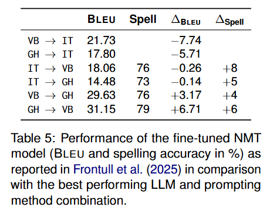

与之相反，在译为拉迪恩语以及各变体之间互译的任务上，无论 BLEU 分数还是拼写准确度，NMT 模型的性能均可与采用 FS 提示的大模型持平，甚至更优。这表明尽管 FS 方法能够实现显著的性能提升，但针对该任务，专用 NMT 模型依旧更占优势，该结论与已有研究结果保持一致（Robinson 等人，2023；Aycock 等人，2024；Scalvini 等人，2025）。

# 7 Conclusion

本文研究了大模型开展低资源语言小样本机器翻译时，样例选择策略所起到的作用。实验结果表明：在向低资源语言做翻译的上下文学习任务中，句法覆盖度可以成为影响效果的关键因素。但即便如此，经过微调的神经机器翻译（NMT）模型依旧是效果最优的方案，能够取得持平甚至更高的 BLEU 分数，同时具备更优异的正字准确度。<u>当从低资源语言翻译为本文研究的高资源语言时，相较于传统 NMT 模型，大模型可以更加高效地利用有限语料，这凸显了其作为工具来构建低资源数据集的应用潜力。</u>

**未来工作** 本文结果表明，大模型的上下文学习能力能够提升低资源语言的翻译质量，但该方法取得效果背后的内在机制仍有待更深入的探究（Chitale 等人，2024；Alves 等人，2023）。目前尚不完全清楚，在不同翻译方向下，究竟是上下文学习样例的哪些具体特征在驱动模型性能。

例如，引入语义相似度指标或上下文多样性指标，有助于解释为何部分样例与 BLEU 分数呈现出比其他样例更强的相关性，<u>尤其针对低资源语言译为高资源语言的场景</u>。此外，如同 Kumar 等人（2023）的研究，将句法覆盖度与其他样例筛选标准相结合，有望得到效果更优的小样本提示策略。

跳出单轮查询提示的范畴，借助 LMQL 这类查询语言等机制主动引导推理过程的方法（Beurer‑Kellner 等人，2023），或许可以更高效地利用现有数据，并触发模型开展特定推理。

上述研究发现同样指向新兴的智能体机器翻译范式（Briakou 等人，2024；Wu 等人，2025）。本文结果表明，厘清句法覆盖度所起到的作用，能够为低资源机器翻译场景下设计这类智能体系统提供有价值的指导。以上均是未来工作中极具前景的研究方向。