# 检索、优化与翻译：基于大语言模型的低资源语言翻译

Retrieve, Refine, and Translate: LLM‑Based Translation for Low‑Resource Languages

**IJCNN 2026**（International Joint Conference on Neural Networks，国际神经网络联合会议，属于 IEEE WCCI 2026

CCF-C类会议

中国，乌鲁木齐，新疆大学，计算机科学与技术学院 ² 中国，乌鲁木齐，新疆大学，新疆多语种信息技术实验室 ³ 中国，乌鲁木齐，新疆多语种信息技术研究中心 ⁴中国，乌鲁木齐，丝绸之路多语言认知计算国际联合实验室 ⁵空天地一体化综合实验室

# 摘要

大语言模型（LLM）在机器翻译任务上展现出良好效果，检索增强生成（RAG）可以引入外部样例，并利用大语言模型的上下文学习能力进一步提升翻译质量。然而，实证研究表明：在低资源场景下，模型生成的译文仍然存在多种多样且难以消除的错误，如何有效修正这类错误仍是一大难题。本文提出一种面向低资源语言机器翻译的两阶段精炼框架。<u>第一阶段为隐式精炼，利用检索得到的平行双语样例，并辅以辅助知识引导，完成主要翻译错误的修正；第二阶段引入面向翻译质量的反馈机制，迭代识别并修正剩余错误。</u>该框架融合隐式纠错与显式反馈，提供一套结构化的译文精炼流程，以此提升翻译质量。本文在涵盖 8 种低资源语言的 3 个基准数据集（FLORES‑200、NTREX‑128、TICO‑19）上开展大量实验，验证了本框架的有效性；基于 XCOMET 与 BLEURT 评测指标，所提方法对比主流基线系统取得极具竞争力的结果。代码已开源

**关键词**：大语言模型；低资源语言；机器翻译；检索增强生成；译文精炼

# I. INTRODUCTION

大语言模型（LLM）在包括机器翻译（MT）在内的各类自然语言处理任务中展现出强大的泛化能力 [1]。传统神经机器翻译需要海量平行语料以及面向特定任务的训练 [2]，与之不同，大语言模型依托强大的上下文学习（ICL）能力，可在零样本或少样本条件下完成翻译任务 [3]。检索增强生成（RAG）将检索获取的外部样例作为任务专属提示词，引导模型生成更加准确的输出，进一步强化上述能力 [4]。该范式能够让大语言模型在翻译过程中更好地利用样例与上下文信息 [5]，因此在平行数据稀缺的低资源场景下极具应用价值。但即便采用该方案，想要在这类场景下实现高质量翻译依旧充满挑战。

已有诸多近期研究探索了多种提升基于大模型的机器翻译效果的策略：例如引入多维度语言学知识引导模型生成译文 [6]；借助多语言词典链施加词汇约束，提升稀有词汇的翻译准确度 [7]；将复杂长句拆解为更简短、简单的短句 [8]。尽管上述方法能够有效引导大语言模型生成质量更优的初始译文，<u>但在低资源场景下，模型输出结果依旧存在各类错误</u>。为此，==译文精炼类方法==应运而生 [9‑11]：该类方法借助辅助质量反馈，提示大模型对译文进行修改；相关研究证实，在额外信息的引导下，大模型可以对存在缺陷的输出做进一步打磨。即便如此，<u>采用一套统一的精炼策略同时处理种类繁多的翻译错误，仍是一项极具挑战性的工作</u>。此外，低资源场景下平行语料数量有限，进一步加剧了上述难题。因此需要合理挖掘已有可用信息，例如在生成阶段和精炼阶段均使用检索得到的双语平行样例 [4]。

具体而言，我们观察到：使用同一个大语言模型对检索得到的平行句对中的源句进行翻译，并将模型译文与参考译文做对比时，这些平行句对不仅能够提供上下文样例，还可以输出有价值的纠错信号。通过这类对比，可以隐式展现翻译错误的修正方式，为模型输出的译文精炼提供天然依据。此外，与源句相关的补充知识、以及针对生成译文的质量反馈，能够为翻译决策提供更加明确的提示，进一步弥补基于样例的引导方式的不足。

基于上述发现，本<u>文提出一种面向低资源机器翻译的两阶段精炼框架</u>。第一阶段执行**隐式精炼**：将待修改初始译文与检索获取的平行句对做上下文对比，以此引导模型修正初始译文；该过程还会借助从源语句提取的辅助知识（主题信息、核心关键词），对译文精炼过程形成约束与引导。第二阶段采用面向质量的引导实现**显式精炼**，迭代识别并修正经过初步上下文调整后依旧留存的残余错误。如图 1 所示，将两个阶段结合后，该框架能够在低资源场景下实现翻译质量的逐步提升。

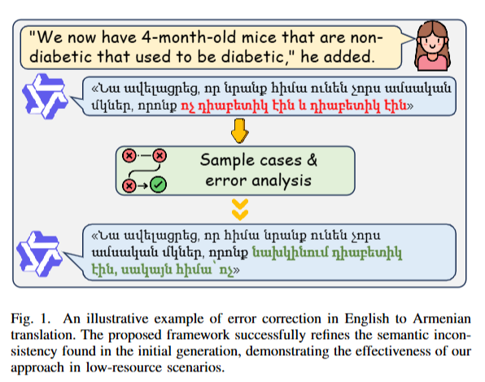

本文的主要贡献总结如下：

- (1) 本文提出一种融合检索增强上下文引导的低资源机器翻译两阶段精炼框架。
- (2) 本文设计了一种隐式精炼策略，利用检索得到的双语平行样例与辅助知识对初始译文进行纠错；并接续设置显式精炼阶段，进一步提升翻译质量。
- (3) 本文在覆盖 8 种低资源语言的多个基准数据集上开展了大量实验，实验结果表明该方法相比基线模型取得稳定提升，验证了所提框架的有效性。

# II. RELATED WORK

## A 基于大语言模型机器翻译的上下文学习

大语言模型的出现，从根本上改变了机器翻译的技术范式，使其从有监督训练转向上下文学习（ICL）。开创性工作 [3] 首次将大语言模型作为少样本学习器，依靠上下文示例完成翻译等任务。在此之后，大量实证研究验证了大语言模型在多语言场景下的应用潜力。例如，针对 BLOOM [12]、PaLM [1] 等模型的相关研究表明，扩大模型规模能够显著提升翻译性能。后续研究 [13‑15] 开展了全面评估并指出：借助少样本提示，大语言模型在高资源语言上的效果可与商用系统相媲美；但在低资源场景中，和 NLLB [16] 这类专用神经机器翻译模型相比，大语言模型依旧面临诸多挑战。

为充分发挥大语言模型的上下文学习（ICL）能力，克服静态示例的局限性，研究者提出检索增强生成（RAG）[17] 技术，该技术能够从外部数据库中动态选取语义相关的示范样例。与随机选取示例的方式相比，通过检索上下文相似的双语平行句对 [4]，或是优化检索策略 [18] 获取相关性更高的内容 [19]（例如错误示范样例 [20]），上述方法大幅提升了模型处理领域专有术语以及适配低资源场景的能力。此外，思维链提示（Chain‑of‑Thought prompting）[21] 的出现催生了分解式提示 [22]、分步翻译 [23] 等方法。这类方法对复杂源句进行拆解，以此提升长文本的翻译准确度。除此之外，基于词典的提示方法 [24] 将词汇约束注入上下文，用于解决特定术语翻译不准确的问题。也有研究探索增加示例数量，近期研究结果证实，多示例上下文学习（many‑shot ICL）[25] 可以进一步提升模型性能。

## B 精炼与反馈机制

尽管标准的上下文学习（ICL）侧重于一次性生成译文，但越来越多的研究表明：允许大语言模型对自身输出结果进行精炼，可以获得更优的效果。该方向的研究对于解决低资源翻译中频繁出现的幻觉与语义错误问题具有重要价值 [26]。Pinpoint [10]、Ladder [11] 等方法提出对应的框架，让模型接收细粒度反馈，或是对初始输出开展自我评估，进而生成润色后的译文。与之类似，xTower [27] 专门用于显式解释并修正翻译错误，将研究重心从单纯的生成任务转向批判性评估。

此外，已有自适应方法被提出，使这类译文精炼过程具备更强的上下文感知能力。自适应机器翻译已有相关研究 [28]，该类方法让模型依据实时反馈调整输出结果；而动态焦点锚定 [29] 则致力于优化模型在生成过程中对相关上下文的注意力机制。以上基于精炼的策略表明：将翻译视作迭代式问题求解过程，而非一次性生成任务，能够显著提升大语言模型的翻译质量。

# III. METHOD

如图 2 所示，本节介绍本文所提出的面向低资源机器翻译的两阶段精炼框架。该框架首先检索相关双语平行句对，并利用大语言模型生成初始译文。3‑A 节介绍隐式精炼阶段，该阶段结合检索样例、模型生成译文、参考译文以及辅助知识共同引导译文纠错。随后 3‑B 节阐述显式精炼阶段：该阶段采用基于多维度质量度量（MQM）的质量分析手段，对译文进行迭代核查，修正残余错误。

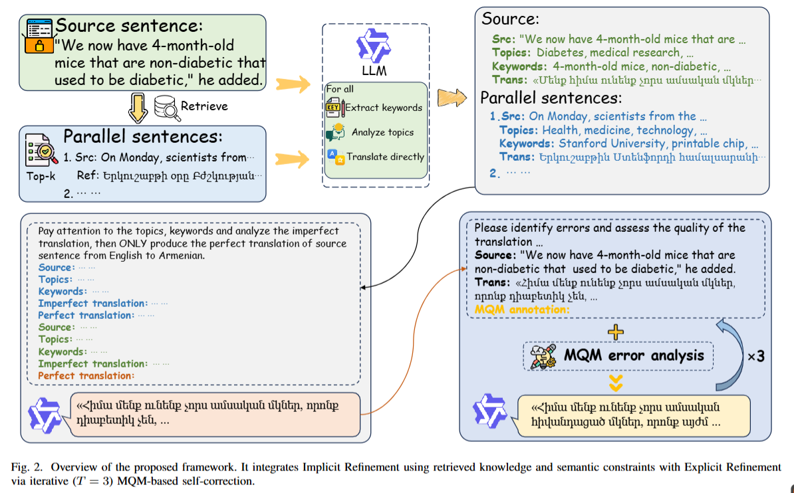

## A 基于检索平行样例的隐式精炼

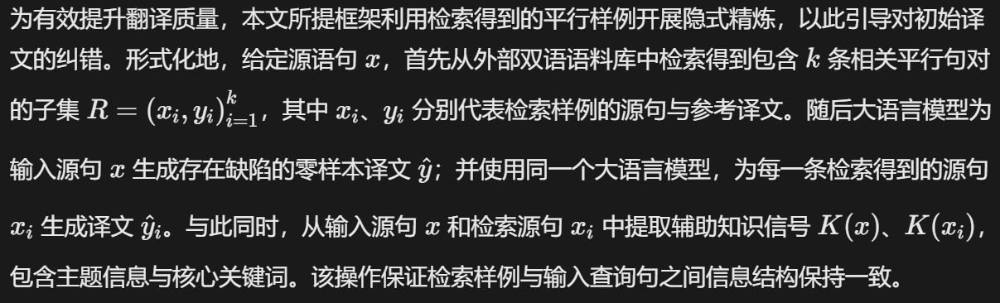

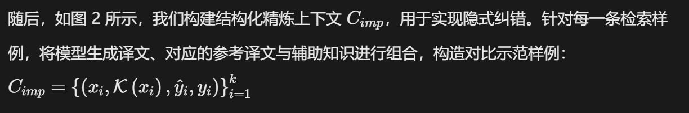

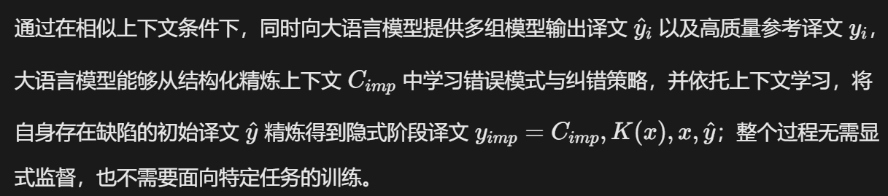

## B 基于 MQM 引导迭代的显式精炼

尽管隐式精炼阶段能够有效修正主要翻译错误，但得到的译文 \(y_{imp}\) 仍可能存在细微问题。第二阶段引入面向翻译质量的显式精炼步骤，促使模型对自身生成的译文进行检查，并开展针对性纠错。

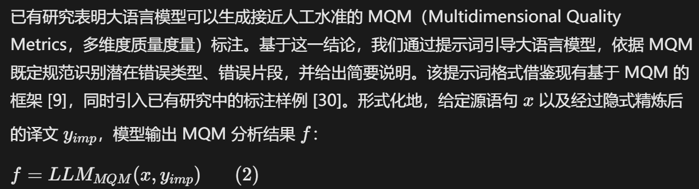

得到的 MQM 格式分析结果 f 针对翻译错误给出显式的细粒度反馈，这些识别出的问题随后将作为修订提示，引导模型对译文做进一步优化。

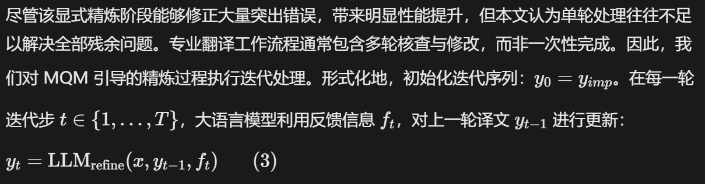

将更新后的译文重新送入显式精炼循环，总共执行三轮迭代，最终得到输出译文。

# IV. EXPERIMENTS

## A. Setup

**数据集** 本文采用如下数据集，测试集的详细统计信息汇总于表 Ⅰ。

- FLORES‑200 [31] 提供 204 种语言的专业翻译句子。我们使用开发集作为检索库，在开发‑测试集上开展评测。实验采用**英语→X 语言**方向，覆盖八种低资源语言。
- NTREX‑128 [32] 包含 1997 条新闻领域双语平行句对。参照已有工作 [8]，选取前 1000 条句对用于评测，剩余 997 条句对作为检索库。翻译方向同样为英语向上述低资源语言进行转换。
- TICO‑19 [33] 包含 35 种语言的新冠疫情相关文本。我们将开发集（971 组句对）作为检索库，并选取四种语言，在**英语→X 语言**与**中文→X 语言**方向上完成测试。

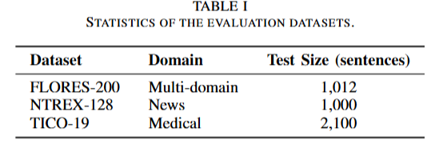

**基线方法** 本文将所提方法与以下基于大模型的翻译基线进行对比：

- COD [7] 将多语言词典查询信息融入提示词，构建语义链，弥补低资源语言中稀有词汇存在的词汇空缺。
- MAPS [6] 向大语言模型输入多种类型知识的提示，并动态选择效果最优的知识来引导翻译过程。
- TEaR [9] 采用自精炼框架，由大语言模型对初始译文进行修正。
- CompTra [8] 将复杂源句拆解为若干简单句，以此检索相关示例，再基于子句译文重构得到最终译文。

**实现细节** 全部实验（包含所有基线方法）均采用 Qwen3‑30B‑A3B‑Instruct [34] 作为基础大语言模型。推理阶段使用贪心解码，将温度参数设置为 0.0，保证实验结果具备可复现性。详细超参数与实现配置汇总于表 Ⅱ。已有研究表明混合检索具备更优性能 [35][18]，因此本文采用混合检索策略：针对每条输入语句检索 3 条双语平行句对，其中 2 条通过 Qwen3‑Embedding‑4B [36] 稠密检索得到，另外 1 条通过 BM25s [37] 稀疏检索得到。翻译质量采用两项基于参考译文的评价指标 XCOMET‑XL [38] 与 BLEURT‑20 [39‑40] 开展评测，二者从互补的角度衡量译文语义完备度与整体流畅度。

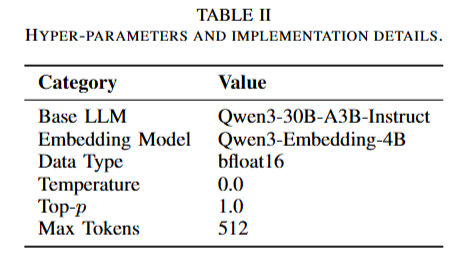

## B. Main results

**总体性能** 表 Ⅲ‑表 Ⅵ 给出模型在 FLORES‑200、NTREX‑128、TICO‑19 这三类不同基准数据集上的对比结果。通过在多领域、新闻、专业医疗场景下开展评测，本文全面评估该框架的适配能力。总体而言，在各类基于大语言模型的基线方法中，本文方法始终取得最优或极具竞争力的性能。尤其在 XCOMET 指标上表现突出，证明无论领域复杂程度如何，也无论源语言为英语还是中文、面向各类低资源目标语言，该方法均具备优异的语义忠实度与泛化能力。

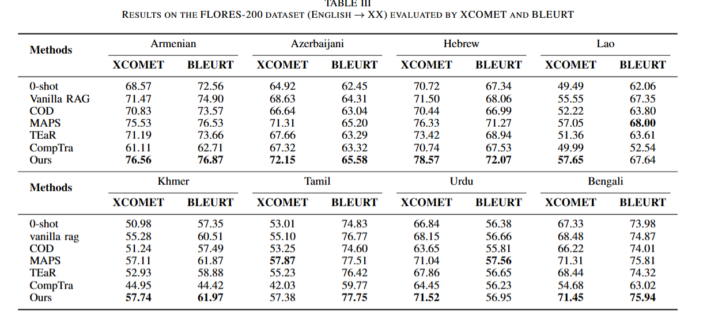

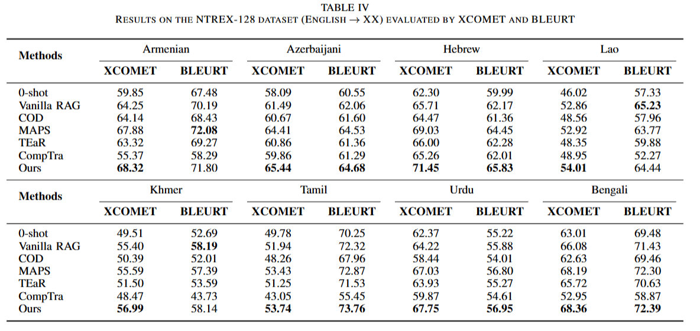

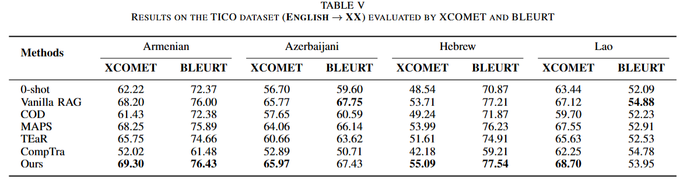

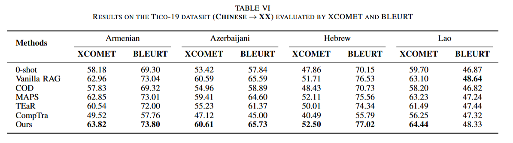

**英语到低资源语言翻译结果** 如表 Ⅲ 至表 Ⅴ 所示，本文方法整体优于零样本基线以及各类对比方法，涵盖词典提示类方法（COD）、自精炼方法（TEaR）以及检索增强类方法（CompTra）。在多领域（FLORES‑200）、新闻领域（NTREX‑128）以及专业医疗领域（TICO‑19）场景下，本文方法在绝大多数指标上取得最优结果。具体来看，相较于零样本基线，在 FLORES‑200 数据集上亚美尼亚语的 XCOMET 指标提升 8.0 分；在 NTREX‑128 数据集上希伯来语的 XCOMET 指标提升 9.1 分。而在医疗领域，尽管专业术语密度很高，本框架依旧具备出色的适配能力，在全部四种目标语言上均取得最高 XCOMET 分数。MAPS 方法虽同样具备不错的竞争力，偶尔在部分特定指标上取得领先，但本文的精炼策略在 XCOMET 指标上占据优势，在各类专业领域与复杂技术内容下保障了更优的语义忠实度与鲁棒性。

**领域与语言泛化能力** 表 Ⅵ 在医疗数据集 TICO‑19 上开展泛化能力评测，该测试设置存在一大难点：源语言切换为中文。即便面临这类领域与语言层面的双重阻碍，本文方法依旧展现出优异的适配能力，在全部四种目标语言上取得最高 XCOMET 分数。在该实验条件下，原始 RAG 成为竞争力最强的基线，性能优于 MAPS 等其他方法。该基线性能提升大概率源于医疗文本中大量的专业术语，检索机制可以有效地提供这类术语。但本文方法在绝大多数指标上始终优于原始 RAG。这一现象说明：检索虽能够提供所需领域术语，而本文的精炼机制可以保障术语在译文中实现正确的句法与语义融合。综合以上实验结果，充分体现本框架整体鲁棒性，验证了该方法即便面对源语言切换、专业技术内容的双重挑战，依然可以生成高质量、语义连贯的译文。

## C. Analysis

**知识引导的作用** 为验证隐式精炼阶段中知识引导模块的贡献，我们基于 FLORES‑200 数据集，采用第一阶段输出结果开展消融实验，实验结果如表 Ⅷ 所示。移除知识引导后，两项评价指标均出现持续下降。这表明：==检索得到的平行样例虽可提供可靠参考，但在此基础上补充显式语义约束，能够进一步提升译文忠实度==。该附加上下文可以有效引导模型生成更加准确、领域风格一致的译文。

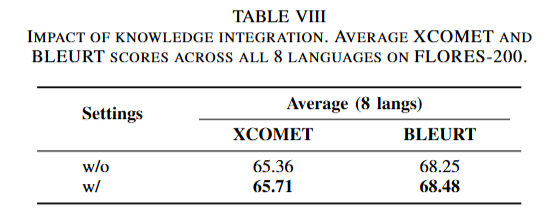

**显式精炼的作用** 如表 Ⅶ 所示，为验证第二阶段的必要性，我们评测引入显式精炼机制所带来的性能增益。将仅经过隐式精炼（只使用第一阶段，记为 Implicit Ref.）的结果，与完整框架（叠加 MQM 引导显式反馈，开启第二阶段，记为 +Explicit Ref.）进行对比。实验可以看到：第一阶段已经打下较好的性能基础，但叠加显式精炼后，八种语言全部获得稳定提升。例如希伯来语的 XCOMET 分数由 74.34 提升至 78.57，亚美尼亚语、阿塞拜疆语上同样出现显著增益。这表明，虽然第一阶段的上下文对比示范可以有效解决主要翻译错误，但第二阶段面向质量的反馈机制，对于修正不易察觉的残余错误、进一步打磨译文语义忠实度与流畅度至关重要。

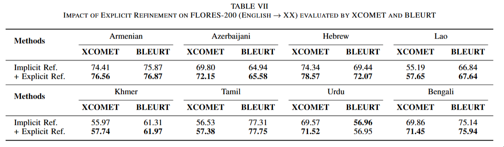

**精炼迭代次数的影响** 如图 3 所示，本文在 FLORES‑200 数据集上，针对全部八种低资源语言，分析每一轮迭代带来的平均边际性能增益，进一步探究第二阶段的最优反馈迭代轮数。首轮迭代（\(T=1\)）即可带来显著的译文质量提升。关键的是，继续增加迭代轮数还能获得稳定的额外收益，证实迭代式反馈可以进一步打磨译文。但当迭代轮数超过三轮之后，边际收益会大幅衰减，性能趋于平稳。因此，为兼顾译文质量与推理开销，本文选取 \(T=3\) 作为最优折中配置。

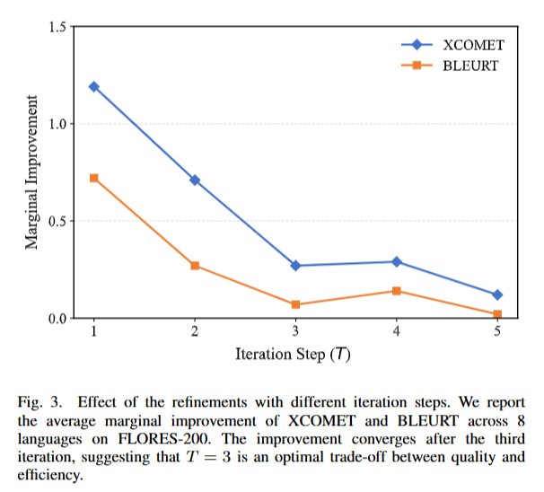

**案例分析** 表 Ⅸ 给出一组英语→希伯来语的实例。原始 RAG 方法出现严重错误，包括生成法语幻觉词汇（“américain”）以及混合文字书写形式的术语（“haletes”）。隐式精炼阶段虽然修正了命名实体，但形态学错误依旧存在。第二阶段最终解决该问题，输出正确的希伯来语词汇 “athletim”，同时优化了习语 “follow their dreams（追逐梦想）” 的译文。该案例证明显式反馈对于修正错误至关重要；但输出译文与参考译文之间仍存在风格差异，这也凸显出在低资源语言场景下，模型想要完全复刻人工译文细腻表达依旧存在难度。

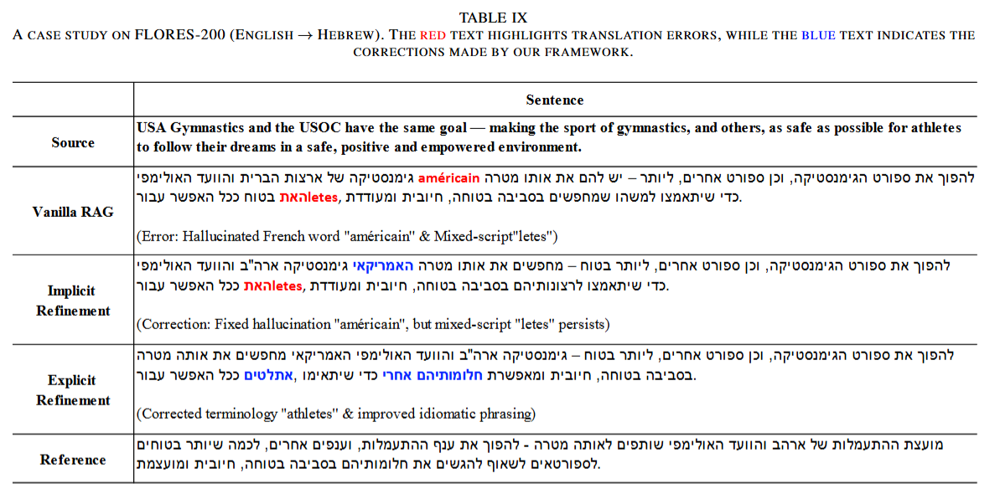

# V. CONCLUSION

本文提出一种两阶段精炼框架，用于应对低资源机器翻译面临的各类挑战。该方法将检索增强生成与自纠错机制相结合，有效融合外部上下文引导信息与模型自身推理能力。具体而言，第一阶段利用检索样例完成隐式精炼；第二阶段借助迭代反馈修正残余错误。在 FLORES‑200、NTREX‑128 以及 TICO‑19 数据集上开展的大量实验表明，本文方法整体优于对比基线方法，即便在专业医疗领域也展现出良好鲁棒性。但迭代精炼会带来一定计算开销，因此未来工作将以效率优化为重点，研究自适应策略，在译文高质量与实际推理成本之间取得平衡。