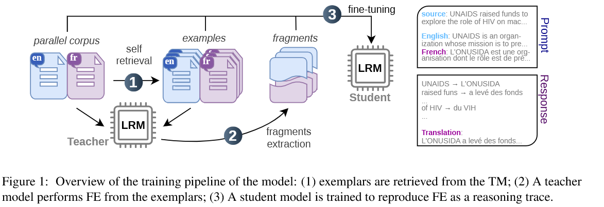
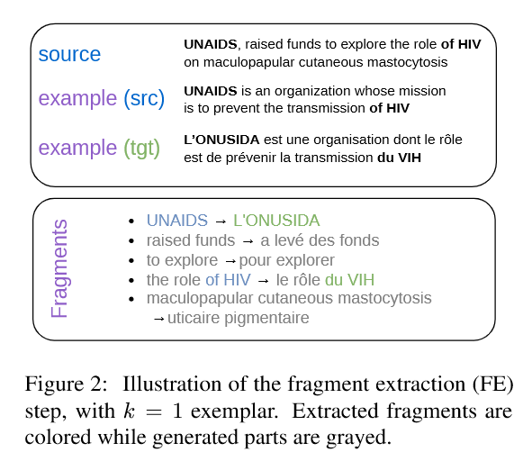
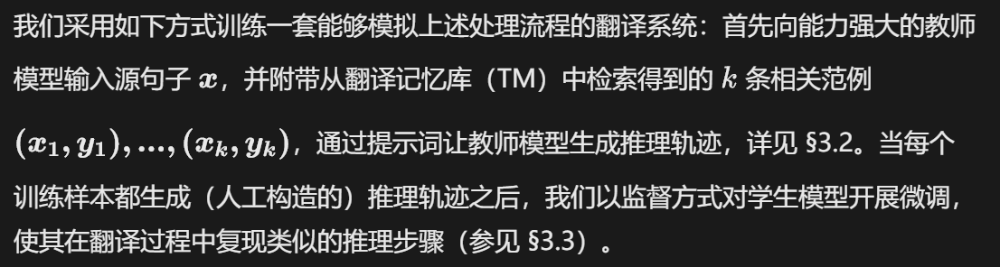
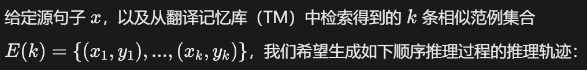
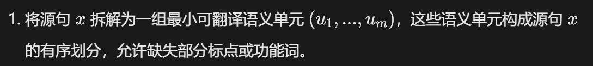
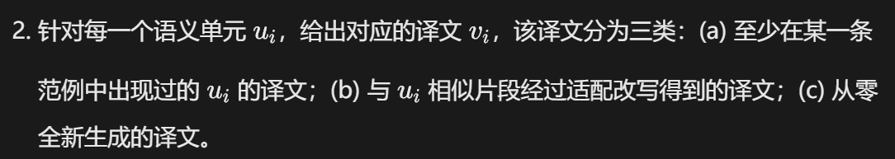
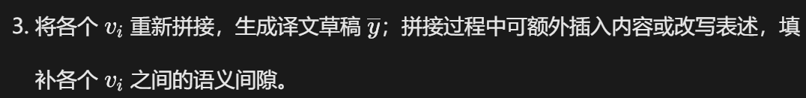

# 面向机器翻译的上下文样本推理

2026-arxiv

# Abstract

大语言模型（LLM）经过训练可以执行思维链推理，以此提升输出结果的可靠性。在本文中，我们研究如何将显式推理应用于带有上下文样本的大模型机器翻译（MT）任务。我们提出一种新颖的基于片段的推理框架：<u>模型先从检索到的相似范例中提取源语言‑目标语言平行片段，并把这些片段作为中间推理线索，生成最终译文</u>。为训练模型，我们从一个大型教师模型中蒸馏得到银标片段与翻译草稿。我们基于 Qwen3 模型系列开展实验，实验覆盖 6 种语言，每种语言最多设置 5 个领域。实验表明，该基于片段的机器翻译方法性能显著优于其他对比（原文句子不完整）。

# 1 Introduction

大语言模型（LLM）已在各类任务中取得出色效果（Touvron 等人，2023），其中就包括机器翻译（MT）任务（Vilar 等人，2022；Zhang 等人，2022）。上下文学习（ICL）（Brown 等人，2020）能够有效提升面向机器翻译定制的大语言模型性能（Zhang 等人，2023a）。该技术提供了一种简便机制，可以输入额外的任务专属、词汇、术语或风格类上下文信息，引导生成算法产出准确度更高的译文（Moslem 等人，2023）。

大语言模型现已演进为大型推理模型（LRM）：这类模型在输出最终结果之前，会先生成 “思考” token（Wei 等人，2022）。通过监督微调（SFT）、强化学习（RL）等手段，可进一步对大型推理模型进行指令调教，使其在数学、代码这类严谨任务上复现人类的推理步骤（DeepSeek‑AI，2025）。放到机器翻译场景下，这些额外生成的思考 token 可用于模拟语言学分析、局部译文或者翻译草稿，之后再输出完整译文（Raunak 等人，2023；He 等人，2024；Briakou 等人，2024；Zebaze 等人，2025a）。

因此，大多数面向机器翻译的思维链（CoT）相关研究都借鉴人类译者的工作流程：将翻译建模为一系列逻辑有序的步骤，包括查阅词典、术语分析、翻译以及多轮修订，并让模型生成对应的 “思考” 标记来模拟该过程。而本文的研究出发点有所不同，我们旨在对翻译记忆库增强翻译中编辑一条或多条高度相似范例所对应的推理过程进行建模（Bowker & Fisher，2010）。尽管神经机器翻译（NMT）系统已取得长足发展，但翻译记忆库依旧是职业译者工作流中的重要工具。它可以复用经过验证、术语与表达方式均准确的高质量译文，且整个复用过程可追溯透明，而术语与表达恰恰是专业领域翻译的两大核心要素。因此，将翻译记忆库与神经机器翻译相结合，再进一步对接上下文学习与大语言模型，是一个极具研究价值的课题，已有不少相关工作对此展开探究（Gu 等人，2018；Bulte & Tezcan，2019）。

正如早期基于实例的机器翻译（EBMT）相关研究所述（Somers，1999），基于翻译记忆库开展推理在逻辑上同样可以拆解为若干步骤：
(a) 为当前源句检索相关范例 ²，<u>通常依据模糊表层相似度得分完成检索</u>；
(b) 在检索得到的范例中匹配同样出现在源句里的文本片段，并获取这些片段对应的目标语言译文；
(c) 对上述片段进行筛选、重组、适配与补全，生成完整译文；
(d‑可选步骤) 对这份译文草稿进行修订。

在本研究中，我们主要聚焦步骤 (b)，其次兼顾步骤 (c)。步骤 (a) 交由外部检索模块实现，步骤 (d) 则利用大语言模型本身固有的生成能力完成。据此，本文提出以下研究问题：
(RQ1) 大语言模型 / 大型推理模型能否可靠完成匹配步骤，从检索得到的范例中识别出真实存在的翻译片段，而非自行生成片段？
(RQ2) 提取得到的这些片段是否能够提升机器翻译质量？
(RQ3) 当检索多条范例时，片段提取（下文简称 FE）是否可以获得更大收益？换言之，模型能否从噪声中筛选出有用信息？
(RQ4) 片段提取是否在部分特定领域或语言上的提升效果优于其他领域、语言？

为探究上述研究问题，我们搭建了一套完整流程（如图 1 所示）。该流程以==Qwen3‑32B 模型（Yang 等人，2025）作为教师模型==，生成匹配任务的训练样本；再使用经过微调的 Qwen3‑8B 模型执行推理与译文生成任务。本文主要研究结论如下：
(a) 大语言模型能够学习对平行句中的有效双语片段进行匹配、筛选或生成；
(b) 在推理过程中提取这类片段 —— 即便片段带有噪声 —— 对于本文所采用的全部评价指标而言，都能显著提升翻译质量；
(c) 性能提升效果与检索得到的范例数量无关，这表明片段提取（FE）能够输出稳定可靠的信号，可用于生成最终译文；
(d) 该方法可以泛化到微调阶段未曾见过的领域；
(e) 将片段检索与草稿生成技术相结合，对于训练阶段见过的领域似乎会损害翻译质量，但对未见过的域外领域能够带来性能增益。

# 2 Related Work

==**检索增强机器翻译**==
检索增强机器翻译（RAMT）利用相似范例来提升翻译质量。和其他认知类任务一样，使用可查阅的范例能够提升翻译过程的可解释性（Rudin，2019）；针对专业领域机器翻译，范例还可以隐式带来一定的领域适配能力。如 Bulte 和 Tezcan（2019）、Xia 等人（2019）、He 等人（2021）、Cheng 等人（2022）、Agrawal 等人（2023）所述，在编码器‑解码器模型中可以很方便地实现检索增强机器翻译：将从翻译记忆库（TM）中检索到的一条或多条相似目标句追加到源语言侧，而目标端的解码器模块基本保持不变。

基于大语言模型的机器翻译同样十分适配范例样本：一旦通过上下文学习（ICL）将范例融入模型输入，范例就能够提供任务专属上下文，同时给出词汇与风格层面的参考建议（Radford 等人，2019）。大量后续研究进一步探究了提示词、范例的质量与数量，以及检索流程带来的影响（Moslem 等人，2023；Vilar 等人，2023；Zhang 等人，2023a；Hendy 等人，2023；Bawden 和 Yvon，2023；Zebaze 等人，2025c）。

另有一条并行的研究路线聚焦==编辑式模型==（Gu 等人，2019），该方向将检索增强机器翻译（RAMT）视作基于实例的神经机器翻译的新范式（Nagao，1984；Somers，1999；Carl 等人，2004）。神经机器翻译与大模型翻译方法是从零生成译文，与之不同，编辑式模型通过对已有译文做最小程度修补来生成输出。这就需要识别出译文里哪些部分应当保留、哪些需要调整、哪些要完全重新翻译，之后执行对应的处理操作。当能够找到相似度很高、只需少量修改的范例时，这类方法效果尤为突出；此时生成结果很大概率会复用检索译文中大段无错误的片段。Xu 和 Carpuat（2021）、Niwa 等人（2022）、Xu 等人（2023）、Zheng 等人（2023）、Bouthors 等人（2023）等工作给出了基于非自回归解码器实现该思路的近期方案。

==大型推理模型==

大型推理模型（LRM）能够执行多步推理，完成复杂任务（Cobbe 等人，2021）。这类模型经过调优后，会在输出最终答案之前，额外生成中间文本，也就是所谓的思维链（CoT）步骤（Wei 等人，2022）。思维链可以通过提示词（例如 “让我们一步步思考”）或者监督微调来开启启用（Kojima 等人，2022；Zhang 等人，2023b；Yasunaga 等人，2024）。强化学习（RL）可以进一步提升模型的推理能力，尤其适用于代码、问题求解这类能够自动检验答案正确性的任务（Setlur 等人，2024；DeepSeek‑AI 等人，2025）。

上述相关研究的重心放在生成后处理步骤上，与之不同，MAPS（多维度提示与筛选，He 等人，2024）则聚焦翻译前预处理。该方法通过提示大语言模型分析源句，生成主题列表、关键词列表，以及以相似范例形式呈现的参考样例。随后利用这些背景信息生成三份候选译文，每份候选译文分别基于不同的知识源生成。最后通过质量评估（QE）指标选出效果最优的候选译文。

Briakou 等人（2024）融合了上述两种研究思路，整合了译者在翻译之前与翻译之后执行的各类子任务。他们的实验设置1 个翻译前步骤（对源句中的 “难点术语” 进行解释）以及3 个翻译后步骤（生成草稿、润色优化、校对），研究聚焦于文档级机器翻译⁴。He 等人（2025）对该方法做了拓展，结合监督微调（SFT）与强化学习（RL），模拟译者使用的多种 “推理” 策略，例如句子拆解、回译、枢轴翻译。

Chen 等人（2025）、Nguyen 和 Xu（2025）直接采用提示技术对面向机器翻译的 “推理” 模型开展评估。Feng 等人（2025）复用 DeepSeek‑R1 的训练策略（DeepSeek‑AI 等人，2025）来调优适配机器翻译任务的大型推理模型。为此，他们研究了多种奖励模型，融合格式合规性与内容一致性指标。实验结果表明，仅依靠强化学习训练出效果优异的机器翻译引擎是可行的。Zebaze 等人（2025a）仅通过监督微调实现思维链，并发现标准思维链 —— 也就是允许模型输出 “思考” 标记 —— 在其实验条件下无法提升机器翻译性能。该工作探究了两类思维链：(a)翻译内省，通过 6 种不同方式模拟专业译者的推理过程（He 等人，2025）；(b)辅助任务，思维链标记对应能够辅助翻译的各类任务，也被称作 “模块化提示策略”。这类各式各样的 “翻译前” 任务，例如对源文本进行复述、识别翻译难点等，均从教师模型中蒸馏得到，之后整理为监督微调样本供给学生模型使用。Rajaee 等人（2026）也报道了类似的实验。

# 3 Method

## 3.1 Principles基本原理

从宏观视角来看，基于实例的机器翻译（EBMT）包含三项核心操作：<u>检索、匹配与重组</u>（Somers，1999）。最后还可选择执行修订步骤。<u>本研究主要聚焦第二步和第三步</u>。给定从翻译记忆库中检索得到的相关范例，匹配步骤会先定位到与当前翻译任务相关的源语言语段，再将这些语段和对应的目标语言语段进行匹配。随后重组步骤会把这些目标语言片段重新拼接，生成完整的翻译候选结果。该过程中可能需要做一些适配处理（例如形态变化、局部语序重排等），以保证翻译候选结果的句法合规。

该训练流程高度依赖自动生成的 “推理” 标记，这也是思维链方法中的常见做法（Shum 等人，2023；Zhang 等人，2023b）。原因在于，除少数特定场景（如数学问题）外，训练数据中几乎不存在这类推理标记。机器翻译任务同样面临该现状，因此我们需要对译者的推理操作进行模拟。后续章节将依次介绍教师模型与学生模型。

## 3.2 银标片段提取

步骤 1 与步骤 2 如图 2 所示。上述每一步都与前代机器翻译系统中已被充分研究的处理过程相类似。例如，步骤 1、2 类似于统计机器翻译系统中生成（无权重）翻译表的过程，而步骤 3 则相当于基于该翻译表做解码（Koehn，2010）。步骤 1 和步骤 2 同样也是基于实例的机器翻译（EBMT）中的标准流程：步骤 1 会借助句法解析，步骤 2 则会用到词汇检索或者自动词对齐。草稿生成（步骤 3）被应用于多款当代机器翻译推理模型中（Xu 等人，2024；Briakou 等人，2024）。面向低资源机器翻译任务，Zebaze 等人（2025b）同样组合了步骤 1‑3：先生成短片段译文，再将这些片段译文作为上下文样例用于整句翻译。