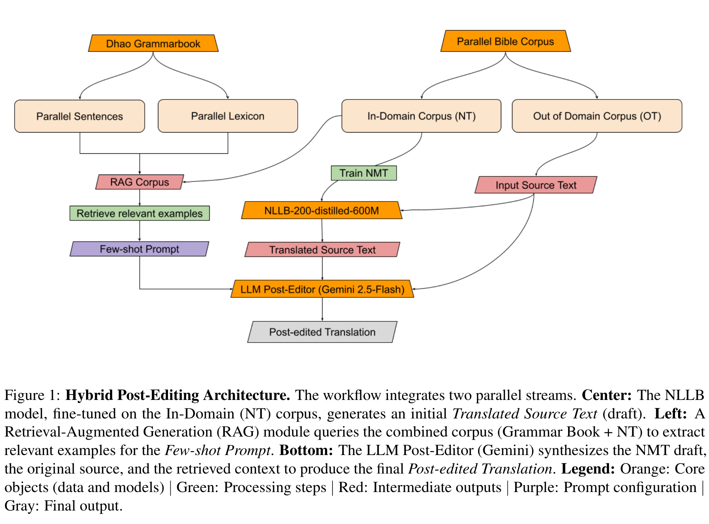
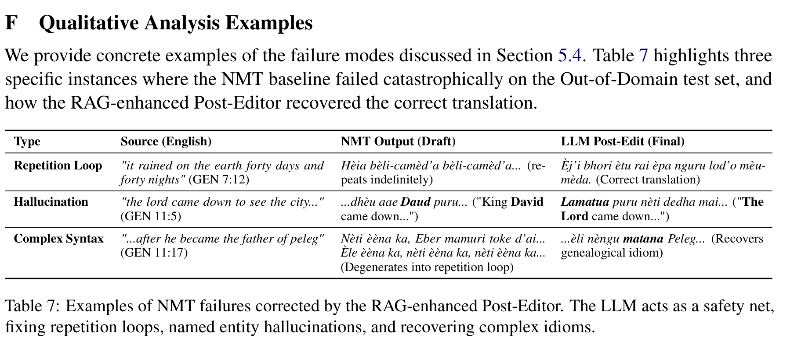
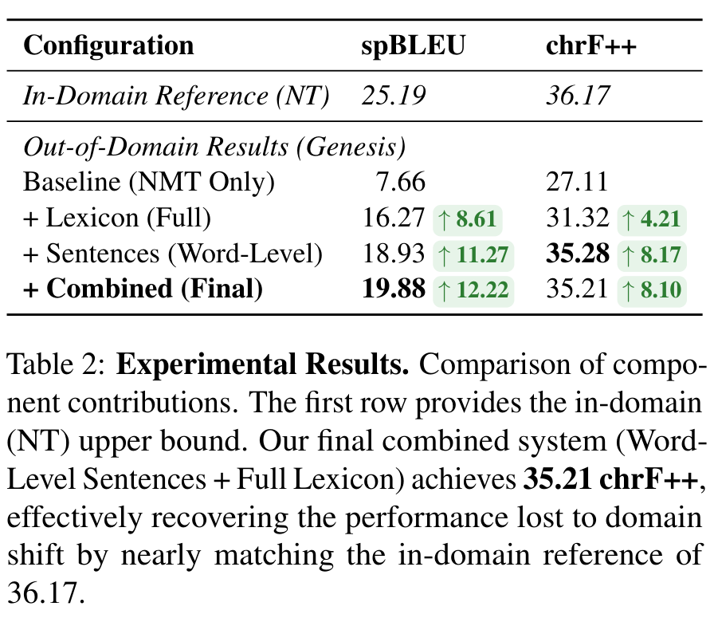

# 上下文规模决定模型性能：基于检索增强生成解决超低资源翻译中的域偏移问题

Context Volume Drives Performance: Tackling Domain Shift in Extremely Low-Resource Translation via RAG

墨尔本大学

# Abstract

面向低资源语言的神经机器翻译（NMT）模型在发生域偏移时会出现显著的性能下降。本文以印尼东部土著语言达奥语（Dhao）为研究对象，对该难题开展量化分析。<u>除《新约》（NT）译本外，达奥语几乎没有其他数字化文本资源</u>。将在《新约》上微调得到的标准神经机器翻译模型用于处理从未见过的《旧约》（OT）文本时，模型性能从域内 chrF++ 分数 36.17 暴跌至 27.11；《旧约》的未登录词（OOV）率达到 25.9%，是原有水平的 3 倍，并且和《新约》训练数据存在明显的主题差异。为弥补上述性能损失，本文提出一种混合框架：由经过微调的神经机器翻译模型生成初始译文草稿，再借助检索增强生成（RAG）技术，通过大语言模型（LLM）对译文进行优化润色。最终系统取得 35.21 的 chrF++ 分数，性能提升 8.10，基本恢复至原始域内翻译质量。分析结果表明，决定系统性能的核心因素是检索得到的示例数量，而非检索算法的选型。定性分析证实，大语言模型可以充当可靠的 “安全网”，能够修复零样本域下出现的各类严重翻译错误。

# 1 Introduction

全球 7000 多种语言中，绝大多数语言的唯一大规模数字化资源往往只有圣经文本（Ranathunga 等人，2023）。但翻译工作通常优先完成《新约》（NT）的翻译，占圣经篇幅 75% 的《旧约》（OT）则常常无人翻译。这是因为《新约》承载着神学核心内容，是新信徒与新兴教会的重要学习起点。此外，《旧约》本身语言复杂度高、篇幅庞大，给翻译带来了巨大挑战。

截至 2025 年 8 月，已有 2574 种语言拥有完整的《新约》译本，但仅有 776 种语言完成了完整的《旧约》翻译（威克里夫全球联盟，2025）。利用现有的《新约》数据训练机器翻译（MT）模型来翻译《旧约》，看似是顺理成章的下一步，然而该技术路线会面临突出的**域偏移**难题。尽管二者同属一套正典经文，但《新约》与《旧约》在词汇、文体层面差异巨大：二者源语言不同（希伯来语对比通用希腊语），所涵盖的主题也截然不同（历史叙事 vs 神学论述）。

我们对英文源文本《世界英文圣经》开展分析，量化了这一域偏移现象：相对于《新约》训练词表，未登录词（OOV）率从域内《新约》验证集的 8.1%，上升至《旧约》测试集的 25.9%（详见附录 A）。因此，仅依靠《新约》训练得到的神经机器翻译模型泛化能力很差，会出现明显的性能下降（Akerman 等人，2023）。

在本文研究中，我们以印尼东部土著语言达奥语（Dhao）为对象，研究从《新约》到《旧约》的域偏移问题；该语言使用者不足 5000 人（SIL 国际，2025）。现有域自适应研究大多依赖目标域单语语料（Chu 和 Wang，2020；Marashian 等人，2025），而本研究的约束条件更为严苛：主要训练数据被限定在单一领域（《新约》），仅有的通用领域信息来自一本篇幅有限的数字化语法书。针对该问题，本文提出一套**神经机器翻译 + 大模型后编辑**混合框架。<u>我们使用经过微调的神经机器翻译模型生成初始译文草稿，再采用检索增强生成（RAG）技术加持的大语言模型，结合从语法书与《新约》中检索得到的上下文，对译文结果做优化处理。</u>

我们系统对比了**句子级检索**（整句相似度匹配）与**词级检索**（源语言单词聚合匹配），评估二者对本文所提混合流水线的影响。实验结果表明：尽管增大上下文规模能够让所有检索策略均稳定获得性能提升，==但检索算法本身的选型属于次要因素==。经过优化的最终系统可将字符级重合度指标 chrF++ 恢复至域内水平；但子词相似度指标 spBLEU 仍存在差距，这很可能源于《旧约》更大的文体与词汇差异。基于上述实验发现，本文将主要贡献总结如下：

Contributions

- **面向未见语言的零样本域自适应**：本文提出一种神经机器翻译与大语言模型结合的混合框架，成功解决了一种几乎无数字化资料的超低资源语言所面临的域偏移问题。实验证明，该架构能够让大语言模型借助微调后的神经机器翻译模型所提供的结构先验知识，完成对其从未接触过的语言（达奥语）的译文纠错，性能优于单独使用其中任意一种模型的基线系统。
- **上下文规模是性能的首要驱动因素**：本文证实，在低资源检索增强生成（RAG）任务中，==上下文规模对大语言模型后编辑性能的影响，远大于检索算法的选型==。分析表明，在将上下文规模统一归一化之后，不同检索策略能够取得相近的性能提升。
- **“安全网” 假设验证**：本文提供定性证据证明，在零样本域场景下，大语言模型后编辑能够专门缓解神经机器翻译的灾难性错误，例如幻觉与重复循环问题，证实该混合架构在数据稀缺场景下具备良好鲁棒性。

# 2 Related Work

**低资源机器翻译中的域偏移**

标准神经机器翻译模型具有高度词汇依赖特性，当处理与训练数据分布不一致的数据时，模型会变得十分脆弱（Koehn & Knowles，2017；Hu 等人，2019；Haddow 等人，2022）。当模型遇到域外数据时，这种脆弱性通常表现为灾难性幻觉，或是输出语句通顺但与原文语义不符的译文（Müller 等人，2020；Raunak 等人，2021）。具体而言，已有研究表明这类域偏移会加剧模型对训练域先验知识的依赖，使模型忽略源文本约束，优先生成训练集中高频出现的文本片段（Wang & Sennrich，2020）。

**大语言模型与混合解决方案**

尽管大语言模型（LLM）在高资源语言翻译任务上表现优异，但由于预训练阶段从未接触过相关语言，它们处理 “未见语言” 时效果很差（Robinson 等人，2023；Hendy 等人，2023）。即便引入检索增强生成（RAG）技术，对于书写体系代表性不足的语言，往往依旧难以实现高质量翻译（Lin 等人，2025）。不过，结合语言对齐（例如词典约束）的上下文学习（ICL）被证实是一种可行方案，能够释放大语言模型处理这类语言的能力；该方法效果显著优于容易发生过拟合的微调方案（Li 等人，2025）。

为弥补上述两种范式各自的缺陷，近年相关研究普遍转向混合架构。已有研究表明，神经机器翻译模型搭配大语言模型后编辑器，是低资源翻译的理想方案，尤其有助于缓解 “词汇混淆” 问题（Nielsen 等人，2025）。但这种后编辑流程下，最优的检索粒度目前仍是尚未解决的问题。现有策略有的致力于优化 n 元语法多样性（Caswell 等人，2025），有的面向组合短语做优化（Zebaze 等人，2025）；也有研究提出采用词级检索用于语法学习（Tanzer 等人，2024）。本文综合吸收上述研究思路：我们采用 Nielsen 等人（2025）验证过的混合框架，<u>并系统对比句子级与词级这两类检索策略，以此判断性能提升究竟来源于检索算法的选择，还是仅仅来自上下文示例数量的增加</u>。

# 3 Experimental Setup

## 3.1 数据构建

我们利用第 1 节介绍的达奥语（Dhao）语言资源，构建了一个零样本域自适应评测基准。由于达奥语缺少标准化数字化资料，我们仅从两份可用原始素材整理数据集：圣经译本以及一本数字化语法书（Balukh，2020）。

**主语料库（双语圣经）** 双语圣经文本取自 ebible 语料库（Akerman 等人，2023）。我们将<u>目标端达奥语译文</u>（使用拉丁字母书写）与源语言《世界英文圣经》（WEB）做对齐处理。本次对齐的主要目的是把原始的经文章节级文本拆分为句子级平行语料，以此为神经机器翻译的有效训练提供细粒度的训练信息。数据集划分如下：

- **域内数据（训练与评估）**：完整的《新约》，共 7644 条平行经文。我们将其中 95% 的数据用于神经机器翻译模型微调，剩余 5% 用作域内验证集。
- **域外数据（测试集）**：《旧约・创世记》的前 500 条经文。虽然达奥语没有完整的《旧约》译本，但存在《创世记》的译文；我们将该文本作为评测的真实参考标准。该数据集属于完全未见过的领域，用于评估模型在第 1 节所述词汇偏移条件下的泛化能力。我们确认这些经文均未出现在补充语法书中 —— 这本语法书仅引用《新约》中的示例（Balukh，2020），以此保证不会发生数据泄露。
- **补充语料库（语法文本抽取）** 为支持<u>基于检索增强生成（RAG）的后编辑任务</u>，我们从《达奥语语法》（Balukh，2020）中抽取得到补充语料库。通过一套包含 PDF 文本切分与大模型信息抽取的半自动化流程（详见附录 B），我们整理得到一份干净数据集，包含 ==1011 条平行句子以及 2377 条双语词典条目==。这些资源是该语言仅有的可用通用领域数据。

## 3.2 Models

我们采用一种混合架构，充分发挥专用神经机器翻译模型与通用大语言模型二者的互补优势：

- **神经机器翻译（译文初稿生成）**：本文使用 NLLB‑200‑distilled‑600M 模型（Costa‑jussà 等人，2024）。我们特意选用该蒸馏版本，而非更大参数的变体（例如 1.3B、3.3B），优先保障推理速度。这既可以加快实验迭代，又能够利用模型大规模多语言预训练的优势，为在有限的达奥语《新约》数据上开展微调提供可靠的初始化权重。
- **大语言模型（后编辑）**：后编辑阶段我们使用 Gemini 2.5 Flash（Comanici 等人，2025）。选择该模型是因为它具备较大上下文窗口（能够接收大量 RAG 检索样例），并且在反复迭代实验中拥有较好的性价比。

## 3.3 Evaluation Metrics

考虑到达奥语属于低资源语言，且缺少标准化语言学工具（例如形态分析器、分词器），我们采用两项稳定性较强的评价指标来汇报模型性能：

- **spBLEU**：一种不依赖外部分词器的 BLEU 指标，基于 SentencePiece 实现（Costa‑jussà 等人，2024）。由于达奥语没有金标准分词器，spBLEU 基于模型学习得到的子词单元计算性能，从而避免基于规则的分词方案可能带来的缺陷。
- ==**chrF++**：一种基于字符 n 元语法的评价指标（Popović, 2017）。我们优先选用 chrF++，因为对于低资源语言而言，它比词级 BLEU <u>的鲁棒性要强得多</u>。该指标通过计算字符层面的重合度，即便模型生成了错误词缀或拼写变体，依然可以对正确词干给予部分分数；这对于评估《旧约》这类未见过的语体至关重要。==

# 4 Methodology

本文提出一种混合翻译框架，将专用神经机器翻译与基于大语言模型的后编辑相结合，用以缓解极端低资源条件下的域偏移问题。尽管该架构采用标准后编辑流程，但本文的核心贡献在于：针对存在域偏移的未见语言翻译任务，对检索增强生成（RAG）上下文开展系统性优化。

## 4.1 The Hybrid NMT-LLM Pipeline

如图 1 所示，该翻译流水线包含两个不同阶段：

> 📌 **图片待补充**：请将对应的截图保存到 `images/` 目录下，文件名为 `pipeline-overview.png`。
>
> 

**阶段 1：神经机器翻译初稿生成** 我们在域内（《新约》）语料上对 3.2 节介绍的神经机器翻译模型进行微调，生成初始翻译假设 \(y_{nmt}\)。我们沿用 eBible 评测基准给出的最优超参数（Akerman 等人，2023），具体细节见附录 D。

**阶段 2：检索增强后编辑** 我们使用 Gemini 2.5 Flash（Comanici 等人，2025）对译文执行后编辑。输入大模型的结构化提示词包含四部分：<u>(1) 源语言原始句子 x；(2) NMT 生成的译文草稿 \(y_{nmt}\)；(3) 一组检索得到的平行句子（取自《新约》与语法书两类数据源）；(4) 一组检索词典条目，格式为直接映射关系（例如：英文单词（词性）→达奥语单词）</u>。检索上下文的构成由实验配置决定。我们对平行句检索与词典检索分别开展评估，并在最终优化系统中将二者结合（见 5.3 节）。完整提示词结构与集成细节参见附录 C。模型被指令将译文草稿与源句做比对，仅在必要时针对性修正幻觉、重复循环等 NMT 错误，而非从头重新翻译。

## 4.2 Baselines

为评估本文所提出的框架，我们在域外（《旧约》）测试集上与四组基线配置开展对比实验。这些基线采用静态检索策略，与 4.3 节介绍的动态检索方法形成对照。

- **仅神经机器翻译（NMT‑Only）**：仅使用《新约》数据微调得到的 NLLB 模型，作为域自适应的性能下限。
- **NMT + 语法语料**：在《新约》数据基础上，加入语法书中的平行句做数据增强后微调得到的 NLLB 模型。
- **大模型直接翻译**：使用 Gemini 2.5 直接将英文翻译为达奥语，设置两种条件：零样本（无上下文）与 5 样本（5 条随机选取的固定《新约》句子）。
- 大模型后编辑（无 RAG）：不带检索模块的混合流水线，依靠大模型内部知识，分别在零样本、5 样本条件下对 NMT 译文草稿进行修正。

## 4.3 Retrieval Strategies (RAG)

本文的一项核心贡献是探究：<u>低资源场景下检索增强生成（RAG）带来的性能提升，究竟来源于检索策略、示例数量，还是二者共同作用</u>。与采用静态上下文的各基线不同，这些策略会针对输入句子 x，动态检索与之相关的示例。

### 4.3.1 Parallel Sentence Retrieval

我们从由域内《新约》语料与语法书组成的混合语料库中检索相关平行句对。全部检索操作均在源语言端（英文）执行，无需使用基于达奥语训练的检索模型。本文评估四种检索策略：

**句子级方法（固定 k 值）**

 这类方法根据与输入源句的相似度检索固定数量 k 的句子。我们测试的 k 取值范围为 {5, …, 100}。

- **BM25（词法检索）**：一种经典稀疏检索方法，依据关键词精确重合度对句子排序，并针对文档长度做归一化处理。==英文分词目前来说是一件非常简单的事情，所以从高资源→低资源使用BM25是一件很正常的事情==
- **BGE 嵌入（语义检索）**：基于 bge‑large‑en‑v1.5 的语义检索方法（Xiao 等人，2023）。我们计算源句嵌入向量与语料库嵌入向量之间的余弦相似度，捕捉关键词匹配之外的语义关联。==语义检索对于高资源来说也不是问题，无需添加阈值限制==
- **ChrF‑Counterweighted（词法检索，侧重多样性）**：改编自 Caswell 等人（2025）的工作，该方法用于提升 n 元语法的多样性。它迭代式挑选字符 n 元重合度高的样例，同时对已选样例中出现过的 n 元语法施加惩罚，避免上下文窗口被大量重复表述占用。

**词级方法（动态 k 值）**

受 Tanzer 等人（2024）启发，本文实现模糊单词匹配策略。该方法不以整句为单位进行检索，而是针对源句中的每个单词，检索排名前‑*n*条平行句子。我们借助 rapidfuzz 库计算归一化莱文斯坦距离，以此得到词元相似度，仅保留相似度大于等于 0.5 的匹配结果。与句子级方法不同，示例总数 *k* 是动态变化的，会随句子长度缩放（*k*≈*n*×句子长度）。我们对 *n*∈{1,2,3,5,10,15,20} 开展消融实验，用以判断细粒度的词级上下文是否优于句子级检索

### 4.3.2 词典检索

我们进一步使用从语法书中抽取的双语词典条目扩充上下文。对比以下两种配置：

- **模糊检索**：针对每个源语言单词，检索相似度排名前‑n的词典条目。我们测试 \(n∈\{3,5,10,15,20,25,30,50,70,100\}\)。

- **完整词典**：将全部 2375 条词典条目全部放入上下文窗口，把词典视作静态资源，而非检索得到的内容。

# 5 Results

## 5.1 基线性能与域偏移

我们首先在域外（旧约）测试集上对微调后的神经机器翻译模型开展评估，以此量化域偏移的严重程度。如表 1 所示，模型出现性能骤降：spBLEU 分数从域内（新约）的 25.19 下降至域外（旧约）的 7.66，chrF++ 分数由 36.17 降至 27.11。该结果证实，面对从新约到旧约之间词汇与文体层面的分布差异，标准微调手段效果有限。

**大模型充当安全兜底机制** Gemini‑2.5‑Flash 

直接翻译的效果很差（spBLEU 为 2.98），说明该模型本身不具备达奥语的先验知识。但混合后编辑框架的性能显著优于 NMT 基线（5 样本条件下 spBLEU 提升 4.88）。定性分析表明，大模型起到了 “安全兜底” 的作用。NMT 模型在处理未登录词时经常出现灾难性错误，例如陷入无限重复循环。大模型能够稳定识别并截断这类循环，输出通顺连贯的文本（见表 7）。

> 📌 **图片待补充**：请将对应的截图保存到 `images/` 目录下，文件名为 `safety-net-effect.png`。
>
> 

## 5.2 检索策略分析

本文的一个核心研究问题是：低资源检索增强生成（RAG）的性能提升，究竟来源于检索算法的选择（例如语义嵌入对比词法重合匹配），还是仅仅由上下文内样例的数量带来。为解答该问题，我们将分析拆分为两部分：首先单独评估平行句检索的效果，随后再分析词典检索带来的影响。

### 5.2.1 平行句检索分析

**上下文样本数量的影响** 如图 2（左）以及附录 E 中表 4 的详细结果所示：所有动态句子级检索策略，即便在较小的k取值下，性能也立刻优于静态 5 样本基线（红色虚线）。无论采用稠密嵌入（BGE）还是稀疏匹配（BM25），随着上下文样本数量从 5 增加至 60，模型性能都得到持续且显著的提升。但当\(k≈60\)时，这些方法的性能便进入平台期。与之不同，词级检索策略（图 2 右）规避了这种性能饱和现象。通过检索细粒度样例，该策略能够让模型充分利用规模大得多的上下文，性能持续提升，并在有效\(k≈137\)时达到峰值（完整数值结果参见表 5）。

**性能趋同与效率权衡** 对比各方法的最优配置后，我们观察到峰值性能趋于收敛。如图 3 柱状图所示，词级检索、ChrF‑RAG、BGE 这几种策略的 chrF++ 最高得分彼此相差均不超过 0.5。词级模糊匹配策略取得了全局最高分（chrF++ 为 35.28），但相较于最优句子级基线（ChrF‑RAG：34.98），优势幅度很小（仅提升 0.3）。

然而，从效率角度分析，句子级检索更占优势。ChrF‑RAG 仅使用 \(K=60\) 个样例，就能达到最优性能的 99%；而词级策略需要将近两倍的样本量（约 137 个），却只换来微弱的性能提升。因此，在受 token 开销与推理时延约束的实际部署场景中，==句子级检索是更务实的方案==。

**检索语料库的影响** 为验证本文研究结论的泛化能力，我们将补充语法数据带来的影响做独立剥离分析。我们对比最优配置（词级检索，\(n=10\)）分别使用混合语料库、以及仅使用域内《新约》语料做检索时的性能表现。

结果表明：将检索数据源限定为《新约》语料库，相较于混合语料库，性能仅有小幅下降（chrF++ 由 35.28 降至 35.01，spBLEU 从 18.93 降至 18.47）。这证明，对于极低资源语言，即便圣经译本是唯一可用的数字化资源，该方法依旧可行，无需额外将语法书数字化。

### 5.2.2 词典检索分析

在完成平行句检索的分析之后，我们独立评估双语词典的实际效用。

**词典条目数量的影响** 如图 4 所示，模型性能随提供的词典条目数量呈线性提升，这与句子检索中出现的性能平台现象形成鲜明对比。提供完整词典可以取得最优性能，spBLEU 达到 16.27（提升 8.61），chrF++ 达到 31.32（提升 4.21）。\(N=100\)的模糊匹配方案的效果十分接近该峰值（chrF++ 约 30.88）。这表明针对定向词典信息，增加条目数量确实能够持续带来收益。提供全部词典，能够最大限度提升未登录词获取精准译文的概率，同时不会引入完整句子所固有的句法噪声（完整结果见附录 E 表 6）。

## 5.3 Final System Performance

我们的最终系统融合最优平行句检索策略 —— 词级模糊匹配（\(n=10\)，有效\(k≈137\)）与完整双语词典。如表 2 所示，该组合实现了整体最高的翻译精度。

> 📌 **图片待补充**：请将对应的截图保存到 `images/` 目录下，文件名为 `final-results.png`。
>
> 

最终模型取得 35.21 的 chrF++ 分数，几乎追平神经机器翻译模型在域内测试集上的性能（chrF++ 为 36.17）。这表明，本文基于检索增强生成的后编辑框架成功挽回了因域偏移造成的性能损失。

值得注意的是，尽管该组合方案取得最高的 spBLEU 分数（19.88），但其 chrF++ 分数（35.21）略低于仅使用平行句检索的配置（35.28）。这体现出评价指标敏感度上微妙的权衡关系：<u>词典能够提供高精度约束，提升子词层面的精确匹配度（拉高 spBLEU），而该指标原本受 25.9% 的未登录词率制约。与之相对，仅依靠句子级检索，字符级匹配指标 chrF++ 就已趋于饱和，分数已经十分接近域内参考集的 36.17。加入完整词典后 chrF++ 出现小幅下降，这可能说明上下文规模增大引入了少量句法噪声，抵消了字符精度上的微弱收益</u>。即便如此，综合子词与字符两个粒度的恢复效果，该组合模型依然是整体鲁棒性最强的系统。

## 5.4 定性分析

为探究性能提升的来源，我们对测试集输出结果进行了分析。==我们发现，经过微调的神经机器翻译模型经常会出现灾难性错误，而检索增强生成的大模型能够有效修复这类问题==。如附录 F 的表 7 所示，我们观察到三种截然不同的错误模式：

**“安全兜底” 效应** 神经机器翻译最常见的错误是重复循环：模型陷入循环，反复生成同一串 token（例如《创世记》10:17 中的 kahib’i‑kalèbho）。大模型具备一种与具体语种无关的能力，能够识别这类无意义的模式，舍弃 NMT 生成的草稿，依据源文本和检索得到的上下文重新进行翻译。

## 5.5 Recommendations

基于本文研究结论，我们面向从事未研究过低资源语言的实际从业者，提出三条关键建议：

**先关注上下文样本规模，再考量上下文效率** 针对低资源机器翻译的检索增强生成（RAG），我们推荐采用两步法：第一，最大化检索样本数量k。==他们这种最大化检索k会得到提升归因于他们的检索难度几乎没有==实验表明，无论选用何种检索方式，在尚未达到上下文饱和前，增加检索样本对翻译质量的提升效果最为显著==在相反方向中并不是k越大越好，我们得到了与之相反的结论，往往会在某一个值取得最优效果==。第二，针对计算效率做调优。本实验证明，不同检索策略最终会收敛到相近的性能区间。从业者可以选择最适配自身时延约束的算法，从计算开销高昂的暴力方法切换为速度更快的方案，例如基于句子嵌入模型（如 BGE）的语义检索，或是倒排索引（BM25），且不会损失翻译精度。

**词典类数据优先用于上下文学习，而非微调** 我们的 “NMT + 语法书” 基线实验表明：在微调阶段直接引入语法书数据反而会带来负面影响，chrF++ 指标从 27.11 下降至 26.62。原因大概率在于，语法书示例文本风格刻板、偏向教学，与目标领域的文学行文风格互相冲突。实验证明，<u>把这类资源作为 RAG 外部知识库保存是最优选择：模型可以动态查询特定词汇，同时不会破坏模型内部学到的文体表征。</u>

**保留域外测试集用于评估模型鲁棒性** 低资源神经机器翻译的常规做法，通常是将可用语料（例如圣经）随机划分为训练集与测试集（Vázquez 等人，2021；Marashian 等人，2025）。许多论文默认圣经属于单一宗教领域，但我们的分析表明，该文本内部存在显著的域偏移现象。这说明，即便圣经是唯一可用的平行语料，依然可以开展域外性能评估。 因此，我们建议低资源方向研究者重视这一点，不要将圣经全部经文同时用于训练与测试；应当采用文档级预留划分（例如选取不同书卷或新旧约），避免得到虚高的性能结果（Khiu 等人，2024）。这与 WMT 2025 通用翻译任务的最新研究结论保持一致（Kocmi 等人，2025）：在简单的域内数据上做评估会掩盖模型的脆弱性，可靠的评估需要使用具备难度的文档级域外预留测试集。

# 6 Conclusion

本文针对极低资源场景下的域偏移问题展开研究。实验证明，<u>传统神经机器翻译在未见过的领域上会出现性能灾难性下降</u>；而本文提出的 NMT + 大模型混合框架可以充当一个鲁棒的 “安全兜底机制”，有效挽回因词汇与语体差异造成的翻译质量损失。

关键的是，我们发现==**上下文样本规模，而非检索算法**==，才是驱动性能提升的主要因素。在按样本规模做归一化处理后，不同检索策略（词汇型检索与语义型检索）的输出质量趋于接近。我们在一门没有任何数字化资料的语言上验证了上述权衡关系，由此为全球数千种低资源语言加速完成旧约圣经翻译，提供了一套可扩展的实施方案。

# 7 Limitations

尽管本研究提供了一套应对域偏移的鲁棒框架，但同时也指出了若干局限性以及明确的未来研究方向：

- **语言与领域的泛化能力**：本实验仅基于一组语言对（英语→达奥语），并且只针对一种特定域偏移场景（《新约》→《旧约》）开展。后续还需要开展工作，==验证该框架的泛化能力。==有必要验证：词级检索的优势，以及大模型后编辑模块的 “安全兜底” 效果，是否同样适用于其他低资源语言对与不同类型的域偏移，例如从宗教文本向世俗文本（如新闻、医疗领域）翻译。
- **上下文协同效果优化**：如 5.3 节所述，我们对多类上下文组合的实验得到了利弊并存的结果。将最优句子检索方法与完整词典结合后，模型取得了最高的 spBLEU 分数，但相较于仅使用句子检索，chrF++ 分数出现小幅下降。这说明二者尚未实现完美协同，大概率是组合后的大量上下文数据引入了噪声。未来研究应当开展更细粒度的消融实验，寻找最优平衡点。例如，不直接使用完整词典，而是将平行句检索与词典的检索子集相结合，这样或许能够减少噪声，同时提升两项指标。

