# 面向印度东北低资源语言的 BM25 增强多示例翻译

BM25-Augmented Many-Shot Translation for Low-Resource North-Eastern Indian Languages

2026-WMT

佛罗里达大学

# Abstract

本文介绍了佛罗里达大学 Gators 团队向 WMT26 低资源印度语言翻译共享任务提交的参赛系统。我们改编了本团队 AmericasNLP 2026 系统（Dhawan 等人，2026b；Bui 等人，2026）中的检索增强多示例翻译流水线，实现英语与 11 种印度东北语言之间的双向翻译。推理阶段，使用 BM25 算法（Robertson 与 Zaragoza，2009）从对应语言的训练样本库中检索相似度最高的平行样例，再由 Gemini 2.5 Flash 大模型（Comanici 等人，2025）依托这些样例对输入文本完成翻译。本工作==不涉及任何模型微调==。训练样本库融合 WMT26 官方数据与 Samanantar（Ramesh 等人，2022）等公开语料库，以及往届 WMT 共享任务发布的数据集。针对全部 22 个语言翻译方向，我们对检索样例数量r、开发集样例数量d开展网格搜索，为每一组翻译任务选出最优配置。项目代码已开源至 GitHub。

# 1 Introduction

WMT26 低资源印度语言翻译共享任务（Pakray 等人，2026）共包含 11 种印度东北部语言，分属四大语系：阿萨姆语（印欧‑雅利安语系）、卡西语（南亚语系）、8 种藏缅语（米佐语、分别采用孟加拉字母与梅泰玛雅克字母书写的曼尼普尔语、博多语、科克博罗克语、卡尔比语、尼希语以及塔金语），还有以英语为基础的克里奥尔语 —— 那加米斯语。其中多种语言，尤其是尼希语（Kakum 等人，2023）、卡尔比语和塔金语，此前几乎没有机器翻译相关研究。

本文所介绍的系统源自两项前期研究工作。在 LoResMT 2026 的论文（Dhawan 等人，2026a）中，我们发现利用 NLLB‑200 生成的合成数据对 mBART 做数据增强，能够提升美洲原住民低资源语言的 ChrF++ 指标，但提升幅度有限，且效果受领域影响很大。之后，我们针对 AmericasNLP 2026 图像描述任务采用检索增强方案（Dhawan 等人，2026b；Bui 等人，2026）：不再进行模型微调，而是通过 BM25 检索出相关平行样例，把这些样例送入 Gemini 2.5 Flash（Comanici 等人，2025）的长提示词中，让模型基于上下文完成翻译。该系统在五种美洲原住民语言的共享任务总竞赛中取得冠军，相较于微调后的 mBART 优势十分显著。因此我们希望验证这套方法能否迁移到其他语系与任务领域。

# 2 Background

WMT 低资源印度语言翻译共享任务自 2023 年起每年举办一届（Pal 等人，2023），语言对数量从最初的 4 组增长至 2026 年的 11 组（Pakray 等人，2026）。该任务按照数据资源规模将语言划分为两个类别：第一类（中等数据资源）包含阿萨姆语、米佐语、卡西语、孟加拉字母书写的曼尼普尔语、梅泰玛雅克字母书写的曼尼普尔语以及尼希语；第二类（数据资源极度匮乏）包含博多语、科克博罗克语、卡尔比语、那加米斯语和塔金语。该印度语言共享任务的主办方不会给出参赛系统的官方排名，也不评选单一冠军，但会公布多项评测指标，包括 BLEU（Papineni 等人，2002）、ChrF++（Popović，2017）、COMET（Rei 等人，2020）等。

往届赛事（Pakray 等人，2024、2025）的主流方案以微调后的多语言模型为主，包括 IndicTrans2（Gala 等人，2023）、mBART（Liu 等人，2020）与 NLLB‑200（Costa‑Jussà 等人，2022）；通常搭配回译技术（Sennrich 等人，2016），或是借助资源更丰富的亲缘印度语言做迁移学习（综述参见 Ranathunga 等人，2023）。

我们的参赛系统采用了截然不同的实现思路。==翻译的全部计算开销都用于调用 Gemini 接口==，由 BM25 在推理阶段完成样例筛选。该方案借鉴了检索增强上下文翻译相关研究（Vilar 等人，2023；Agrawal 等人，2023）：这些研究表明，只要选取合适的平行示例作为演示，大语言模型的性能就能够达到甚至超过微调得到的基线模型（Brown 等人，2020）。本实验室在多模态低资源数据生成（Xiao 等人，2025）与跨书写系统平行数据（Driggers‑Ellis 等人，2025）方面的相关工作，也为本研究的数据准备工作提供了参考。

# 3 系统描述

流水线的整体框架如图 1 所示。本节将完整介绍该流水线的各个执行阶段。

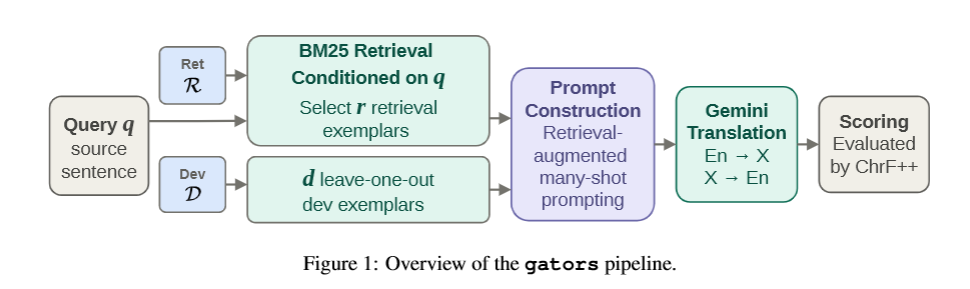

## 3.1 数据准备

<u>检索库R基于 WMT26 训练数据构建，并使用 WMT23 双语句对与公开平行语料库进行扩充。</u>我们保留了仅在 WMT23 中存在的 21 条曼尼普尔语句对和 3554 条米佐语句对（Pal 等人，2023）。

第一类语言 对于阿萨姆语，在 WMT26 的 54000 条句对基础上，额外加入来自 Samanantar 语料库的 142080 条句对（Ramesh 等人，2022）、来自《濒危食谱译文 500》数据集的 1359 条句对（Karya，2026、2025；Joshi 等人，2025），以及来自 IndicGenBench FLORES 数据集的 2009 条句对（Singh 等人，2024）。卡西语在 26000 条 WMT26 句对之外，补充 1048 条来自《濒危食谱译文》的句对；曼尼普尔语则在 23687 条 WMT26 句对基础上，新增 2009 条 FLORES 句对以及 21 条 WMT23 句对。

其余第一类语言我们没有引入 WMT 之外的外部数据。梅泰‑玛雅克文曼尼普尔语拥有 17001 条 WMT26 句对；尼希语拥有 60000 条 WMT26 句对；米佐语的句对取自 WMT26 与 WMT23 两个数据集，合计 53543 条，其中分别对应 49989 条和 3554 条。尽管这三门语言或许还存在其他可用平行数据，但我们的数据收集工作重点放在资源更加匮乏的第二类语言上。本小节后续段落将分别详细介绍每一门第二类语言的数据增强方案。

**博多语**：我们将 15214 条 WMT26 句对，与来自英‑博多平行数据集（Panjiyar）的 134931 条句对、1497 条《濒危食谱译文》句对以及 2009 条 FLORES 句对进行合并，由此得到本任务中规模最大的一套融合 WMT 官方数据与外部资源的语料库。

卡尔比语：我们在 1000 条 WMT26 句对的基础上，补充从《卡尔比语语法》（Konnerth，2014）中提取的 382 条句对，以及取自《卡尔比语文本集》（Konnerth 和 Tisso，2018）的 1144 条句对。

**科克博罗克语、那加米斯语与塔金语**：WMT26 官方数据集对应的句对数量分别为 2269 条、1998 条和 5344 条。我们补充了来自科克博罗克数字化项目（Caswell 等人，2025；Jones 等人，2023）的 6078 条科克博罗克语句对、来自 FNPC‑25 数据集（Maheshwari 和 Keshri，2025）的 8771 条英‑那加米斯语句对，以及来自 GinLish v0.1.0 数据集（Dugi，2024）的 854 条英‑塔金语句对。

所有数据源合并时，采用基于源端的 SHA‑256 去重、Unicode 规范化处理（孟加拉文与天城文使用 NFC 范式，拉丁文字使用 NFKC 范式），以及句长比例过滤。对于噪声较高的外部数据源，我们可选择执行 LaBSE（Feng 等人，2022）跨语言相似度过滤。
$$
表 1：领域内训练数据增强前后的数据规模。主系统使用 Train 数据集，对比系统使用 Pairs 数据集。增强比率由新增句对数量除以基础句对数量计算得到。+ 由 Train 数据集重新计算得到的 Pairs。曼尼普尔‑梅泰玛雅克语（Mni_Mtei）未使用外部数据，因此二者数值相等。
$$
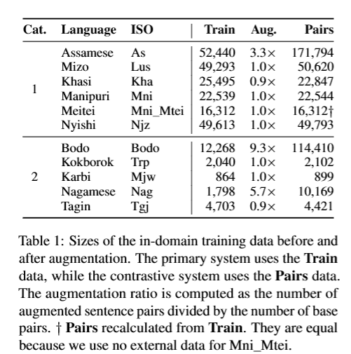

## 3.2 领域内数据过滤

我们将检索范围限定于领域内数据，因为来自无关领域的句对与 WMT26 测试输入在词汇、语义层面重合度很低。因此 BM25 会为这类句对给出较低的相关性分数，它们几乎不会被挑选为有效的上下文示例。主系统与对比系统均使用经过过滤的领域内数据。最终主系统的 Train 语料规模以及 Pairs 句对数量（包含对比实验所用数据）如表 1 所示。

## 3.3 BM25 检索

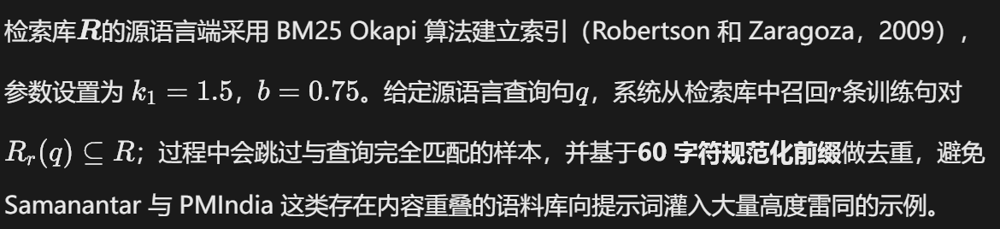

**正确设置索引构建方向十分关键。对于英译低资源语言（En→X），基于英文句子构建索引；对于低资源语言译英（X→En），查询语句为印度本土语言，因此必须在印度语言侧构建索引。** 在 AmericasNLP 系统（Dhawan 等人，2026b）中曾存在一处程序缺陷：无论翻译方向如何，系统始终以西班牙语（Es）构建索引。但当时该问题并未被发现，因为任务并不需要执行低资源语言译西班牙语（X→Es）。在本次共享任务中，我们定位并修复了该问题。

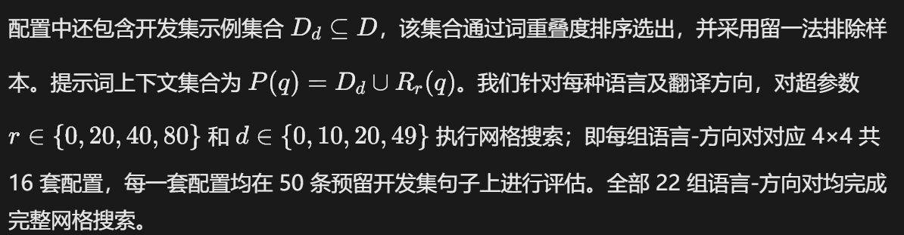

## 3.4 翻译

提示词通过google‑genai软件开发工具包发送至 Gemini 2.5 Flash（Comanici 等人，2025），参数配置为：温度系数 0，关闭思考模式，最大输出 512 个 token。
我们采用双密钥 API 池，结合轮询调度与配额故障转移机制，用以处理速率限制。11 门语言各自配有独立的系统提示词，对书写系统、词序以及形态类型进行说明：卡西语提示词会提醒模型注意 VOS（动词‑宾语‑主语）语序与变音符号；博多语提示词则明确告知模型，该语言虽使用天城文书写，但属于藏缅语，并非印地语。我们在附录中对这些提示词设计要点展开详细阐述。

后处理环节会去除模型生成的多余前缀，执行 Unicode 规范化；对于非拉丁书写系统，还会校验输出字符是否落在预期的 Unicode 编码块范围内。该校验对梅泰‑玛雅克文字（U+ABC0‑U+ABFF）尤为重要，Gemini 偶尔会错误输出孟加拉文字符。仅有极少部分输出行（21599 条中占 4 条，占比 0.018%）为空，成因是部分特定政治语句触发 Gemini 安全过滤机制，即便调整温度参数重试也无法解决该问题。

## 3.5 与 AmericasNLP 系统的关联

如图 1 所示，相较于 AmericasNLP 流水线（Dhawan 等人，2026b），主要架构改动是移除了视觉字幕生成阶段。同时，通过前文所述的 BM25 索引修复实现了双向翻译支持，并将多个外部语料库合并至检索库中。

# 4 门语言

该共享任务 11 个语言赛道中，有 8 门属于藏缅语；其余 3 门非藏缅语分别为阿萨姆语、卡西语与那加米斯语（Post 和 Burling，2017）。 这些语言大多采用**主‑宾‑谓（SOV）**语序，这与印度东北部藏缅语言以及本土印度‑雅利安语言普遍存在的句末谓语特征保持一致。卡西语属于南亚语系，是主要特例，基础语序为主‑谓‑宾（SVO）（Post 和 Burling，2017；Sharma，1999）。 阿萨姆语属于印度‑雅利安语；那加米斯语是以阿萨姆语为词汇基础的克里奥尔语，通行于那加兰邦（Post 和 Burling，2017；Maiti 等人，2025）。曼尼普尔语设有两个任务赛道：一种使用孟加拉文书写，另一种使用梅泰‑玛雅克文字书写（Singh，2012）。这两个赛道代表**同一门语言的两套书写系统**，并非谱系上相互独立的两种语言；本文其余部分将梅泰‑玛雅克文赛道简称为梅泰语。博多语归属于藏缅语系，但使用天城文书写（Post 和 Burling，2017；Narzary 等人，2022）。实验中我们发现，Gemini 偶尔会生成类似印地语风格的博多语译文，原因大概率是博多语与印地语、尼泊尔语共用天城文字符集（Narzary 等人，2022）。我们在系统提示词中明确指明目标语言为博多语，该错误现象便得以消除。

# 5 Experimental Setup

实验在佛罗里达大学 HiPerGator 集群上运行。翻译流水线仅使用 CPU（向 Gemini 发起 API 调用），运行于 hpg‑default 计算分区。环境采用 Python 虚拟环境（venv），而非 conda 环境。GPU 节点（hpg‑b200）以及 mamba（conda）环境仅用于 NLLB‑200 的数据生成工作。评估使用 SacreBLEU 工具计算 ChrF（Popović，2015）与 ChrF++（Popović，2017）指标。

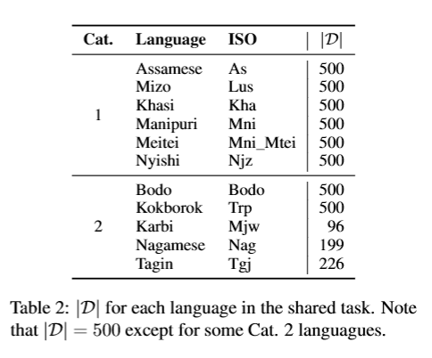

由于 WMT26 早期并未发布官方开发集，我们在并入外部数据生成 Pairs 数据集之前，从各语言的 Train 数据中截取末尾最多 500 条句对，作为候选开发示例集合D（\(|D| \le 500\)）。各语言的集合D的规模如表 2 所示。初步网格搜索基于该划分得到的 50 条句子，对每一组\((r,d)\)参数组合开展评测。我们选取 ChrF 分数最高的配置作为最终提交系统的配置。

# 6 Results

本节将介绍本文方法在一类语言、二类语言的英译低资源语言（En→X）以及低资源语言译英（X→En）任务上的实验结果。表 3 列出了对比系统在各语言对、各翻译方向上的性能指标，评测使用提交前经过增强处理的开发集数据集。我们采用 ChrF 与 ChrF++ 两项指标衡量性能；ChrF 用于确定提交系统所使用的(r,d)参数组合，引入 ChrF++ 则是为了方便直接对比开发集与测试集上的模型表现。

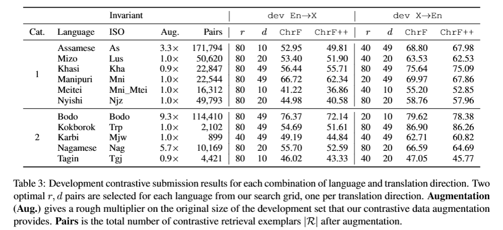

表 4 列出了各语言及翻译方向的对比系统性能，指标采用共享任务主办方公布的 BLEU 与 ChrF++ 结果（Pakray 等人，2026）。其余测试阶段指标可查阅该共享任务总结论文（Pakray 等人，2026）。

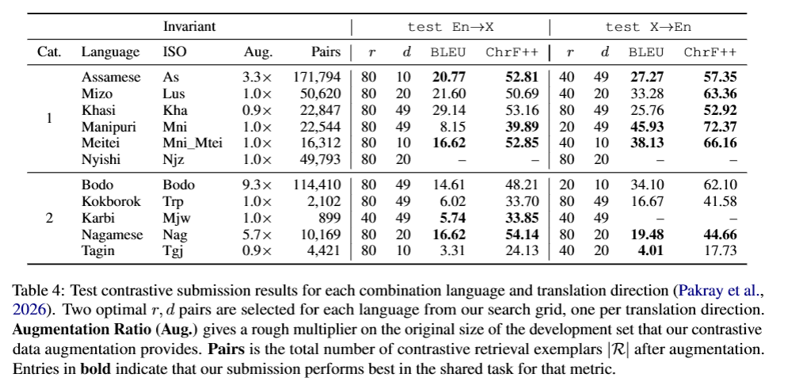

# 7 Ablations

在本节中，我们考察相较于本文所提方法的其他备选方案。通过展示哪些改动能够提升当前方法、哪些改动无法带来增益，同时进一步深入探讨该方法的优缺点，希望这些消融实验能够为后续研究提供参考。

## 7.1 Multi30k 领域不匹配

最为明显的负面实验结果来自合成数据增强；在我们此前多项机器翻译实验中，该手段曾取得正向效果（Dhawan 等人，2026a,b）。

我们为本任务 11 门语言中的 3 门准备了合成增强数据，但最终并未使用。参照 MultiScript30k 的方法（Driggers‑Ellis 等人，2025），我们利用 NLLB‑200 模型将 Multi30k 图像描述文本（Costa‑Jussà 等人，2022；Elliott 等人，2016）翻译为阿萨姆语、米佐语与曼尼普尔语，每种语言约生成 29000 条句对。 在 AmericasNLP 系统中，该数据增强手段是提升瓜拉尼语翻译性能的最关键因素。Multi30k 图像描述文本与图像字幕任务具备一定领域匹配度（Dhawan 等人，2026b），因为其本身就是图像字幕；该参赛系统翻译阶段的输入查询是由机器生成的西班牙语图像字幕。而 WMT26 测试集的内容为体育新闻与政府会议文本，例如 “PCB 请求国际板球理事会复核”、“印度曲棍球 0‑8 落败”。

我们得出结论：在基于 BM25 的 RAG 系统中，领域匹配度对翻译性能的贡献远大于数据绝对规模；因此，我们在全部最终检索库中均弃用 MultiScript30k 增强数据。

## 7.2 网格搜索的关键实验发现

文字书写系统效应 虽然本文系统以及共享任务文档都将二者视作完全独立的语言，但前文已经说明：曼尼普尔语在本次任务中出现两次。本文所称的Manipuri（曼尼普尔语），指采用孟加拉文书写的曼尼普尔语；而Meitei（梅泰语）赛道，是同一门语言，只是采用梅泰‑玛雅克文字书写。
使用孟加拉文版本时，在 En→Mni（英译曼尼普尔语）方向，提交系统开发集 ChrF++ 达到 62.34；而 En→Mni_Mtei（英译梅泰‑玛雅克书写的曼尼普尔语）仅为 36.86。
该现象在 X→En（小语种译英语）方向同样存在，但性能落差更小：分数从 67.86 下降至 52.85。同一口语语言，两套书写系统带来大约 25 点、15 点的 ChrF++ 性能差距。
在测试集上的 X→En 方向也观察到类似趋势；但在 En→X 方向，该高低分关系发生反转。

我们推测：Gemini 预训练阶段接触到的孟加拉文书写的曼尼普尔语数据，很可能远多于梅泰‑玛雅克文字（Unicode 码段 U+ABC0‑U+ABFF）书写的曼尼普尔语；梅泰‑玛雅克文字在网络文本中出现得极为稀少。但这一点并不能解释我们观察到的结果不一致现象。无论如何，我们提醒：在条件允许的情况下，正字法（书写体系）的选择会影响本文 RAG 方法下的机器翻译性能。

**数据清洗**。除了第 5 节描述的原始网格搜索之外，我们在提交截止日期之后，使用略有差异的数据与排序方式，重复执行了相同的实验流程。我们再次对 WMT26 训练数据做过滤，本次实验剔除近似重复的候选检索样例；并且改用 ChrF++ 指标进行排序，而不再使用 ChrF。

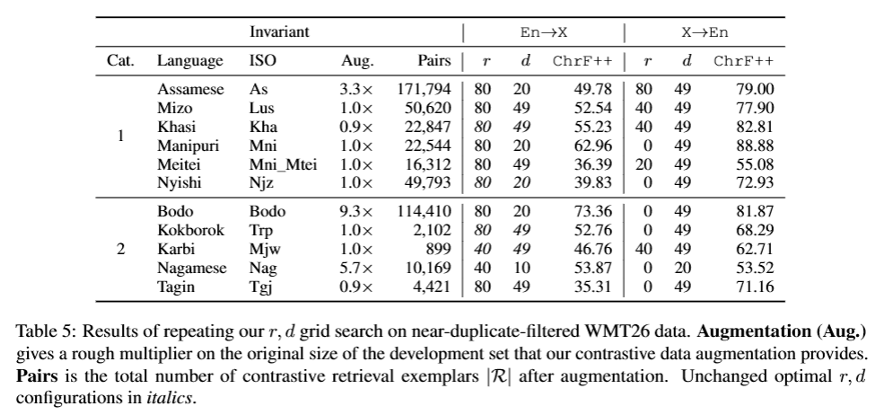

实验结果如表 5 所示。将其与表 3、表 4 对比可以发现：**22 个任务中，有 18 个任务的最优\((r,d)\)配置发生了改变**。 具体来看：在 11 个小语种译英语（X→En）任务中，有 7 个任务的最优r变为 0。与之相对，11 个 X→En 任务中有 9 个任务最优配置为\(d=49\)；其中 6 个任务为\((r=0,\ d=49)\)。而 11 个英语译小语种（En→X）任务中，仍然有 9 个任务最优\(r=80\)。

这套经过重新过滤数据得到的结果，尽管依旧仅基于小规模试点评测（n=50条样本），却展现出原始网格搜索未曾体现的翻译方向不对称现象。绝大多数语言在 En→X（英译低资源语言）任务上最优r=80，说明在生成低资源语言译文时 RAG 确实能够提升性能，这与本任务以及我们之前在 AmericasNLP 共享任务中的提交结果一致。卡尔比语与那加米斯语出现两组r=40
的最优配置；这两种语言语料规模最小，这一现象可能表明：在数据极度匮乏的条件下，检索带来的增益会受到限制。与此同时，X→En（低资源语言译英语）任务中大量最优配置取
r=0，说明：==当大模型本身已经很熟悉目标高资源语言（英语），且检索库不存在与待翻译查询完全匹配或高度近似的样例时，检索不会带来增益。==

源端检索索引。对于 X→En（低资源语言译英语）任务：将 BM25 检索索引构建在印度本土源语言一侧（而非全部场景都构建在英语侧），会改变绝大多数语言的最优参数配置。这也是我们对 AmericasNLP 2026 参赛系统的一项关键改进（Dhawan 等人，2026b）。在旧方案中，检索索引固定构建于英语侧，不随源语言变化；该设置下，阿萨姆语译英语（As→En）与卡尔比语译英语（Kha→En）的最优(r,d)配置为r=0。这意味着：对于这两门语言，不使用任何检索，效果反而优于基于固定英语索引的检索方案。当修正 BM25 索引，改为使用源语言构建索引后，最优r∗提升至表 3、表 4 中呈现的数值，说明检索终于能够为翻译带来性能增益。

# 8 Discussion

几乎在每一种语言与翻译方向上，我们都观察到模型从开发集迁移至测试集时会出现一定程度的性能衰减。结合我们此前在 AmericasNLP 共享任务上的实验结果（Dhawan 等人，2026b），这种衰减现象在我们的预期之内。博多语与科克博罗克语的开发‑测试集性能差距最为突出，尤其是 `En→Bodo`（英译博多语）与 `Trp→En`（特里普里语译英语）任务。从开发集切换到测试集后，二者性能分别出现接近 30 点、40 点的大幅下降。不过相较于其他语言，博多语和科克博罗克语属于异常值；同时根据 ChrF++ 指标，也存在不少**测试集性能反而高于开发集**的情况。

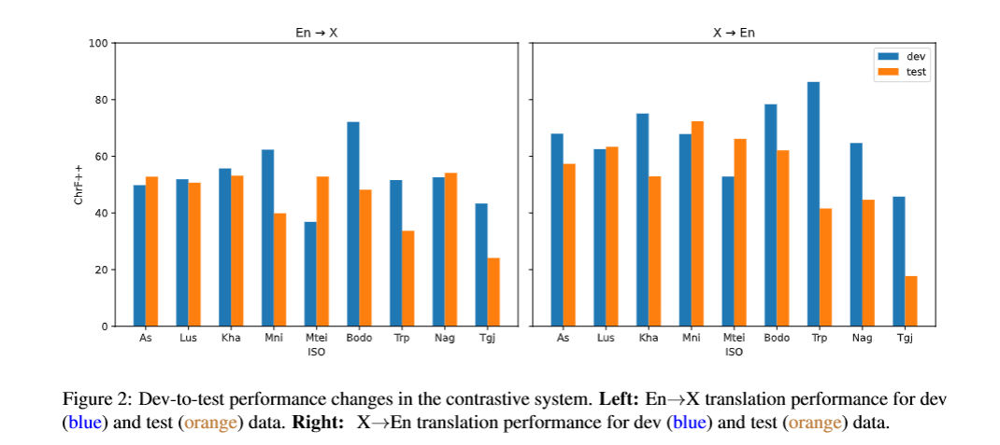

我们使用 Matplotlib 绘制了图 2（Hunter，2007），用以展示 `En→X`（右侧）与 `X→En`（左侧）两类翻译任务上的性能差距，以及部分打破 “性能预期下降” 规律的特例。

对于性能差距较小，甚至分数反转（测试集优于开发集）的语言，这或许暗示：本次共享任务的测试集与开发集的领域相似度，要高于 AmericasNLP 2026 共享任务的数据集。但要证实该猜想，需要仔细考察测试集文本本身，或是查阅详尽的数据集文档；而且该假说也无法解释从开发集切换到测试集时出现的大幅性能提升现象。	

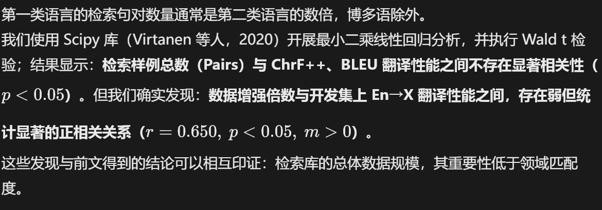

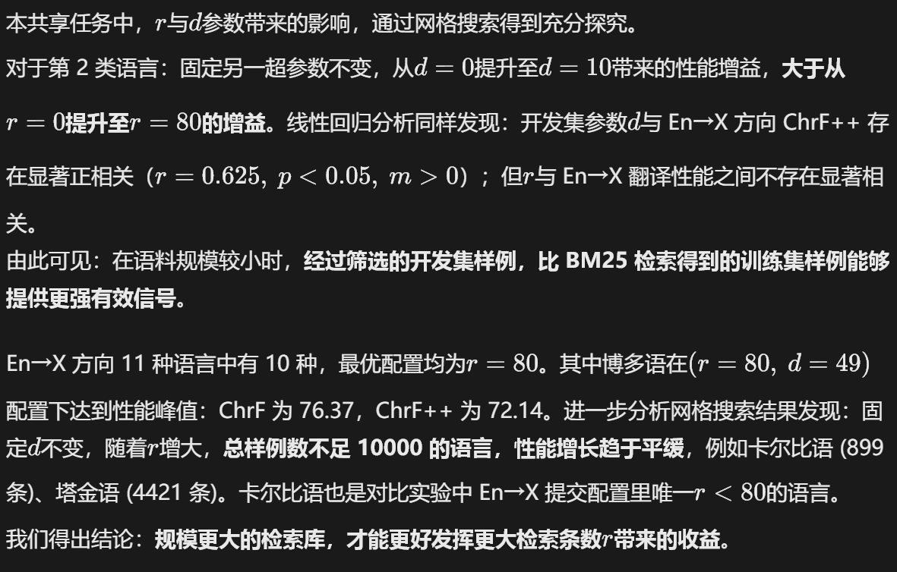

# 9 Conclusion

本文介绍 gators 系统参加 WMT26 印度本土语言共享任务的提交方案：这是一套无需训练、检索增强的机器翻译系统，采用 BM25 检索与 Gemini 2.5 Flash，实现英语与 11 种印度东北部语言之间的互译。该方法在我们 AmericasNLP 2026 系统的基础上做迁移学习（Dhawan 等人，2026b）；移除了视觉相关模块，将研究聚焦于检索增强机器翻译本身，并采用不同的平行文本构建检索库。

结合其他消融实验，我们对全部 22 个语言‑方向组合完成了网格搜索；本次提交系统覆盖全部语言的双向翻译。本文揭示了领域匹配对合成数据增强的重要性 —— 该合成数据增强方案是我们在前一项共享任务中所采用的（Dhawan 等人，2026b）；同时修复了原始 BM25 索引构建流程中的一处关键程序缺陷。

尽管上一届共享任务的提交系统证明，检索增强机器翻译能够将视觉大模型（VLM）生成的字幕翻译为低资源语言，但在本工作中，我们剥离多模态模块，单独考察检索增强机器翻译本身的能力，并复现了此前取得的良好效果。我们的提交系统在各项任务上均小幅但可量化地优于其他参赛系统。在全部 19 项翻译任务中，我们的对比提交系统有 9 项取得最优 BLEU 分数，有 11 项取得最优 ChrF++ 分数（Pakray 等人，2026）。

# Limitations

该系统完全依赖 Gemini 2.5 Flash API。在小规模网格搜索阶段，爆发式请求触发的 429 限流错误，即便启用指数退避重试机制，依然耗尽了 SLURM 任务的全部运行时间窗口；为了赶在提交截止前完成全部 22 个语言‑方向网格配置的实验，需要精细调度任务，并采用双密钥 API 池。有极少部分测试句子（21599 句中的 4 句，占比 0.018%）输出为空，原因是 Gemini 安全过滤机制拦截了特定政治内容。

检索库的质量差异很大。第 2 类语言的平行数据十分有限，可获取的外部语料还常常存在领域不匹配的问题。例如，那加米斯语可用的唯一外部语料来自圣经译本。正如第 7 节消融实验所示：**如果 BM25 检索无法召回这些数据，即便增加更多数据也毫无帮助**。

开发集划分由训练数据末尾最多 500 条句对构成；每个网格配置仅评测 50 句。该开发集与训练语料属于同一领域，因此开发集指标会高估真实翻译性能。我们在 AmericasNLP 任务中也观察到类似现象（Dhawan 等人，2026b）。典型例子：瓜拉尼语在官方测试集评测时，分数相比开发集几乎腰斩。而在本文实验中：表 3 显示，除博多语以外，其余各语言的性能下降幅度并不统一；但总体上依旧普遍存在性能下滑现象。

# Acknowledgments