# 自反思增强上下文学习：面向中国少数民族语言的机器翻译性能提升

Self‑Reflection Augmented In‑Context Learning: Enhancing Machine Translation for China’s Minority Languages

2025-中科院四区

浙江水利水电学院-计算机科学与技术学院

# SUMMARY

大语言模型（LLM）借助上下文学习（ICL）在机器翻译（MT）任务上取得了可观的效果，但上下文示例的选取仍是一个尚未解决的难题，会对翻译质量产生重大影响。现有的基于启发式规则的示例选取方法缺少针对性机制来处理漏译、错译等翻译错误。受独特的语言特征、语料资源匮乏以及特殊语言结构等因素影响，这类问题在中国少数民族语言翻译任务中表现得尤为突出。本文提出一种自反思机制，专门用于优化大模型机器翻译任务的示例选取，目标就是修正上述翻译错误，该方法命名为面向上下文示例选择的自反思方法（SR‑ICES）。本方法包含四个依次执行的阶段：(1) 大语言模型通过任务专属提示词生成初始译文；(2) 大语言模型利用自身内置的语言知识开展自反思，识别源语句中的错误片段；(3) 将识别得到的错误片段作为查询，从平行语料库中召回词法相关性最高的前N组源‑目标双语句对；(4) 最后，将召回得到的示例再次输入同一个大语言模型，生成优化后的译文。
本文在三项中国少数民族语言机器翻译任务（维吾尔语‑汉语、藏语‑汉语、蒙古语‑汉语）上开展了充分实验。实验结果表明，SR‑ICES 的性能始终优于多个对比基线模型，验证了利用大模型自反思能力完成上下文示例选取的有效性；该方法打通了翻译生成与示例选取之间的闭环，提供了一种可扩展、与语种无关的方案来提升机器翻译性能。

关键词：大语言模型、上下文学习、自反思、中国少数民族语言

# 1 Introduction

大语言模型（LLM）借助上下文学习（ICL）在机器翻译（MT）任务上展现出良好效果。上下文学习是一种无需面向任务微调，仅依靠给定示例就使模型适配翻译任务的范式 [1‑2]。然而，上下文学习的效果高度依赖上下文示例的选取方式，该问题至今尚未得到妥善解决。现有上下文学习的示例选取方案大多属于启发式方法，例如从开发集随机采样、基于关键词检索等。这类方法无法系统性解决漏译、错译等翻译问题，在低资源、域外场景下问题会进一步恶化。维吾尔语、藏语、蒙古语等中国少数民族语言具备独特的语言特征：黏着形态、非拉丁书写体系、语序灵活，同时平行语料稀缺。上述特点会放大翻译错误，导致传统上下文学习策略效果大打折扣。例如，Agrawal 等人 [2] 的研究表明，在域外场景中，噪声样本或者无关示例能够使翻译质量下降 20% 以上；该问题在中国少数民族机器翻译这类低资源场景下尤为突出。

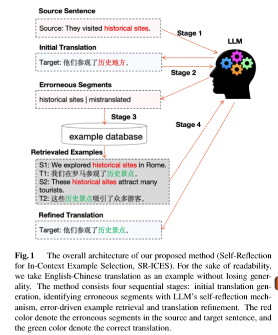

为解决该问题，本文提出一种<u>自反思机制</u>来优化大模型机器翻译的示例选择，其明确目标就是修正上述翻译错误，该方法命名为面向上下文示例选择的自反思方法（SR‑ICES）。如图 1 所示，SR‑ICES 分为四个顺序执行阶段：(1) 大语言模型通过任务专用提示词生成初始译文；(2) 利用大模型自身的语言知识开展自反思，精准定位源句中的错误片段（包含未译内容与错译内容）；(3) 将这些错误片段作为查询，借助 BM25 算法从平行语料库中召回词法相关性最高的前N组源‑目标双语句对；(4) 将召回得到的示例输入第二轮大模型提示词，生成优化后的译文。
该闭环框架（初始翻译→自反思错误检测→示例检索→译文优化）不再采用通用的启发式选择策略，而是针对初始翻译识别出的错误片段来检索匹配示例。与采用完整源句作为检索查询的 BM25‑ICL 方法不同，本文方法仅使用经自反思检测得到的错误片段来构建查询。这一设计保证召回示例聚焦于造成错译、漏译的特定术语与语言模式，而非那些整体语义相似但相关性较低的内容。

本文在三项中国少数民族语言机器翻译任务上开展实验：维吾尔语‑汉语（维‑汉）、藏语‑汉语（藏‑汉）以及蒙古语‑汉语（蒙‑汉）。实验结果表明，本文所提出的自反思机制性能始终优于多个对比基线方法。

综上，现有针对大语言模型机器翻译的相关研究不断增多，本文为此作出如下贡献：证明将<u>自反思</u>机制融入上下文学习流水线能够显著提升翻译性能。以往研究依赖静态或人工整理的示例，与之不同，本文方法可以针对翻译错误进行动态适配，为大模型机器翻译中的上下文学习提供了一种可扩展、语种无关的解决方案。

# 2 Methods

本文所提出的方法 —— 面向上下文示例选择的自反思方法（SR‑ICES）由四个顺序执行的阶段构成：初始译文生成、自反思、错误驱动的示例检索以及译文优化，各阶段将分别在后续小节中详细介绍。

## 2.1 初始译文生成

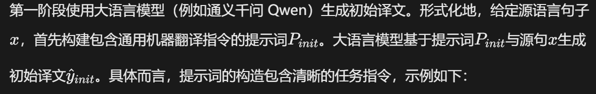

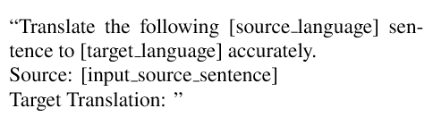

其中`[source language]`（源语言）、`[target language]`（目标语言）替换为实际的源语言与目标语言；`[input source sentence]`为待翻译的测试句子。

## 2.2 基于自反思的错误检测

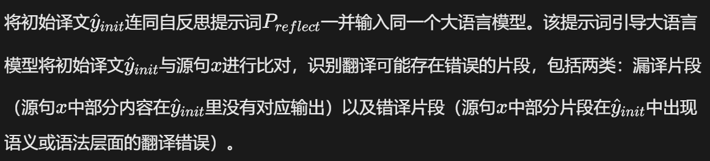

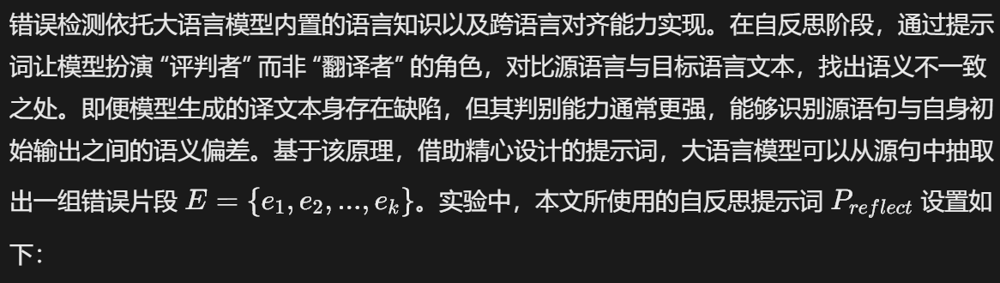

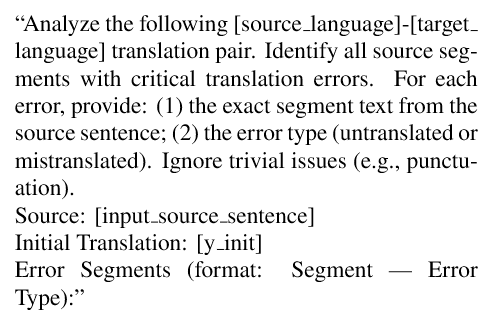

## 2.3 错误驱动的示例检索

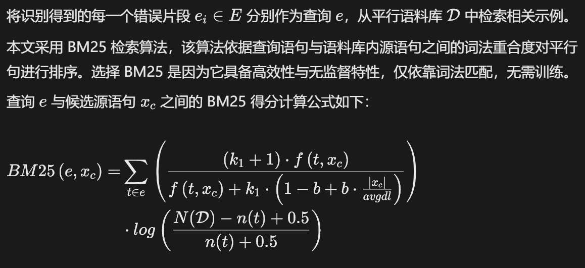

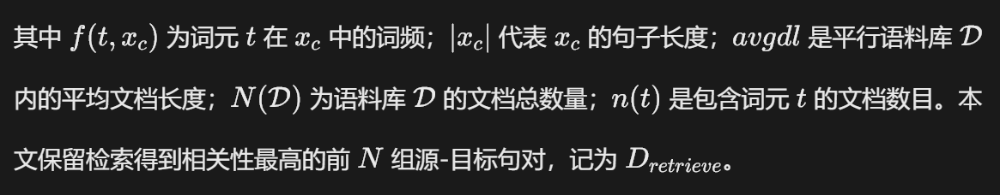

## 2.4 译文优化

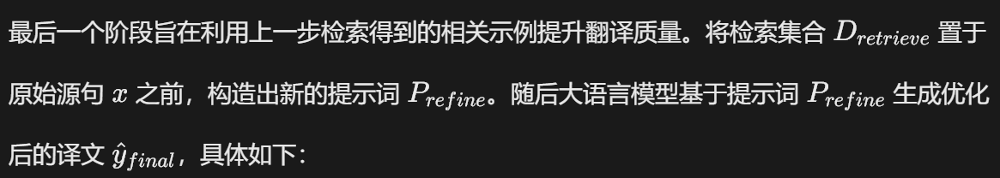

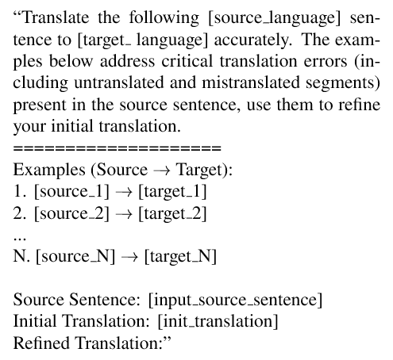

其中，`[source i]`与`[target i]`为前N个示例中的第i组源‑目标句对，这些句对可能包含第 2 阶段检测出的错误片段所对应的正确译文。

==该四阶段流水线使大语言模型能够对翻译错误进行自我诊断==，并针对这些错误动态检索上下文示例，由此形成译文生成与示例选择之间的闭环。

# 3 Experiments

## 3.1 Data and Setup

为验证本文所提方法的有效性，我们在三项中国少数民族语言机器翻译任务上开展了全面实验：维吾尔语‑汉语（维‑汉）、藏语‑汉语（藏‑汉）以及蒙古语‑汉语（蒙‑汉）。实验旨在回答两个核心研究问题：<u>(1) SR‑ICES 在翻译质量上是否优于传统上下文学习（ICL）基线方法？(2) 检索示例的数量会对机器翻译性能产生怎样的影响？</u>

评估阶段，针对每个翻译任务，本文采用 CCMT2025 发布的两类平行语料分别作为示例库与测试集。具体来说，维‑汉、藏‑汉、蒙‑汉任务的测试集分别使用 XJIPC‑test‑uyzh‑CWMT2018、QHNU‑test‑tizh‑CWMT2018、IMU‑test‑mnzh‑CWMT2018，每个测试集均包含 1000 组平行句对。我们使用 <u>CCMT2025 发布的训练集平行语料构建示例检索库；维‑汉、藏‑汉、蒙‑汉对应的库内句子规模分别为 170 057、156 578、1 259 772 条。</u>

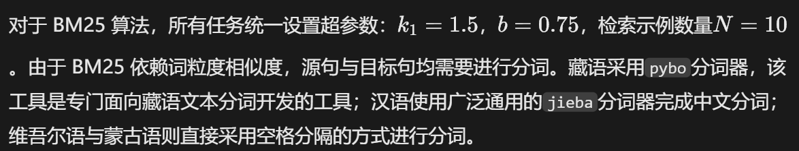

## 3.2 机器翻译实验结果

我们将本文所提出的 SR‑ICES 方法与另外三种基于大语言模型的机器翻译方法进行对比，具体如下：

- LLM：大模型直接零样本翻译，不使用上下文示例。
- **Random ICL**：从训练集中随机选取 N 个上下文示例。
- **BM25 ICL**：将完整源句作为 BM25 查询语句，检索得到前N个示例，不执行自反思模块。
- **TasTe[3]**：一种前沿的基于自反思的翻译方法，该方法依靠自我校正实现译文优化，不采用检索增强的示例选择机制。

为保证对比公平，本文全部实验所使用的大语言模型均为阿里通义千问 Qwen3††，具体版本为 `qwen‑plus‑2025‑07‑28`。选择该模型是因为其具备较强的跨语言能力，尤其在汉语以及中国少数民族语言方面表现突出，同时处理翻译任务效率较高，可便捷调用云端 API。

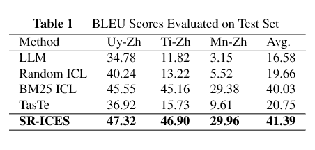

本文采用基于字符的 BLEU‑4作为评价指标 [4]。为保证实验结果可靠稳定，所有实验均独立重复 5 次，报告 BLEU 分数的平均值，并进行统计显著性检验（p<0.05）[5]。如表 1 所示，相较于原始大模型基线与随机 ICL 基线，BM25‑ICL 在全部翻译任务上取得最为显著的性能提升，该结果与已有研究结论保持一致 [2]，进一步证实上下文学习对于提升低资源语种翻译性能不可或缺。

在此基础上，本文所提 SR‑ICES 通过引入**错误驱动的示例选择机制**进一步提升性能：不同于 BM25‑ICL 使用完整句子作为查询，SR‑ICES 首先借助大模型自评估识别错误片段，再针对这些具体缺陷检索对应的示例样例。该设计使得 SR‑ICES 取得最高平均 BLEU 值（41.39），相比 BM25‑ICL（40.03）平均提升 1.36 个点。分语种来看：对比 BM25‑ICL，SR‑ICES 在维‑汉任务上达到 47.32（+1.77），藏‑汉任务 46.90（+1.74），蒙‑汉任务 29.96（+0.58）。此外，SR‑ICES 平均高出先进自反思方法 TasTe 达 20.21 个 BLEU 点，进一步证明检索示例的有效性。

从整体实验结果可以看出，所有基于上下文学习的方法性能均显著优于零样本大模型基线，这证实了演示样例对于低资源少数民族语言翻译的重要性。BM25‑ICL 通过检索语义相似的样例获得可观提升；而 TasTe 作为不使用上下文演示样例的纯自校正方法，得到的分数相对较低。这表明仅依靠自反思，不足以解决数据稀缺与语言差异巨大带来的翻译难题。与之相比，本文所提 SR‑ICES 将自反思错误检测与错误驱动的上下文样例检索相结合，稳定取得最优性能。该针对性样例选择机制能够有效缓解错译与漏译问题，更适用于这三类典型的中国少数民族语言翻译任务。

## 3.3 示例数量的影响

为回答上述第二个研究问题，即探究上下文示例数量如何影响翻译质量，本文设计对照实验，将参数N的取值范围设置为 0‑30。如图 2 所示，在维‑汉、藏‑汉、蒙‑汉三个任务上，翻译性能总体随上下文示例数量增加而提升。当示例数量从 0 增加至 10 时，BLEU 分数快速上涨；但数量超过 10 之后，性能增长显著放缓。一种可能的解释是：过多的示例会造成信息冗余，最终仅带来微小增益甚至性能小幅下降。另一方面，10 个示例或许已经覆盖译文修正所需的绝大部分信息。

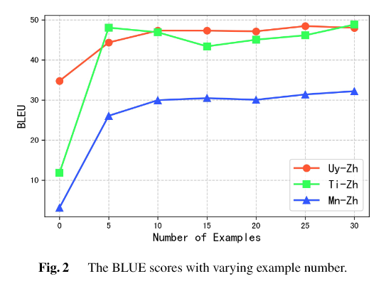

# 4 Related Work

机器翻译中的上下文学习

上下文学习在基于大语言模型的机器翻译领域受到研究人员广泛关注 [2][6]。上下文学习（ICL）让大模型可以依据提示词内提供的少量上下文示例完成任务。早期研究表明，诸如 GPT‑4 这类大模型，即便使用随机选取的上下文示例，在高资源语言对上也能取得不错的效果；但在低资源场景下，上下文学习的效果会明显下降 [2]。例如，Agrawal 等人研究发现，在单样本上下文学习中，只要存在一个噪声样例，就可以让域外翻译任务的 BLEU 分数下降最高达 20%，凸显出示例质量的关键作用。该领域以往大部分研究主要围绕优化上下文示例的选取与展示方式，以此提升翻译质量。然而，如何系统性筛选出相关性最高、效果最优的上下文示例，仍然是一个尚未解决的难题。本文针对该问题，引入自反思机制识别初始译文的错误，再依据错误信息检索相关示例；这与现有大多依赖静态策略或启发式规则进行示例选取的工作有所区别。

基于大模型机器翻译的自反思

自反思是指大模型对自身输出进行评估与优化的过程，现已被广泛用于提升大模型的性能。近期研究 [7][6][3] 提出迭代修正框架：大模型首先生成译文，<u>借助自动评测指标（如 MQM）识别翻译错误，再对译文进行修正</u>。这类工作表明，基于反馈的迭代优化能够减少翻译错误，尤其在改善译文流畅度与术语翻译问题上效果显著。与上述工作不同，本文的研究重点并非直接对译文文本进行纠错，而是聚焦于**示例选择**。我们利用大模型识别源语言端存在错误风险的片段，并检索上下文相关的演示样例，将翻译任务转化为检索查询生成任务。这一思路与检索增强生成（RAG）范式相契合：引入外部知识（如平行语料库），针对性弥补大模型初始输出存在的缺陷。

自动后期编辑

自动后期编辑（Automatic Post‑Editing，APE）旨在对机器翻译系统的输出进行自动纠错，作用类似于人工译后编辑人员 [8][9]。通常，APE 系统需要使用**三元组数据**完成模型训练，数据格式包含源文本、机器译文以及经过译后编辑修正的译文。与 APE 不同，本文用于上下文示例选择的自反思框架依托单个大语言模型来优化翻译全过程。该框架融合自我评估与错误驱动的示例检索，旨在引导大模型直接生成更加准确的翻译结果，而非采用事后纠错的模式。因此，本方法无需构建译后编辑数据集来训练全新的模型。

# 5 Conclusion

本文针对大模型机器翻译中传统上下文学习存在的关键缺陷，即缺少面向翻译目标的示例选择机制，开展研究。本文提出一种全新的上下文示例选择自反思框架 SR‑ICES，该框架使大模型能够动态识别翻译薄弱点，并检索更具针对性的上下文示例，打通翻译生成与示例选择之间的闭环。
在三项中国少数民族语言机器翻译任务上开展的充分实验验证了所提方法的有效性。虽然当前研究<u>主要围绕中文</u>相关机器翻译展开，但未来工作将拓展该方法，在更多语言对上验证其效果，并使用不同的大语言模型开展实验。