# 大语言模型的低资源语言拓展与翻译能力增强 —— 以维吾尔语为研究对象

1 中国科学院新疆理化技术研究所，中国乌鲁木齐 2 中国科学院大学，中国北京 3 新疆少数民族语音与语言信息处理重点实验室，中国乌鲁木齐

2025-COLING主会长文-CCF-B

# Abstract

尽管大语言模型在自然语言生成方面取得了巨大进展，但它们在低资源机器翻译领域的潜力尚未得到充分挖掘，尤其对于那些翻译模型从未训练过的语言更是如此。本文以维吾尔语为研究案例，详细展示了如何对大语言模型高效开展低资源语言适配，并显著提升模型的翻译能力。整套流程包含四个阶段：单语数据的收集与预处理、基于大规模单语数据开展持续预训练、利用少量平行语料进行翻译监督微调，在此基础上进一步提出**基于翻译自进化的直接偏好优化算法（DPOSE）**。大量实验表明，本文所提策略能够有效拓展大语言模型支持的低资源语言，仅依靠少量平行数据便可大幅提升模型的维吾尔语翻译能力。本研究也为将其他低资源语言引入大语言模型提供详实的参考思路。

# 1 Introduction

大语言模型（LLM）的出现为自然语言处理（NLP）领域带来了全新范式（Achiam 等，2023；Touvron 等，2023a；Chowdhery 等，2023；Touvron 等，2023b；Anil 等，2023；Xu 等，2024）。凭借庞大的参数量与海量训练数据，大语言模型具备出色的文本理解能力以及强大的类人文本生成能力。从早期的 Transformer，到后续的 BERT 系列（Kenton 和 Toutanova，2019；Zhang 等，2019；Liu 等，2020）、GPT 系列（Radford，2018；Radford 等，2019；Brown，2020；Ouyang 等，2022；Achiam 等，2023），模型参数量不断增长，理解与生成能力也随之持续增强。时至今日，BLOOM（BigScience Workshop 等，2023）、GPT‑4（OpenAI 等，2024）等代表性大语言模型已在自然语言处理领域广为人知。这类大模型在多项基准测试上表现优异，在高资源语言场景下，其翻译能力可以媲美最优机器翻译模型（Hendy 等，2023；Zhu 等，2024a）。但与高资源语言相比，大语言模型在低资源语言上的训练并不充分。受模型初始训练语料本身的限制，大语言模型通常仅在部分高资源语言上效果良好，而对绝大多数低资源语言表现很差，甚至无法理解（Mao 和 Yu，2024；Merx 等，2024）。造成该现象的主要原因是：低资源语言在模型训练数据中占比极低，词表十分稀疏（Ebrahimi 和 Kann，2021）。如图 1 所示，BLOOM 训练集中占比最高的 9 种语言占据全部数据总量的 95.75%，而剩余 38 种语言合计仅占 4.25%，其中占比最低的语言数据仅有 0.16MB。大模型对低资源语言支持存在这一固有缺陷，严重制约了低资源语言相关技术的发展。

本文旨在研究大语言模型针对低资源语言的语言能力扩充与翻译性能增强问题。本文选取维吾尔语作为研究对象，维吾尔语是一门黏着语，主要在中国新疆维吾尔自治区使用，使用人口约 1300 万。尽管该语言使用者数量众多，但近年来针对该语言的相关研究较少，可采集获取的语料资源十分有限。根据我们初步的探索与测试（见第 5.2 节），目前还没有大语言模型能够有效理解并翻译维吾尔语，这严重阻碍了该语言相关技术的发展。

本文以经过中文能力增强的大语言模型 **Chinese‑LLaMA2‑7B**（Cui 等人，2024）为底座，该模型是 LLaMA2（Touvron 等人，2023b）的迭代版本。我们完整实现了大语言模型的维吾尔语能力扩充，并提升其翻译性能。该目标通过一套完整流程完成：数据采集与处理、预训练、翻译指令微调，以及基于翻译自进化的直接偏好优化（DPOSE）（Rafailov 等人，2023）。所提方法在维吾尔语机器翻译基准测试集 CCMT‑UC¹（CCMT，2024）上完成验证。本文的主要贡献总结如下：

- 本文提出了一套面向低资源语言的高效数据收集与预处理方法，并公开了训练数据的分布情况，现有相关研究很少对该部分内容进行说明。后续实验验证了该策略的有效性。
- 本文提出 DPOSE，这是一种简单且有效的训练策略，能够显著提升低资源语言的翻译能力，缓解大语言模型中翻译输出偏离目标语言的问题。
- 本文实现了大语言模型的维吾尔语能力扩充，并提升其翻译性能，为对大语言模型中其他低资源语言开展同类优化工作提供了有价值的参考思路。

# 2 Related Work

## 2.1 LLMs for Low-resource Language

对于在大语言模型中训练占比不足的语言，可以通过微调以及提示词方法有效提升模型效果。Huang 等人（2023）提出一种通用模板提示，旨在系统性激发模型的跨语言与逻辑推理能力，以此增强大语言模型的多语言能力，该方法被称为**跨语言思维提示（XLT）**。Lai 等人（2023）针对 ChatGPT 开展全面评测，覆盖 7 项不同任务、37 种语言，语言资源覆盖从高资源到极低资源的完整区间。评测结果表明，ChatGPT 在低资源语言上的表现明显欠佳。Guo 等人（2024）借鉴人类的学习方式，为大语言模型构建类教科书语料，通过教科书学习提升模型对低资源语言的理解能力。Yamaguchi 等人（2024）系统调研了现有的跨语言词表适配方法，并证明：基于更加均衡的多语言数据完成预训练的模型，下游任务性能可以与原始模型持平。

另一种极端研究场景是：大语言模型如何理解从未参与训练的语言。要让大语言模型具备处理未见过语言的能力，最直接的手段就是扩充词表，并增加该语言的训练数据。Cui 等人（2024）通过在原有词表中新增中文子词单元，提升了 LLaMA 模型的编码效率以及对中文的语义理解能力。Kim 等人（2024）提出一种高效的词表扩充方法，该方法包含参数冻结与子词初始化两项技术。Fujii 等人（2024）为 LLaMA2 的词表加入日语字符，并基于大规模日语网页语料开展持续预训练。Gao 等人（2024）提出跨语言一致性正则化技术 XConST，用于缩小不同语言之间的表征差异，以此提升大语言模型的零样本翻译能力。

## 2.2 LLMs for Machine Translation

大语言模型的问世也为机器翻译带来了全新机遇。Zhu 等人（2024b）提出跨语言样例，为低资源翻译提供更强的任务引导。Mao 和 Yu（2024）通过构建翻译指令与跨语言对齐指令，提升了大语言模型的零样本翻译性能。Zhang 等人（2023b）对比了零样本提示、少样本学习、微调这三种方法的效果，并在句子级与文档级翻译任务上完成验证。Zhang 等人（2023a）借助交互式翻译任务，将模型的语言生成与指令遵循能力从英语迁移至其他语言，并开发出面向翻译的大语言模型 BayLing。Yin 等人（2024a）提出一种简单高效的数据采集方案，该方法利用双语词典生成数据集。基于采集得到的数据开展微调后，大语言模型的性能获得显著提升，尤其在词义消歧与专业术语翻译任务上效果突出。

# 3 数据集收集与预处理

本文维吾尔语数据直接来源于维吾尔语网站以及 CC‑100 数据集 ²。我们对全部数据采用一套启发式预处理技术，主要包含基于规则的过滤和数据去重两部分。 （1）**基于规则过滤**：包括关键词过滤、异常字符过滤以及广告内容过滤。 （2）**数据去重**：使用 xorbits³ 工具，该工具基于 MinHash‑LSH（Zhu 等人，2016）算法，能够快速高效地完成语料去重。

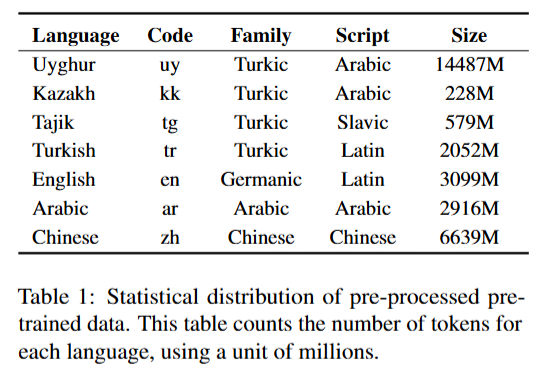

我们收集的数据总量为 30B（词元），各语言分布如表 1 所示。该表格表明，<u>除维吾尔语之外，数据集还纳入了另外六种语言</u>。从实践经验来看，该做法主要实现两个核心目标：第一，尽可能保留模型原本对其他语言的理解能力，降低灾难性遗忘的风险；第二，由于维吾尔语自身的数据覆盖不够全面，以此来丰富模型的表征。加入与维吾尔语相近的语言，能够大幅提升模型的知识迁移能力。之后，我们将数据划分为高质量数据与低质量数据两类。高质量数据指来源可靠、语句通顺、知识信息丰富的句子；受资源条件限制，这部分数据仅占全部数据的约 0.4389%，其余数据均归为低质量数据。

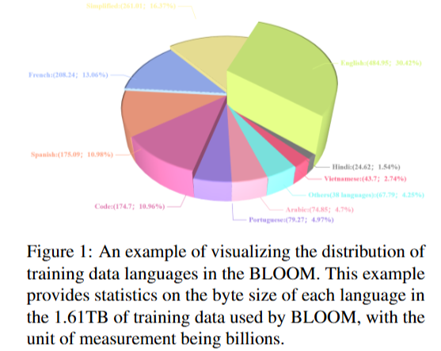

为验<u>证本文数据处理策略的有效性</u>，设置四种不同条件开展模型预训练实验：(1) 完全不做任何预处理；(2) 仅执行基础预处理（关键词过滤、异常字符过滤）；(3) 在基础预处理的基础上加入高质量数据；(4) 完整预处理流程叠加高质量数据。本文采用困惑度（perplexity）评价模型输出效果。困惑度的计算方式（Jel，1977）具体为：将模型输出与真实样本对比，计算交叉熵损失，再对计算结果求以 10 为底的指数，得到困惑度数值。如表 2 结果所示，模型表现充分证明：采用有效的数据预处理手段、保证数据质量能够带来明显增益。为直观展示不同策略之间的差异，本文在附录 A 中给出策略 1 与策略 4 的示例。

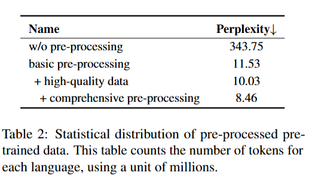

# 4 Method

本节首先简要介绍预训练以及翻译监督微调所采用的方法，随后阐述本文所提出的 DPOSE 方法。整体训练流程如图 2 所示。

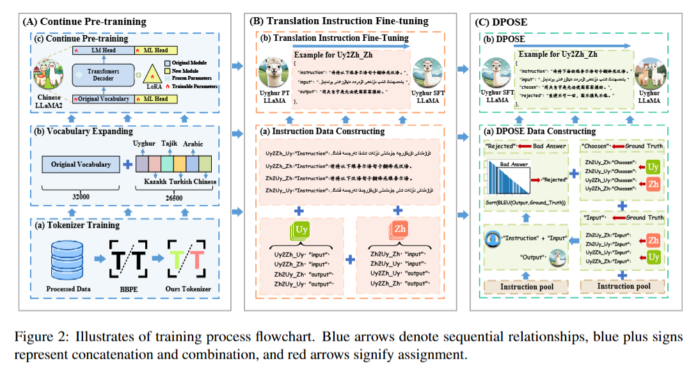

## 4.1 Pre-training

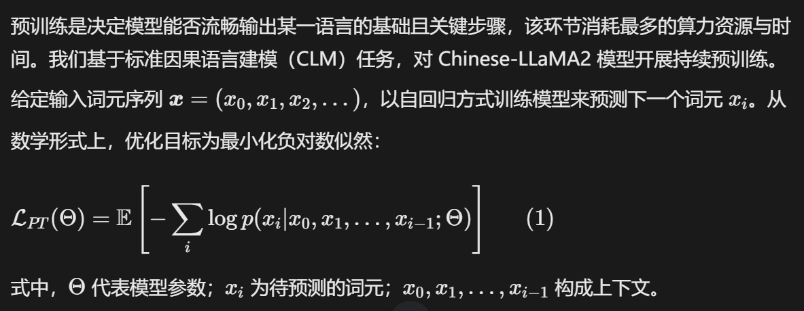

如图 2 (A) 所示，与多数语言扩充工作类似，本文的预训练策略主要包含三方面核心内容。首先，我们利用字节对编码（BPE）（Gage，1994），基于表 1 中列出的六种语言，重新训练了专用分词器。

第二个关键细节是，我们将分词器的总词元数量设置为 30K。使用该分词器处理数据后，得到一份新词表。将这份新词表与原始词表进行比对并去重后，得到规模为 26.5K 词元的新词表。最后，对两份词表进行拼接合并。第三个核心要点是采用 LoRA 方法对模型进行再训练。具体而言，对模型的嵌入层与语言模型输出头（LM head）执行全量训练；注意力层与 MLP 层保持冻结状态，仅为该部分训练少量额外参数。详细的参数配置见 5.1 节。

## 4.2 Translations Instruction Fine-tuning

语言模型微调已经成为基于大语言模型翻译领域的标准做法（Jiao 等人，2023；Xu 等人，2024；Yin 等人，2024b）。该过程利用规模更小、领域针对性更强的数据集对预训练语言模型进行训练，使其适配特定任务或特定领域。微调的目标是增强模型对领域专有词汇、句法以及上下文的理解能力，进而提升模型在目标任务上的性能。经过微调后，基于大语言模型的翻译系统能够获得更高的翻译准确率与更优的上下文理解能力，在实际应用场景中效果更好。

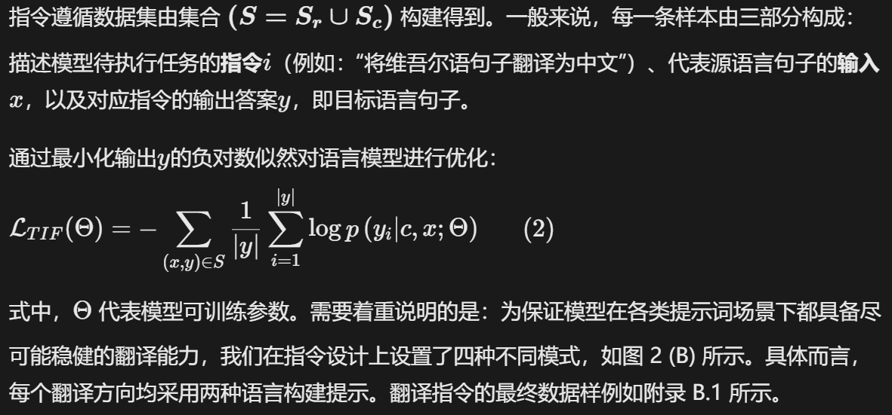

## 4.3 DPOSE

尽管大语言模型可以通过大规模无监督学习获得流畅生成文本的能力，但由于训练过程完全基于无监督方式，如何精确控制模型的输出行为仍然是一大难题。为解决该问题，通常会采用基于人类反馈的强化学习（RLHF）。但该训练流程复杂，且训练过程常常不稳定。因此，本文选用直接偏好优化（DPO）作为基线方法；相较于 RLHF，DPO 实现更简单、效果更优，同时所需计算资源更少。

DPO 常被用于问答与安全领域的模型训练，以生成更实用、更安全的回答。标准 DPO 的数据格式包含一条问题以及两条或多条候选回答，候选回答被划分为**优选（chosen）**与**劣选（rejected）**两类。训练过程中引导模型倾向于优选样本，使模型偏好与人类偏好对齐（Rafailov 等人，2023）。受此启发，本文探索将 DPO 应用于机器翻译领域。如图 2 (C) 所示，我们将监督微调（SFT）阶段的 “指令” 与 “输入（源语言）” 直接作为 DPO 的指令与输入；输入对应的真实参考译文（目标语言）作为 DPO 的优选样本。再将经过 SFT 训练后的模型生成结果作为劣选样本，以此完成面向翻译自进化的 DPOSE 数据集构建。值得注意的是，<u>在观察 SFT 模型的翻译输出后，我们发现部分模型生成译文质量甚至高于参考译文。因此，我们对全部模型输出计算 SacreBLEU 分数（Post，2018），将得分靠后的 70% 样本划定为劣选样本用于后续优化；排名前 30% 的高质量生成样本不再参与 DPOSE 训练流程。</u>

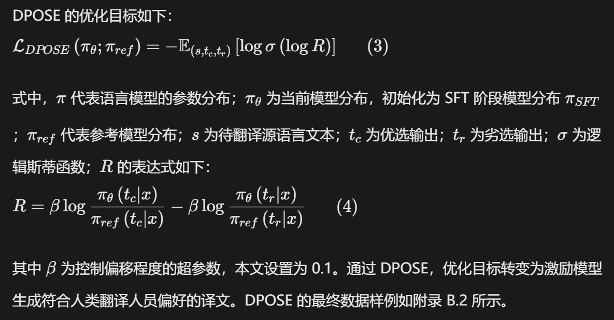

# 5 Experiments

## 5.1 Basic Details

**基线实验设置** 本文模型以 Chinese‑LLaMA2‑7B（Cui 等人，2024）为底座。该模型是在 LLaMA2‑7B 基础模型上，利用补充中文数据开展持续预训练与微调得到的。为提升训练效率，我们对模型的嵌入层和语言模型输出头（LM‑head）执行全量训练，其余模块则采用低秩适配（LoRA）（Hu 等人，2022）进行微调。

**参数设置** 详细参数配置如表 4 所示。在持续预训练与翻译监督微调阶段，我们沿用 Chinese‑LLaMA2 的参数配置。由于 DPOSE 阶段对参数较为敏感，我们经过多组小规模对比实验后，选定上述参数。全部训练均基于 LlamaFactory⁴框架完成。

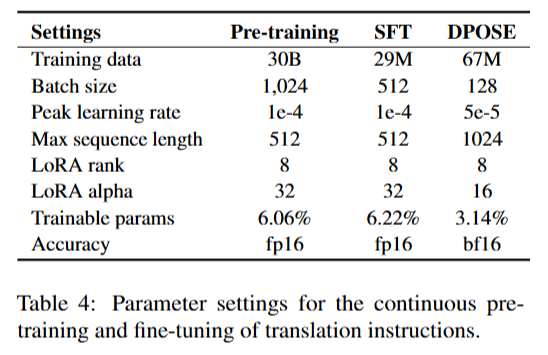

**训练开销** 本文全部实验均基于英伟达 A100（80G）GPU 完成。预训练阶段使用 16 张显卡，耗时 20 天完成；指令微调阶段使用 8 张显卡，训练耗时 1 天；DPOSE 阶段同样使用 8 张显卡，训练耗时 7 天。

**评价指标** 本文采用 BLEU 与 COMET（Rei 等人，2020）作为评价指标衡量模型性能。BLEU 指标使用 SacreBLEU 实现版本，该工具对分词流程做标准化处理，提升实验可复现性。

BLEU 依赖机器译文与参考译文之间的 n 元语法重叠程度完成打分；与之不同，COMET 模型基于包含人工译文及人工质量评分的大规模数据集训练得到，可结合源文本预测翻译质量。因此 COMET 能够实现更全面的评价，兼顾译文流畅度、充分度以及语义保真度。本文选用最新权重 `Unbabel/wmt22‑cometda⁵` 开展评测。

## 5.2 大语言模型维吾尔语翻译测试

一个很自然的问题是：现有具备代表性能力的大语言模型能否胜任维吾尔语翻译任务。为此，我们基于 CCMT‑UC 测试集，在**维译汉**、**汉译维**两个翻译方向上对上述模型开展评测。参与测试的模型包括：(1) GPT‑4（OpenAI 等人，2024）；(2) GPT‑3.5（Ouyang 等人，2022）；(3) Baichuan2‑13B（Yang 等人，2023）；(4) Qwen1.5‑14B（Team，2024）；(5) Qwen‑7B（Bai 等人，2023）；(6) Chinese‑LLaMA2‑7B（Cui 等人，2024）；(7) ChatGLM3‑6B（Du 等人，2022）；(8) LLaMA2‑7B（Touvron 等人，2023b）。测试结果如表 3 所示。绝大多数现有大语言模型难以生成维吾尔语文本（汉译维），同时对维吾尔语文本的理解能力也存在局限（维译汉）。值得注意的是，GPT‑4、GPT‑3.5 以及百川 2 在维译汉方向表现相对较好，但汉译维方向仍有较大提升空间。该现象说明，这类模型能够理解维吾尔语文本的语义，却无法生成质量可靠的维吾尔语文本。这一结果也印证了本文开展维吾尔语相关研究的研究价值。此外，我们针对维译汉的翻译结果做了细致分析，详见附录 C.1。

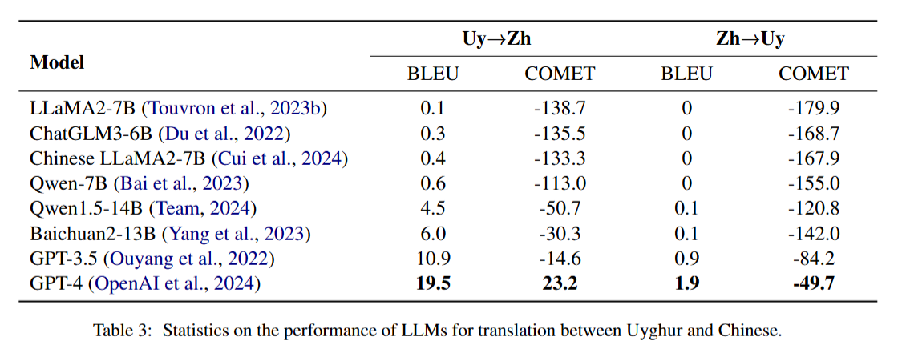

## 5.3 Uyghur LLaMA

为验证本文语言扩充策略与翻译能力增强方法的有效性，我们在维汉双向翻译任务上，对预训练模型、SFT 监督微调模型以及 DPOSE 模型开展评测，实验结果如表 6 所示。本文所提方法显著提升了模型对维吾尔语的理解能力与翻译水平。具体来看，相较于基线模型，DPOSE 方法在两个翻译方向上的 BLEU 分数分别提升 33.3 与 11.1，COMET 指标分别提升 176.9 与 205.1。

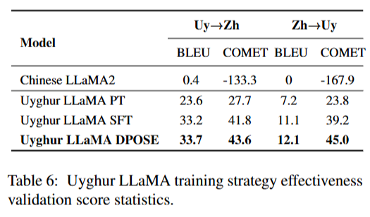

## 5.4 Efficacy of Prompt

与传统生成任务范式不同，大语言模型的输出会受到提示词设计的显著影响。设计合理的提示词能够明显提升模型性能（Gao 等人，2024）。此外，对于支持多语言输出的翻译模型，提示词所使用的语言同样会带来明显影响。为此，我们针对维吾尔语 LLaMA 开展提示词语言的对比实验，结果如表 5 所示。不同提示词带来的效果存在差异：**与目标语言保持一致的提示词翻译效果更优**。大语言模型依靠自回归机制逐词元生成文本；生成过程依赖上文输出，因此使用与目标语言一致的提示词，可以为模型提供更准确的监督信号，引导模型生成目标语言正确的语序。我们同时观察到，维吾尔语方向的 BLEU 分数整体偏低。这是因为维吾尔语属于**黏着语**，词汇由词根与词缀构成；即便模型输出的词根正确，只要词缀出现错误，依然会被判定为错误词元抖音百科。

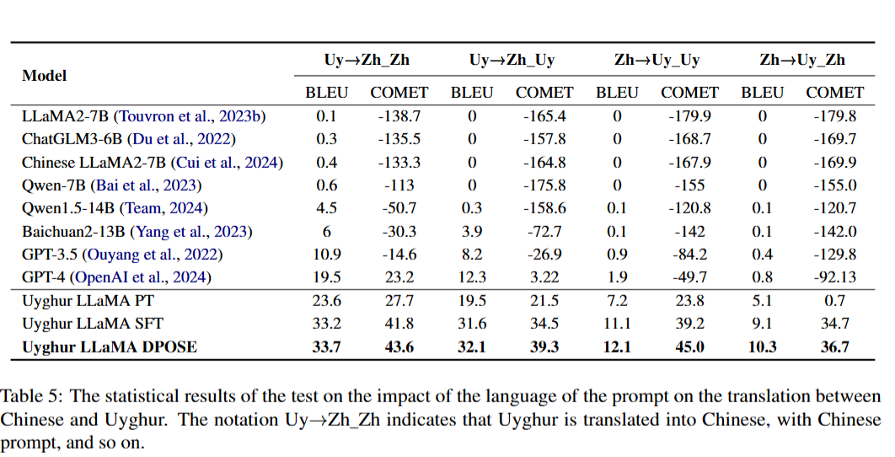

## 5.5 非目标语言翻译现象评估

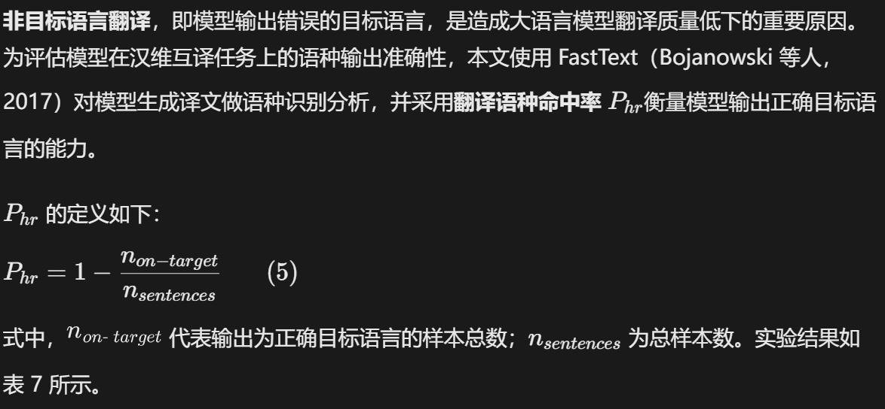

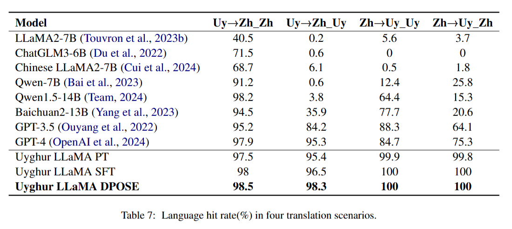

## 5.6 Learning Curves

如图 3 所示，语种命中率越高，代表模型翻译能力越强。本文的三阶段模型在该指标上表现良好。此外，我们发现，在同一个翻译方向下，不同提示词会显著影响模型的语种命中率，本文以外的对比模型以及 GPT 系列模型均体现出该现象。造成该现象的原因是：这些模型能够部分理解维吾尔语文本的语义，但不具备可靠生成维吾尔语文本的能力。

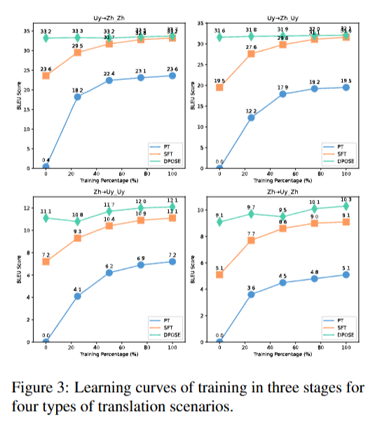

为展示本文三阶段模型在四类翻译任务上的学习曲线，我们在每个训练阶段平均采样 5 个模型检查点作为代表。针对每个检查点，在四类翻译场景下计算 BLEU 分数，评估模型性能，绘制得到的学习曲线如图 3 所示。

可以明显观察到：模型在持续预训练（PT）阶段与监督微调（SFT）阶段性能提升显著。而 DPOSE 阶段的性能提升主要集中在**维吾尔语为目标语言**的两个翻译方向上。此外，DPOSE 训练过程存在一定震荡现象，这是 DPO 算法本身训练不稳定所导致。

# 6 Conclusion

本文详细阐述了如何在数据稀缺条件下对大语言模型开展高效语种扩充，涵盖数据收集与预处理、数据分布设计、持续预训练以及监督微调（SFT）等环节。在此基础上，本文提出 DPOSE 方法。多组实验结果表明，该方法能够有效提升模型的低资源语言翻译能力。通过实验分析，本文得到如下发现：（1）采用有效的预处理策略并使用高质量数据，能够显著优化预训练效果，对于低资源语言而言效果尤为突出；（2）在基于大语言模型的翻译任务中，与目标语言保持一致的提示词具备更优效果；（3）针对低资源语言进行优化，相比高资源语言能够获得更大的性能增益。

在未来工作中，我们计划探究如何进一步增强大语言模型内部的跨语言知识迁移能力。我们认为，持续预训练足以让模型获得流畅生成对应语言的能力，同时大语言模型本身具备良好的泛化能力。

# Limitations

尽管本文取得一定研究成果，但仍存在若干局限性。第一，本文选取八款代表性大语言模型开展维吾尔语能力评测，但该评测覆盖范围仍不够全面。第二，实验中观察到大语言模型存在翻译幻觉现象，但本文并未对该问题展开深入探究，后续研究可进一步探索如何缓解翻译幻觉问题。第三，本文主要聚焦维吾尔语机器翻译任务的性能，还可以拓展至其他任务开展研究，例如探究本文方法在问答、文学生成等场景下的适用性。受限于计算资源，上述方向将留作未来工作进行全面研究。