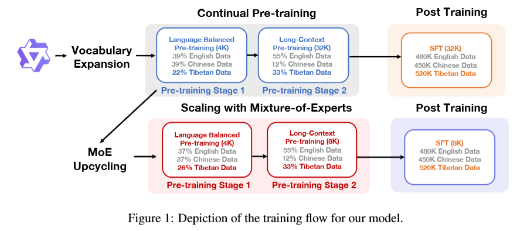
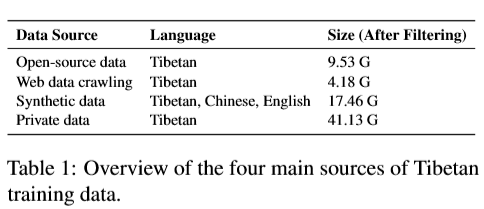
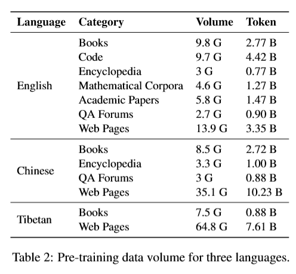
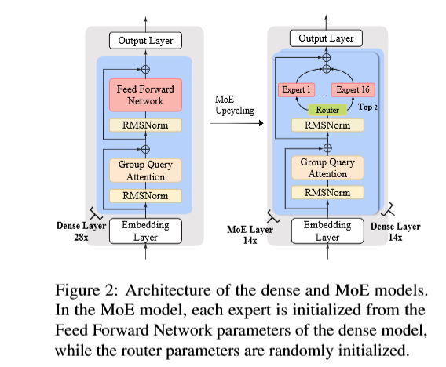
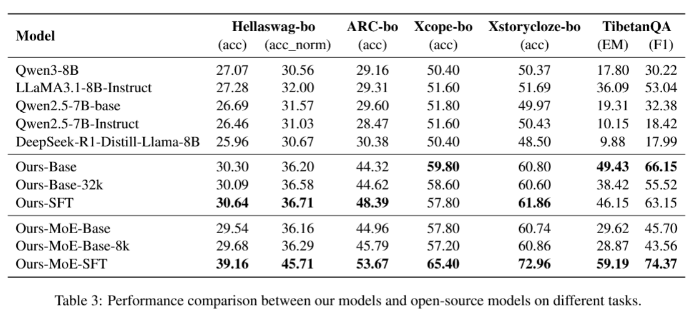
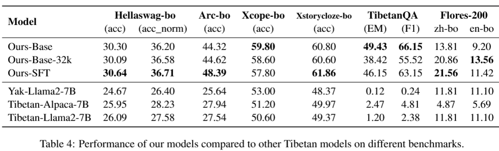
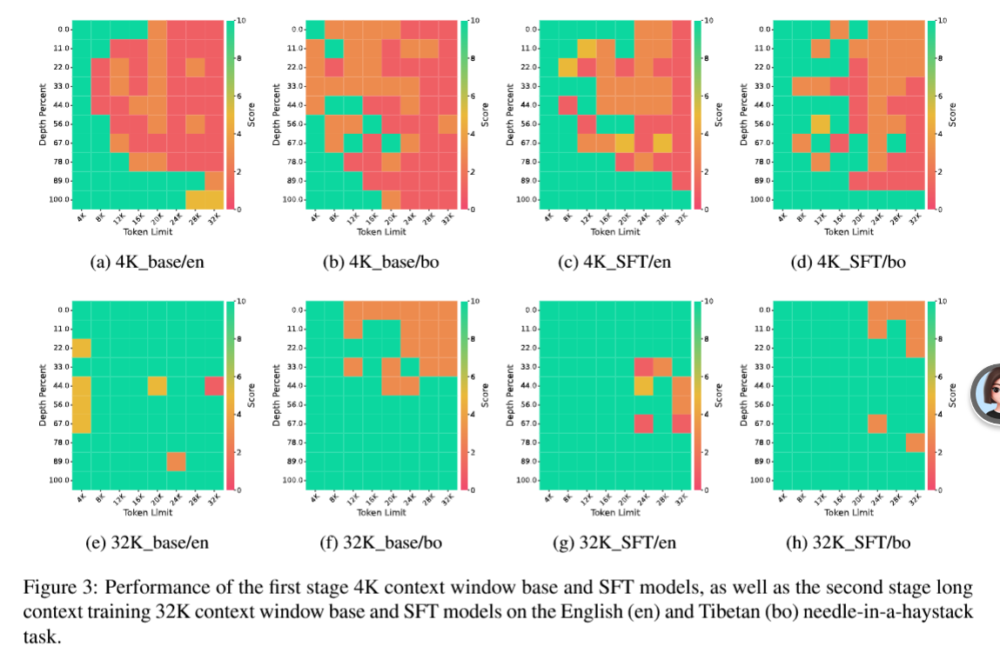

# 从精选数据到可扩展模型：面向藏语的稠密与混合专家大语言模型持续预训练

From Curated Data to Scalable Models: Continual Pre-training of Dense and MoE Large Language Models for Tibetan

2026-ACL

# Abstract

大语言模型（LLM）在各类自然语言处理任务上取得了瞩目成果，但其性能存在明显偏向高资源语言的问题。藏语具备重要的文化价值，使用人口众多，然而在大模型中却严重缺位。本文提出一套完整技术流程，通过大规模数据整理与持续预训练推进藏语语言建模研究。我们构建了规模达 72GB 的高质量藏语语料库，为目前已知规模最大的藏语语料；基于藏、汉、英三语均衡数据对 Qwen2.5‑7B 开展多语言持续预训练，并后续执行多语言指令微调，完成模型适配。为高效进一步扩充模型能力，我们将稠密模型拓展为总参数量 50B、单 Token 激活参数量 10B的混合专家（MoE）架构。由于缺少标准化的藏语评测基准，本文借助高质量翻译结合人工核验，构建了多套评测数据集。实验结果表明，在各类任务上，稠密模型与混合专家模型的表现均持续优于同等规模现有的开源模型以及面向藏语的专用模型。本研究推动了以藏语为核心的大语言模型相关研究，也为将大语言模型拓展至其他低资源语言提供可借鉴的思路。后续我们将开源模型权重、评测基准以及详细的数据处理文档。

# 1 Introduction

近年来，大语言模型（LLMs）取得长足进展，在各类自然语言处理任务上表现出优异性能（Shen 等人，2023；Guo 等人，2023）（Grattafiori 等人，2024；Yang 等人，2025b，2026），这在很大程度上得益于海量高质量训练数据的支撑（Kaplan 等人，2020；Wettig 等人，2024）。但主流大语言模型的预训练语料以英语、汉语等高资源语言为主（Touvron 等人，2023；Nie 等人，2026；Yu 等人，2026）。这种数据分布失衡，造成模型性能明显偏向高资源语言，而对低资源语言的支持能力则十分有限（Zhu 等人，2024b；Sun 等人，2024）。

造成这一差距的根本原因在于：低资源语言本身可获取的数据十分匮乏，同时在数据采集、清洗与标准化工作中还存在巨大挑战（Kudugunta 等人，2023；Penedo 等人，2024）。上述制约因素阻碍了低资源语言大语言模型的发展，也限制了模型效果，使得使用这些语言的人群无法平等享受人工智能领域的最新研究成果（Nguyen 等人，2024b；Dou 等人，2024）。此外，这种技术失衡可能会让语言资源与技术创新进一步向主流语言集中，对全球语言多样性（Üstün 等人，2024）以及文化保护工作构成严重威胁（Xu 等人，2024；Li 等人，2024）。因此，推进低资源语言的大语言模型研究，不仅是一项技术发展任务，更是促进人工智能公平性、保护文化多样性的关键举措（Shen 等人，2024）。

==藏语是具有代表性的低资源语言，属于我国少数民族语言，拥有数百万母语使用者。它是传承藏族文化与历史遗产的重要载体（Liang 等人，2024；Huang 等人，2025）。尽管藏语使用人口基数大、文化价值突出，但数字化语言资源仍然十分匮乏，长期被归类为低资源语言（Liu 等人，2022；Liu 和 Best，2025）。近年来，随着多语言大语言模型不断发展，模型对藏语的支持能力得到逐步提升（Liu 等人，2024；Lv 等人，2025）。然而，受训练语料中高资源语言占主导地位、藏语数据规模有限、质量参差不齐且缺乏标准化等因素影响，现有模型在处理藏语相关任务时依旧表现不佳（Zhuang 等人，2024）。==

针对上述挑战，本文构建了一款支持藏、汉、英三语的多语言大语言模型。我们提出一套完整的技术流程来构建具备藏语处理能力的大模型，涵盖数据整理、预训练、后训练以及模型评测四大环节。

为整理藏语预训练数据，我们从四大主要来源构建藏语预训练语料库：(1) 公开数据集；(2) 大规模网页爬虫；(3) 合成数据生成；(4) 私有数据。为保障数据高质量，我们还开发了一套面向藏语的定制化数据清洗流水线。经清洗后，我们一共收集得到 72GB 藏语文本。据我们所知，这是目前用于大语言模型预训练的规模最大的藏语语料库。

为构建本研究的模型，我们对开源效果优异的多语言大模型 **Qwen2.5‑7B‑base**（Yang 等人，2024）开展持续预训练，使其拓展获得藏语处理能力。图 1 展示了本研究的数据构成与训练流程。为实现有效的跨语言迁移、加快模型适配，在该持续预训练阶段，我们将经过整理的藏语数据与汉语、英语数据一同投入训练。预训练完成后，我们利用从开源仓库收集的藏、汉、英多语言指令遵循数据集开展指令微调，进一步提升模型处理三种语言下各类下游任务的能力。

在完成稠密模型适配工作之外，我们进一步采用混合专家（MoE）架构对模型进行能力扩容（Shazeer 等人，2017；Fedus 等人，2022），该架构可以在保证推理高效的前提下大幅提升模型容量。这种基于 MoE 的扩容策略，能够让模型更好地利用新增的藏语数据，并且在经过指令微调之后，模型性能得到显著提升。

在模型评测方面，由于面向大语言模型的标准化藏语评测基准十分匮乏，我们将现有评测基准自动翻译为藏语，构建了多套全新的藏语评测数据集。所有翻译结果均由藏语母语者进行严格校对。我们将翻译得到的评测数据集与已公开的藏语评测基准相结合，搭建一套更为完备的评测框架。实验结果表明，本文的基座模型与对话模型在各类任务上的表现均持续优于其他同等规模模型，部分任务上甚至可以和参数量大得多的大语言模型取得相近效果。此外，我们对模型词表进行扩充，加入高频藏文字符组合，进一步提升了模型的生成质量与解码效率，在同等运行条件下实现更快的推理速度。

我们的主要贡献可总结如下：

- 本文构建了高质量藏语预训练语料库（目前规模最大的藏语数据集），并开发了多款专门面向藏语大语言模型的评测基准，夯实了藏语自然语言处理的研究基础。
- 基于这套经过精选处理的数据，我们构建了具备强大藏语能力的 7B 稠密多语言大语言模型以及 50B‑A10B 混合专家（MoE）多语言大语言模型。
- 大量评测实验表明，在各类评测基准上，相较于<u>其他开源模型以及同等规模的藏语专用模型</u>，本文模型的准确率获得显著提升。

# 2 Related Work

近年来，多语言大语言模型取得了重大进展，逐步从仅支持少数高资源语言，发展到覆盖更多中、低资源语言（Yang 等人，2025b）。这一进步很大程度上得益于多语言语料库的持续扩充，既体现在支持语言种类的增加，也体现在每种语言可用数据规模的提升（Penedo 等人，2025；Zhou 等人，2026）。相应地，大语言模型的多语言能力也得到稳步提升（Üstün 等人，2024；Ji 等人，2024）。尽管取得上述进展，但现有的多语言模型对藏语的支持依旧不足（Yang 等人，2024）。现有开源多语言语料库中的藏语数据，无论在数据规模还是多样性方面都十分有限，严重制约了模型在藏语理解与生成任务上的效果（Kudugunta 等人，2023；Nguyen 等人，2024a）。为弥补这一短板，本文重点构建大规模、高质量的藏语预训练语料库，并训练一款强化藏语能力的专用语言模型，以此提升模型在藏语下游任务上的性能。

为高效利用特定语言的数据来构建面向该语言的定制化模型，一种直接的方案是将收集到的数据与多语言语料库混合，从零开始训练全新模型（Ji 等人，2024）。但该方法计算成本高昂。为此，已有研究提出了多种低成本替代方案，用以提升现有模型在特定语言上的性能。其中一类研究探究上下文学习技术（Cahyawijaya 等人，2024）。这类方法虽然效率相对较高，却无法从根本上提升模型在目标语言上的固有能力，并且通常要求基座模型本身已经对该语言具备一定程度的支持。对于藏语这类原生模型表现本就很差的真正低资源语言，该缺陷导致上下文学习方法效果有限。另一类研究采用持续预训练，让预训练模型适配资源匮乏的语言。代表性工作包括 Sailor（Dou 等人，2024）与 LLaMaTurk（Toraman，2024）；这些工作证明，通过针对性持续预训练对多语言模型进行拓展，能够有效增强模型在特定语言上的能力。受该思路启发，本文采用持续预训练的方法，强化 Qwen2.5 模型对藏语的支持能力。

近期已有多款支持藏语理解与生成的大语言模型被提出，例如 TiLamb（Zhuang 等人，2024）、Sunshine（Huang 等人，2025）以及 T‑LLaMa（Lv 等人，2025）。其中部分模型采用 LoRA 等参数高效微调技术开展持续预训练（Hu 等人，2022）。与之不同，本文的方案使用**全参数微调**，具备更强的灵活性与适配潜力。此外，相较于上述模型，本文所使用的藏语训练语料规模更大、数据源更加多元，覆盖的语言场景也更为广泛。因此，基于该语料训练得到的模型，无论是在本文自建的藏语评测基准，还是现有的公开评测数据集上，均取得更优的性能。

# 3 预训练数据整理

在预训练数据整理阶段，我们从多种来源采集藏语数据。除汇总全部可获取的开源藏语语料库之外，还纳入网页爬取内容、合成生成数据以及一部分私有资源。为保证数据高质量，我们设计并使用一套专门面向藏语的数据清洗流水线，对全部数据集进行处理。

## 3.1 数据采集

我们从四大来源采集风格多样、质量优异的训练语料：开源数据集、网页数据爬取、合成数据生成以及私有数据。这些数据源在文本风格、领域覆盖范围以及语言特征上各有差异，共同构成一套完备的藏语预训练语料库。

表 1 汇总了各数据组成部分的详细信息。

我们从各类开源多语言数据集以及藏语单语数据集中大规模采集藏语数据。所收集数据集的详细信息见附录 A。该部分数据大部分来源于网页，同时也涵盖新闻、书籍、维基百科等其他领域的文本内容，提升了整个语料库的整体多样性。

开源数据采集
我们从各类开源多语言数据集以及藏语单语数据集中大规模采集藏语数据。所收集数据集的详细信息见附录 A。该部分数据大部分来源于网页，同时也涵盖新闻、书籍、维基百科等其他领域的文本内容，提升了整个语料库的整体多样性。

网页数据爬取
尽管我们收集的开源数据已经包含大量网页类文本，但存在时效性不足的问题，很多新近资料并未体现在现有数据集当中。为解决该问题，我们使用 crawl4ai 工具 ¹，对 55 个藏语网站开展数据采集，共获取 204 125 条网页。爬取得到的数据覆盖多个领域，以新闻内容为主，同时包含书籍、维基百科及其他类别文本，丰富了藏语语料库的多样性。网页爬取数据的详细信息参见附录 B。

**合成数据生成** 在低资源场景下，合成数据常被用于弥补真实世界数据的不足，已有研究表明合成数据能够有效提升大语言模型的性能（Abdin 等人，2024）。藏语属于低资源语言，高质量数据稀缺，因此我们采用自动数据合成的方式扩充藏语语料库。考虑到现有大语言模型的藏语单语生成能力有限，我们选择通过翻译的方式生成藏语数据。为进一步促进跨语言迁移，我们构建平行语料，将源语言句子及其对应的藏语译文一同用于训练。我们从 FineWebEdu（Penedo 等人，2024）与 Cosmopedia（Ben Allal 等人，2024）预训练数据集中采样部分文本，借助谷歌翻译 API 将其译为藏语，并采用 Zhu 等人（2024a）提出的指令模板整理这份平行数据。

私有数据使用
除公开可获取的数据之外，我们还使用一部分藏语私有数字资源，主要包含书籍与典籍类资料。该部分资源取自非公开但可合法获取的渠道，例如内部数字档案库以及机构合作渠道。本类所用数据均不包含个人身份信息与用户生成内容，仅用于科研与模型训练。

## 3.2 数据清洗与去重

完成藏语语料采集之后，我们开展全面的数据清洗工作，以保障数据质量能够满足大语言模型训练要求。鉴于藏文字符体系的独特性，受 FineWeb 数据处理流程启发（Penedo 等人，2024），我们开发了一套面向藏语的定制化数据清洗流水线。该清洗流水线主要包含两个阶段：语言过滤与质量过滤。语言过滤阶段，我们采用 FastText 语言分类器（Grave 等人，2018）识别藏语文本，将藏语置信度得分低于 0.5 的文档全部剔除。质量过滤阶段，组合使用五项过滤策略：Gopher 重复过滤、Gopher 质量过滤（Rae 等人，2021）、C4 质量过滤（Raffel 等人，2020）、FineWeb 质量过滤以及敏感内容过滤。为更好适配藏语文本特点，我们对上述流程中的部分启发式规则做了小幅修改。质量过滤的详细说明参见附录 C。

完成数据清洗流程后，我们使用 DataTrove 工具 ² 开展基于 MinHash 的去重操作，去除高度冗余的文本片段。该步骤有助于提升预训练数据的多样性与训练效用。

## 3.3 数据构成

藏语数据完成清洗与去重之后，我们在持续预训练过程中引入高质量、多领域的中英双语数据（Chen 等人，2024），进一步强化模型的藏语能力。该方法利用跨语言泛化能力，将模型已有的中英语言优势迁移至藏语。同时，这也是一种数据重放策略，可以避免模型仅使用藏语数据训练时可能出现的通用知识灾难性遗忘问题。此外，我们采用均衡的多语言数据配比，在充分利用跨语言泛化收益的同时，降低高资源语言带来的干扰，以期最大化模型的藏语性能。各语言用于持续预训练的数据量汇总于表 2。

# 4 Continual Pre-training

我们选用 Qwen2.5‑7B‑base（Yang 等人，2024）作为基座模型，该模型具备优异的多语言能力，为向藏语这类低资源语言开展跨语言迁移提供了良好基础。为提升模型处理藏语文本的能力，我们首先扩充词表，加入常用藏语字符组合，实现更高效、更准确的分词。随后采用两阶段持续预训练策略：第一阶段为语言均衡预训练，使用较短上下文窗口，将中英知识迁移至藏语；第二阶段为长上下文预训练，拓展模型的上下文长度。数据构成与完整训练流程如图 1 所示，模型整体架构如图 2 所示。

## 4.1 词表扩充

Qwen2.5 原始分词器容易对藏语字符发生**过度切分**，造成计算开销增大，同时降低生成可控性。为解决该问题，我们在代表性藏语语料上训练一个 15K 规模的字节级 BPE 分词器，将其词表与原始词表合并并去重，以此扩充词表。最终词表包含 165 428 个 token，实现更高效、更准确的藏语分词。此外，我们在 7.6 节对多款模型的分词效率做了详细对比，实验结果表明本文分词器具备显著优势。

## 4.2 第一阶段：语言均衡预训练

持续预训练的第一阶段旨在利用藏语单语数据，同时借助高资源语言带来的跨语言迁移效应，建立模型的藏语基础能力。为保证知识留存、防止发生灾难性遗忘，训练过程中我们按配比混合使用中文、英文与藏语数据。

经本文扩充后的分词器完成分词处理后，训练数据集约包含 150 亿中文 token、150 亿英文 token 以及 85 亿藏语 token。值得注意的是，尽管藏语原始数据体量很大，但由于本文分词器针对藏语做了专门适配，压缩效率更高，最终得到的 token 数量反而更低。

本阶段基于 Qwen2.5‑7B‑base 模型开展持续预训练，保留模型原有配置不变。为提升训练效率，我们采用 4K token 的较短上下文窗口。更多训练细节参见附录 D。

## 4.3 第二阶段：长上下文预训练

为提升模型处理长输入文本的能力（Yang 等人，2025d），我们基于第一阶段产出的模型开展长上下文预训练，将上下文窗口拓展至 32K token。

训练数据为中、英、藏三语混合文本，中文 0.56B token、英文 2.5B token、藏语 1.5B token（该部分藏语数据未用于第一阶段训练），总计 4.56B token，以此提升模型在藏语长文本场景下的泛化能力。训练参数方面，我们与 Qwen2.5‑7B‑base 基座模型以及第一阶段预训练保持一致。具体的数据分布与训练参数详见 7.5 节。

我们采用 “大海捞针（needle‑in‑a‑haystack）” 评测方案，并以 Claude 作为评测器，评估模型的长上下文理解能力。受藏语数据稀缺的限制，我们构建了藏语版本的大海捞针数据集；为避免模型固有先验知识对评测结果造成干扰，选取近期新闻文本作为 “针” 样本。实验结果表明，经过第二阶段长上下文预训练后的模型，性能显著优于仅完成第一阶段预训练的模型。详细实验内容参见 7.5 节。

# 5 后训练

完成持续预训练之后，模型已经具备藏语基础能力。为进一步提升模型遵循指令的能力，我们使用经过精心筛选、内容丰富多样的指令数据集开展指令微调。

在领域覆盖上，我们收集的开源指令数据覆盖多个方向，包括指令遵循、多轮对话、翻译、摘要等。这种多样化的数据覆盖旨在全面提升模型在各类任务上的对齐能力。从语言角度出发，为将中英语言的指令遵循能力迁移至藏语，我们构建了覆盖三种语言的多语言指令数据集。后训练数据与流程的详细信息参见附录 E。

# 6 基于混合专家模型的规模扩展

为进一步扩充模型容量，同时保证推理效率，并探索适用于低资源语言场景的可扩展建模方案，我们研究了一套专门面向藏语建模的混合专家（MoE）架构。本工作所用训练数据、处理流程以及模型架构如图 1 与图 2 所示。

## 6.1 MoE 架构与数据

我们采用**模型升级复用（upcycling）**方案，基于 7B 规模的稠密模型训练 MoE 模型（Zhang 等人，2024；He 等人，2024；Hui 等人，2025；Liew 等人，2025）。具体而言，MoE 层设置频率为 2，即每隔一层将原始前馈网络替换为 MoE 层，自注意力结构保持不变。每个 MoE 层包含 16 个独立专家；推理阶段采用 Top‑2 门控机制，每个 token 激活 2 个专家。

在该配置下，MoE 模型总参数量约为 500 亿，而推理时每个 token 实际激活的参数量约为 100 亿。该设计在保障较高推理效率的同时，大幅提升了模型的表达能力（Mu 和 Lin，2025；Lo 等人，2025）。

除架构层面的规模扩展外，MoE 模型训练还配套进行了数据扩充。在 7B 稠密模型训练语料的基础之上，我们额外引入约 22 亿 token 的数据，主要包含藏语 PDF 文档以及藏语相关中文文本。这批数据以长文本高质量内容为主，与 MoE 模型更大的模型容量和上下文建模能力相匹配，有助于提升模型的知识覆盖度与长文本理解能力。

## 6.2 训练流程

本节重点阐述 MoE 模型的初始化策略与训练流程。本文主 MoE 模型并非直接基于通用多语言基座模型初始化，而是采用 4.2 节得到的经过藏语适配的稠密模型检查点进行初始化。该设计能够保证 MoE 各个专家模块在进一步专项训练之前，就继承已经训练完备、对齐良好的藏语语言表征。

在训练流程方面，我们首先将 MoE 模型置于 4K 上下文窗口下开展持续预训练，训练 token 规模约为 407 亿。随后参照 4.3 节的配置，把模型上下文长度拓展至 8K，以此增强模型的长文本建模能力。最后，使用与第 5 节完全相同的多语言指令数据集对 MoE 模型执行监督微调（SFT），得到最终的 MoE‑SFT 模型。

## 6.3 初始化策略

值得注意的是，我们还探究了另一种初始化方案：直接基于 Qwen2.5‑7B‑base 检查点初始化相同结构的 MoE 模型，并在完全一致的设置下开展持续预训练。但该方案无法带来稳定的性能提升，整体效果显著差于由藏语适配稠密模型初始化得到的 MoE 模型。

该结果表明，初始化策略在面向低资源语言的 MoE 规模扩展中起到关键作用。直接对通用多语言基座模型套用 MoE 架构，可能会造成不同专家之间语言表征碎片化，进而需要海量训练数据才能实现有效的专家专业化。与之相比，从已经完成语言适配的稠密模型出发，能够更完整地继承已学习到的语言结构与知识，为后续 MoE 规模扩展提供更加稳定高效的基础。关于该配置下专家行为与路由动态性的进一步分析，留作未来工作。

# 7 Experiments

鉴于目前缺少面向大语言模型的标准化藏语评测基准，我们构建了 4 套评测基准，用于评估模型的通用藏语能力。再结合两套已有的传统藏语 NLP 任务评测基准，实现对模型性能的全面评测。实验结果表明，在全部评测任务上，本文模型均优于同等规模开源模型以及面向藏语定制化的模型。

## 7.1 藏语通用评测基准构建

现有的大模型评测基准（Yang 等人，2025c；Leng 等人，2025）大多面向高资源语言设计，藏语相关可用资源十分有限。为实现对藏语大模型多任务下的系统性评测，我们基于多款成熟的英文评测基准进行翻译，构建了面向通用场景的藏语评测集，所用源数据集包括 HellaSwag（Zellers 等人，2019）、ARC（Clark 等人，2018）、Xcopa（Ponti 等人，2020）以及 XStoryCloze（Lin 等人，2021）。

我们利用具备优秀藏语生成能力的 Claude‑Sonnet‑3.7 模型，将原始数据集翻译为藏语。为保证翻译数据的质量与可靠性，我们执行严格的多轮审核流程，从语义一致性、语法正确性、文化适配性以及内容安全性多个维度开展校验。翻译与质量审核的详细流程参见附录 F。最终构建得到 4 套评测基准：HellaSwag‑bo、ARC‑bo、Xcopa‑bo、XStoryCloze‑bo。

## 7.2 评测基准与对比模型

我们在多套藏语评测基准上对模型开展评测，包括：用于推理与知识能力评估的自建任务集（HellaSwag‑bo、ARC‑bo、Xcopa‑bo、XStoryCloze‑bo）、用于阅读理解任务的 TibetanQA（Sun 等人，2021），以及面向多语言翻译任务的 FLORES‑200（Team，2024b）。评测基准的详细说明参见附录 G。

我们对稠密模型与 MoE 模型各三个版本开展对比评测。Base 版本经过单阶段持续预训练得到；Base‑32/8k 经过两阶段持续预训练；SFT 版本在此基础上额外完成指令微调。在通用推理任务基准与藏语专属评测基准上，将以上模型与主流开源通用模型进行对比，对比基线包括 Qwen 系列（Yang 等人，2024，2025a）、LLaMA 系列（Team，2024a）以及 DeepSeek 系列（DeepSeek‑AI，2025）。

## 7.3 Main Results

稠密模型。如表 3 所示，在 HellaSwag‑bo、ARC‑bo 等多选推理任务上，本文模型的准确率始终优于基线模型。在 TibetanQA 数据集上优势更为显著，本文模型的 EM 值与 F1 值均大幅领先通用模型。上述结果验证了本文所采用的持续预训练策略、指令微调以及数据构建流程，能够有效提升藏语这类低资源语言的模型性能。

MoE 模型。MoE‑Base 与 MoE‑Base‑8k 在绝大多数评测基准上取得了与稠密模型相当的性能，说明 MoE 规模扩展并不会损害模型核心的藏语理解能力。经过 SFT 指令微调之后，MoE‑SFT 在全部评测基准上均获得大幅性能提升。尤其是在 XStoryCloze 这类强推理任务上，MoE‑SFT 显著优于稠密模型；并且在 TibetanQA 任务上实现大幅度提升，F1 分数达到 74.4。上述结果表明，MoE 扩容带来的模型表达能力，需要经过对齐之后才能得到最充分释放，使模型能够更好地利用扩增的参数与藏语专属数据。

## 7.4 与现有藏语定制化模型对比

我们进一步将本文模型与多款专为藏语设计的指令微调模型进行对比。如表 4 所示，在全部任务上，本文模型性能均持续优于现有的藏语指令微调模型。尤其是在阅读理解与问答任务上提升十分显著，其他模型在该类任务上表现差距明显。此外，在汉‑藏（zh‑bo）、英‑藏（en‑bo）翻译任务中，本文模型取得所有模型里最高的 BLEU 分数，体现出优秀的多语言对齐能力与良好的跨语言泛化能力。

## 7.5 长上下文预训练

​	**数据分布**。为充分利用第一阶段训练数据的分布特征，并进一步提升模型对藏语的长上下文处理能力，我们在第二训练阶段加入多语言混合长文本（中文、英文、藏语）作为训练语料。我们分别从各语言的长上下文数据源中采样得到 0.56B token 中文数据、2.5B token 英文数据以及 1.5B token 藏语数据（该部分藏语数据未在第一阶段使用），最终得到总量为 45.6 亿 token 的三语长上下文训练集。

**训练参数**。在训练配置方面，我们保持与 Qwen2.5‑7B‑base 模型一致，将 RoPE 的 θ 参数设置为 1 000 000。全局批大小设置为 128，确保每一批次处理的 token 数量与第一阶段预训练保持一致。此外，学习率从 5e‑5 下调至 1e‑5，其余全部超参保持不变。本阶段训练采用 DeepSpeed ZeRO‑3 Offload 策略，共训练 1000 步。

**实验结果**。我们在 “大海捞针”（needle‑in‑a‑haystack）任务上评测 4 个模型变体：第一阶段的 Base 模型与 SFT 模型，以及经过第二阶段长上下文训练后的 Base 模型与 SFT 模型。评测采用英文、藏语双语长上下文样本开展。如图 3 所示，实验结果表明，长上下文训练成功将模型上下文窗口拓展至 32K token，并且显著提升了模型的多语言能力。

## 7.6 分词效率分析

除基于准确率的评测之外，我们还通过测算分词器压缩比对分词器效率进行分析，该指标定义为每个 token 平均对应的字符数。该指标能够反映分词器表征文本的效率，并且会直接影响训练与推理开销，以及输入文本的有效长度。

具体而言，本文藏语模型表现优异，分词压缩比达到 3.9644。该数值远高于业界主流模型，例如 Qwen3‑8B 的 0.7315、LLaMA3‑8B 的 0.4885，体现出突出的压缩能力优势。更高的压缩比意味着，处理同等长度的藏语文本时，模型所需 token 数量更少，能够有效降低计算负载与内存占用，进而大幅加快推理速度。该特性不仅提升了模型运行效率，也为藏语自然语言处理任务在实时响应场景与资源受限环境下落地提供有力支撑，印证了本文方法在优化推理速度、降低计算开销方面具备显著实用价值。

# 8 Conclusion

本文提出一套实用且可扩展的框架，用于优化藏语大语言模型。藏语属于代表性严重不足但具备重要文化价值的低资源语言。通过构建目前规模最大的高质量藏语预训练语料，并采用定制化的数据清洗流程，本文解决了藏语领域数据稀缺与数据质量的核心难题。借助均衡的多语言持续预训练、词表扩充以及多语言指令微调，本文模型在藏语理解与生成能力上取得大幅提升。本文进一步证实：从经过藏语适配的稠密模型进行初始化，MoE 扩容可以在不损失效率的前提下有效提升模型容量。最后，本文推出经过严谨校验的全新藏语评测基准，实现更为系统化的模型评测。以上工作共同为藏语大模型研究奠定坚实基础，同时也为将大模型拓展至其他低资源语言提供可迁移的研究思路。

# Limitations

尽管本文取得了不错的实验效果，但本工作仍存在若干局限性。第一，虽然本文构建的藏语语料库是目前规模最大的，但与高资源语言的语料相比体量依旧有限，这可能会限制模型对藏语小众领域、文体风格以及方言变体的覆盖能力。第二，部分训练与评测数据依赖机器翻译与合成生成，即便经过严格过滤与人工校验，仍可能引入翻译瑕疵或是不易察觉的语义偏差。第三，本文的评测基准相较现有资源覆盖面更广，但主要由英文数据集翻译而来，或许无法完全体现藏语特有的推理模式以及藏语本土固有的文化知识。最后，本文对混合专家（MoE）的分析主要聚焦于模型性能结果；针对专家专业化能力、路由行为以及效率‑质量之间权衡关系的深入研究留待后续工作。想要克服上述局限，则需要规模更大的原生藏语数据集、更贴合本土文化的评测基准，以及针对低资源语言可扩展架构开展更加细致的分析。